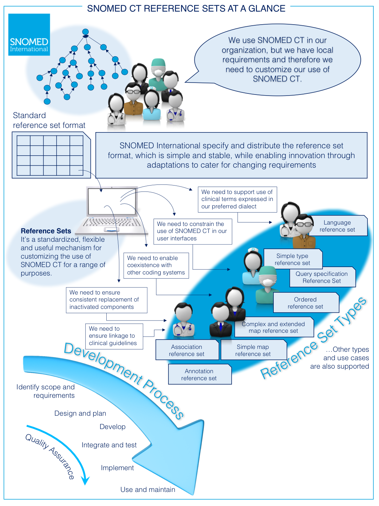

# Introduction

## Background

SNOMED CT provides the core clinical terminology for the electronic health record (EHR) and contains more than 300,000 active concepts with unique meanings. These concepts are organized into hierarchies and have formal logic-based definitions. When implemented in software applications, SNOMED CT can be used to represent clinically relevant information consistently, reliably and comprehensively as an integral part of producing electronic health records. Due to the comprehensiveness and expressivity of SNOMED CT it is often useful to constrain its use to a subset of concepts, descriptions or relationships relevant to a particular use case. SNOMED CT reference sets provide a standard way to represent subsets of SNOMED CT components. Reference sets also provide an extensible mechanism to customize the terminology to meet a wide range of practical requirements.

## Purpose

The aim of this document is to provide a high level introduction to SNOMED CT reference sets, and to explain the different types of reference sets and their usage. Furthermore, the document includes an introduction to the reference set format and provides guidance on the development and management of reference sets. Thus, the objective of this document is to support users of SNOMED CT in :

* Understanding the purpose of reference sets
* Knowing about the different types of reference sets and their characteristics
* Choosing the correct type of reference set for a specific purpose
* Creating, developing and maintaining reference sets
* Using reference sets together with other SNOMED CT resources (for entry and display, analytics, knowledge linkage, communication)
* Sharing reference sets
* Adopting or adapting existing reference sets
* Exploring and assessing the content of existing reference sets

## Audience

The intended audiences for this guide are those involved in the creation, maintenance and usage of SNOMED CT reference sets. More specifically, this includes:

* SNOMED International Members who wish to learn about the practical uses of reference sets or who are involved with defining reference sets
* Clinicians, informatics specialists and technical staff involved in the planning, management, design or implementation of reference sets.
* Software vendors, data analysts, epidemiologists and others designing SNOMED CT based solutions.

This document assumes a basic level of understanding of SNOMED CT. For background information the reader should refer to the [SNOMED CT Starter Guide](https://app.gitbook.com/o/h8Z6qGxuQrzM9vbx5bPT/s/UmSUeu96fIQZWDm7RISx/).

<figure><figcaption></figcaption></figure>

<a href="https://docs.google.com/forms/d/e/1FAIpQLScTmbZIf0UEQwYDkY27EEWBkaiYkHSbR0_9DmFrMLXoQLyL7Q/viewform?usp=pp_url&entry.1767247133=Refset+Guide&entry.670899847=Introduction" class="button primary">Provide Feedback</a>
