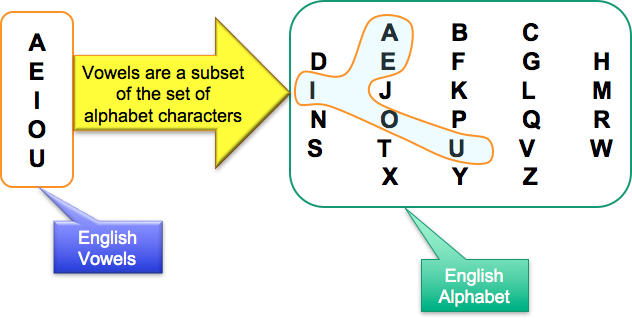

# 2.1. Subset

A [subset](https://confluence.ihtsdotools.org/display/DOCGLOSS/subset "Glossary link: subset") is defined as  a set of members all of which are members of another set (from  _set theory_ in mathematics).

### Notes

  * In [SNOMED CT](https://confluence.ihtsdotools.org/display/DOCGLOSS/SNOMED+CT "Glossary link: SNOMED CT"), the definition of _subset_ applies to [SNOMED CT components](https://confluence.ihtsdotools.org/display/DOCGLOSS/SNOMED+CT+component "Glossary link: SNOMED CT components") as follows:
    * A subset of [SNOMED CT concepts](https://confluence.ihtsdotools.org/display/DOCGLOSS/SNOMED+CT+concept "Glossary link: SNOMED CT concepts") is a set of [concepts](https://confluence.ihtsdotools.org/display/DOCGLOSS/concept "Glossary link: concepts") taken from a wider set of concepts.

    * A subset of [SNOMED CT descriptions](https://confluence.ihtsdotools.org/display/DOCGLOSS/SNOMED+CT+description "Glossary link: SNOMED CT descriptions") is a set of [descriptions](https://confluence.ihtsdotools.org/display/DOCGLOSS/description "Glossary link: descriptions") taken from a wider set of descriptions.

  * The members of a subset can be defined in one of two ways:
    * [Extensionally](https://confluence.ihtsdotools.org/display/DOCGLOSS/extensional+subset+definition "Glossary link: extensional subset definition"), by enumeration, with a [simple reference set](https://confluence.ihtsdotools.org/display/DOCRELFMT/5.2.1.1+Simple+Reference+Set) as the standard distribution format.
    * [Intensionally](https://confluence.ihtsdotools.org/display/DOCGLOSS/intensional+subset+definition "Glossary link: intensional subset definition"), using rules to determine inclusion, with a [query reference set](https://confluence.ihtsdotools.org/display/DOCRELFMT/5.2.1.7+Query+Specification+Reference+Set) as the standard distribution format.

# Subset Example

The diagram below shows an example of a subset. The English vowels are a subset of the set of alphabet characters included in the English alphabet

<figure><figcaption>
Figure 2.1-1: Subset example
</figcaption></figure>

  

  

  

  

