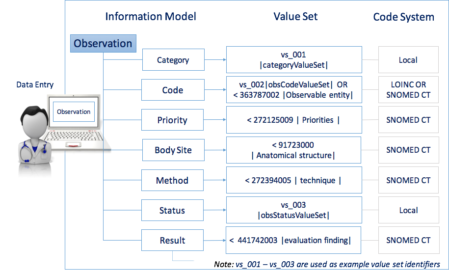

# Value Set

A **value set** is a uniquely identifiable set of valid concept representations, where any concept representation can be tested to determine whether or not it is a member of the _value set_.

A _value set_ is typically used to represent the possible values of a coded data element in an information model. The members of a _value set_ may represent concepts using either simple codes or postcoordinated expressions.

There are a number of use cases for value sets, including constraining the permitted values for elements in a communication specification, specifying the values in a pick list on a user interface and defining the required values to use for reporting. Value sets may range from a simple flat list of codes from a single code system, to an unbounded hierarchical set of post-coordinated expressions drawn from multiple code systems. Value sets containing only SNOMED CT components may be represented as SNOMED CT reference sets.

For example, a message or reporting specification might define a single value set for a problem list, which includes:

* SNOMED CT 64572001 <mark style="color:blue;">|</mark> Disorder<mark style="color:blue;">|</mark> concepts
* SNOMED CT expressions that are subtypes of 64572001 <mark style="color:blue;">|</mark> Disorder<mark style="color:blue;">|</mark>
* ICD-10 classification codes representing diseases

## Value Set Example

The diagram below illustrates an example of an Observation model, which may be used to support diagnosis, monitor progress, determine patterns in clinical data, etc. Each data element in the information model is linked to a value set, which represents the value values for that element. As shown below, the value sets used in this information model may be selected from different code systems. In some cases, a single value set may also include concepts from different code systems.

<figure><figcaption>
Value sets used in an information model
</figcaption></figure>

<a href="https://docs.google.com/forms/d/e/1FAIpQLScTmbZIf0UEQwYDkY27EEWBkaiYkHSbR0_9DmFrMLXoQLyL7Q/viewform?usp=pp_url&#x26;entry.1767247133=Refset+Guide&#x26;entry.670899847=Value%20Set" class="button primary">Provide Feedback</a>
