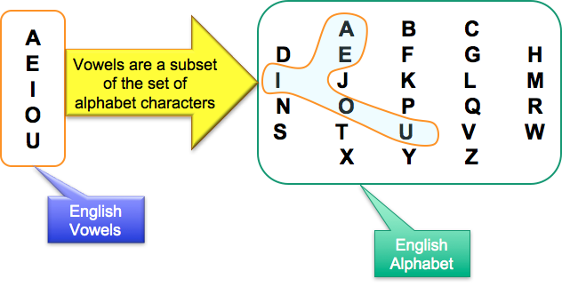
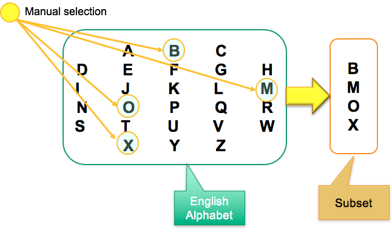
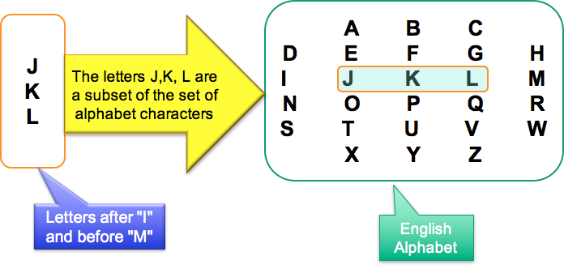
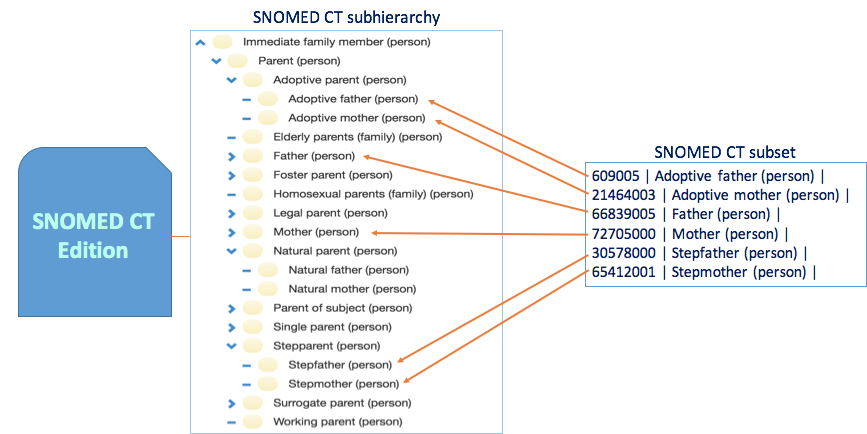
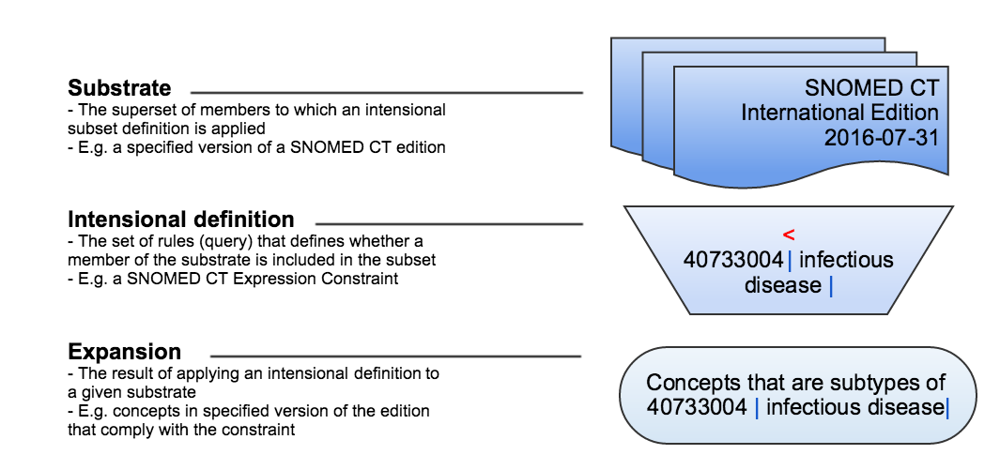

# Subset

A **subset** is defined as a set of members all of which are members of another set (from _set theory_ in mathematics).

#### Notes

* In SNOMED CT, the definition of _subset_ applies to SNOMED CT components as follows:
  * A subset of SNOMED CT concepts is a set of concepts taken from a wider set of concepts.
  * A subset of SNOMED CT descriptions is a set of descriptions taken from a wider set of descriptions.
* The members of a subset can be defined in one of two ways:
  * **Extensionally**, by enumeration, with a **simple reference set** as the standard distribution format.
  * **Intensionally**, using rules to determine inclusion, with a **query reference set** as the standard distribution format.

## Subset Example

The diagram below shows an example of a subset. The English vowels are a subset of the set of alphabet characters included in the English alphabet

<figure><figcaption>
 Subset example
</figcaption></figure>

## Subset Definitions

There are two distinct ways to define the membership of a subset. These are known as **extensional** and **intensional** subset definitions. These terms are defined and illustrated below.

### Extensional subset definition

A subset in which the members are represented by enumeration.

<figure><figcaption>
Illustration of an extensionally defined subset
</figcaption></figure>

### Intensional subset definition

A subset definition in which the membership is represented by a set of rules specifying the conditions for inclusion.

<figure><figcaption>
Illustration of intensionally defined subset
</figcaption></figure>

## Extensional Definitions

Extensionally defined subsets of SNOMED CT components consist of a list of SNOMED CT component identifiers, which are typically either concept or description identifiers. Extensionally defined SNOMED CT subsets are formally represented using the **simple reference set** type.

<figure><figcaption>
Illustration of an extensionally defined subset of SNOMED CT concepts
</figcaption></figure>

## Intensional Definitions

The design of SNOMED CT lends itself to intensional subset definitions, because rules can be formulated to specify the conditions for member inclusion.  The subtype hierarchy and formal definitions of SNOMED CT  concepts enable constraints to be specified, such as:

* Concepts that are descendants of a particular concept.&#x20;
  * For example:  <  [118794001 | Procedure on lung|](http://snomed.info/id/118794001)  (i.e. all descendants of the concept [118794001 | Procedure on lung|](http://snomed.info/id/118794001) )
* Concepts that share a set of defining characteristics.&#x20;
  * For example:  <  [64572001 |Disorder|](http://snomed.info/id/64572001) :  [116676008 |Associated morphology|](http://snomed.info/id/116676008)  =  [257552002 |Inflammation|](http://snomed.info/id/257552002)  (i.e. all disorders with an associated morphology of inflammation)
* Concepts that are members of a particular subset AND share one or more defining characteristics.&#x20;
  * For example: ^  [450984003 |Symptoms and signs reference set for GP/FP health issue|](http://snomed.info/id/450984003)  AND <  [95324001 |Skin lesion|](http://snomed.info/id/95324001)  (i.e. all members of the [450984003 | Symptoms and signs reference set for GP/FP health issue|](http://snomed.info/id/450984003) which are also descendants of [95324001 | Skin lesion|](http://snomed.info/id/95324001) )

Intensionally defined SNOMED CT subsets are formally represented using a  [query specification reference set](https://confluence.ihtsdotools.org/display/DOCRFSPG/5.2.+Query+Specification+Reference+Set). The query string in this reference set represents the intensional definition of the subset. The standard way of representing the query is using the SNOMED CT  [Expression Constraint Language](https://app.gitbook.com/o/h8Z6qGxuQrzM9vbx5bPT/s/sOJBD7YbxAy9bD1Ko9L9/) (ECL).

## Substrate

The substrate is the superset of members to which an intensional subset definition is applied. Related to subsets of SNOMED CT components the 'Substrate' is the SNOMED CT content against which an intensional query is executed. Typically, the substrate is a specified version of a particular SNOMED CT Edition. Regardless of whether the subset members are intentionally defined or extensionally defined it is important to be specific about the substrate used to generate the subset, because the result of running a query, or manually selecting the subset members, may vary depending on the substrate used.

## Expansion

The expansion is the result of applying an intensional definition to a given substrate. The Expansion may differ depending on the substrate that the query is run against. The expansion that results from running the query against a specific SNOMED CT substrate can be represented extensionally as a simple reference set. Alternatively, the expansion may be computed dynamically or represented in an internal format within a software application.

For more information about the process and methods for developing subsets and reference sets, see the section about  refset development.&#x20;

<figure><figcaption>
Illustration of a substrate, intentional subset definition and expansion
</figcaption></figure>
