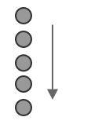
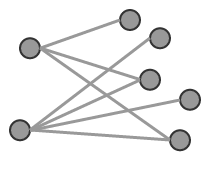
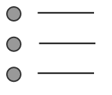
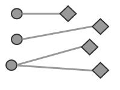
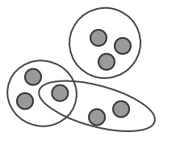

# 3.1. Requirements

To decide if a reference set is needed, successful implementers of SNOMED CT must clearly understand their requirements.

[Table 3.1-1](https://confluence.ihtsdotools.org/display/DOCRFSPG/3.1.+Requirements#Table-requirements "Requirements met by reference sets") shows some typical requirements that may be met using SNOMED CT reference sets. The examples in this table are not exhaustive, but instead illustrate common use cases in which the category of requirement is needed. T he table also shows the type (or types) of reference set that best meets each requirement. For more information on each requirement category, please click on the diagram to visit the relevant section.

Table 3.1-1: Requirements met by reference sets

REQUIREMENTS| EXAMPLE USE CASES| REFERENCE SET  
---|---|---  
**[<figure><figcaption>
***<em>[3.1.1. A Subset of Components](3.1.1.-A-Subset-of-Components</em>35985527.html)**|
</figcaption></figure>](3.1.1.-A-Subset-of-Components_35985527.html)  

  * [3.2.6.1. Constrain Value Sets](3.2.6.1.-Constrain-Value-Sets_35985629.html)
  * [3.2.3.2. Specifying Queries for Retrieval and Analysis](3.2.3.2.-Specifying-Queries-for-Retrieval-and-Analysis_35985611.html)
  * [3.2.5.2. Interface Terminology](3.2.5.2.-Interface-Terminology_35985663.html)

| [5.1 Simple Reference Set](5.1-Simple-Reference-Set_35985677.html)  
  
  
[<figure><figcaption>
<em> [3.2.1.4. Order Items for Search and Data Entry](3.2.1.4.-Order-Items-for-Search-and-Data-Entry</em>35985577.html)
</figcaption></figure>](3.1.2.-An-Ordered-List-of-Components_35985508.html)**[3.1.2. An Ordered List of Components](3.1.2.-An-Ordered-List-of-Components_35985508.html)**| 

  * [3.2.1.5. Alternative Hierarchical View](3.2.1.5.-Alternative-Hierarchical-View_35985573.html)

| [Ordered Reference Set](Ordered-Reference-Set_35985666.html)  
**[<figure><figcaption>
***<em>[3.1.3. A Set of Associations between Components](3.1.3.-A-Set-of-Associations-between-Components</em>35985514.html)**|
</figcaption></figure>](3.1.3.-A-Set-of-Associations-between-Components_35985514.html)  

  * [3.2.6.3.2. Representing Historical Associations](3.2.6.3.2.-Representing-Historical-Associations_35985650.html)
  * [3.2.1.6. Use Case Specific Associations](3.2.1.6.-Use-Case-Specific-Associations_35985582.html)

| [5.4 Association Reference Set](5.4-Association-Reference-Set_35985671.html)  
**[<figure><figcaption>
***<em>[3.1.4. A Set of Components Annotated with Additional Information](3.1.4.-A-Set-of-Components-Annotated-with-Additional-Information</em>35985521.html)**|
</figcaption></figure>](3.1.4.-A-Set-of-Components-Annotated-with-Additional-Information_35985521.html)  

  * [3.2.2.1. Linking Concepts to Web Resources](3.2.2.1.-Linking-Concepts-to-Web-Resources_35985597.html)
  * Link components to a textual advice

| [Annotation Reference Set](Annotation-Reference-Set_35985674.html)  
**[<figure><figcaption>
***<em>[3.1.5. A Set of Maps between SNOMED CT and Another Code System](3.1.5.-A-Set-of-Maps-between-SNOMED-CT-and-Another-Code-System</em>35985524.html)**|
</figcaption></figure>](3.1.5.-A-Set-of-Maps-between-SNOMED-CT-and-Another-Code-System_35985524.html)  

  * [3.2.3.1. Maps to Statistical Classifications](3.2.3.1.-Maps-to-Statistical-Classifications_35985624.html)
  * Link concepts to legacy codes and data, to support migration

| [5.2.9 Simple Map Reference Set](/pages/createpage.action?spaceKey=DOCRELFMT&title=5.2.9+Simple+Map+Reference+Set)[5.2.3.3 Complex and Extended Map from SNOMED CT Reference Sets](https://confluence.ihtsdotools.org/display/DOCRELFMT/5.2.3.3+Complex+and+Extended+Map+from+SNOMED+CT+Reference+Sets)  
**[<figure><figcaption>
***<em>[3.1.6. A Set of Sets of Components](3.1.6.-A-Set-of-Sets-of-Components</em>35985532.html)**|
</figcaption></figure>](3.1.6.-A-Set-of-Sets-of-Components_35985532.html)  

  * [3.2.6.2. Managing Value Sets](3.2.6.2.-Managing-Value-Sets_35985640.html)
  * [3.2.6.2. Managing Value Sets](3.2.6.2.-Managing-Value-Sets_35985640.html)

| [5.1 Simple Reference Set](5.1-Simple-Reference-Set_35985677.html)[5.2. Query Specification Reference Set](5.2.-Query-Specification-Reference-Set_35985685.html)  
  
  
  

