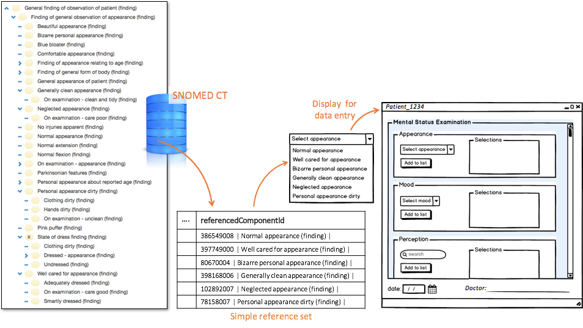

# 3.2.1.1. Constrain Data Entry

In many care settings, similar data sets are collected for each patient. Clinical consultations for many conditions involve repeatable sequences of data entry. These structured and predictable data entry requirements can be met using sets of customized data entry forms designed to collect appropriate data items. 

When using a structured data entry mechanism, SNOMED CT encoded data can be selected in a variety of ways. For example, the concepts or descriptions may be selected directly from a list, or the encoding may result from responses to simple choices or the entry of particular values. [Simple reference sets](5.1-Simple-Reference-Set_35985677.html) can ensure that SNOMED CT codes are entered effectively and consistently.

A simple reference set of concepts may be used to represent the options available in a small selection list. Similarly, a [simple reference set](5.1-Simple-Reference-Set_35985677.html) of descriptions or a [language reference set](5.9.-Language-Reference-Set_35985689.html) may specify the set of descriptions available for searching in a specific coded data element. The figure below illustrates how a [simple reference set](5.1-Simple-Reference-Set_35985677.html) is is used as a value set in a data entry form.

<figure><figcaption>
Figure 3.2.1.1-1: Using simple reference sets to constrain data entry
</figcaption></figure>

  

