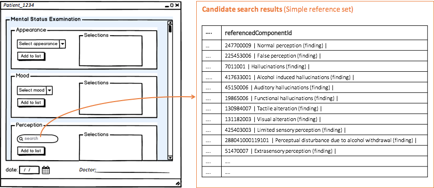

# 3.2.1.2. Constrain Searches

Simple reference sets enable text searches to be constrained to those components relevant to a particular field. The[SNOMED CT Search and Data Entry Guide](https://confluence.ihtsdotools.org/display/DOCSEARCH/SNOMED+CT+Search+and+Data+Entry+Guide) provides additional detail about how to make effective and efficient search capabilities using SNOMED CT. The figure below illustrates the use of a [simple reference set](https://github.com/IHTSDO/snomedct-refset-guide/blob/main/3%20requirements-and-use-cases/3.2%20use-cases/3.2.1%20search-and-data-entry/5.1-Simple-Reference-Set_35985677.html) to constrain the values returned by a text search in a data entry form. Additionally, dedicated search features support searching the content of the reference set.

<figure><figcaption>
Figure 3.2.1.2-1: Using simple reference sets to constrain searches
</figcaption></figure>
