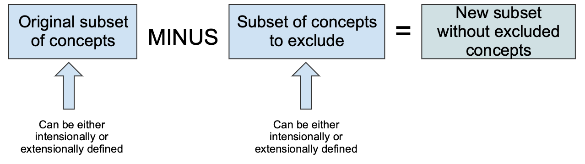

# 3.2.1.3. Exclude Content

Even though subsets are typically used to specify content for inclusion, some situations may require particular components to be excluded from another set. Excluding sets of SNOMED CT components can be used to prevent certain concepts appearing in particular search and data entry items.

Like every subset of SNOMED CT components, it is possible to define the subset for exclusion either intensionally or extensionally . This is illustrated in the figure below. When intensionally defined, a [query specification reference set](https://github.com/IHTSDO/snomedct-refset-guide/blob/main/3%20requirements-and-use-cases/3.2%20use-cases/3.2.1%20search-and-data-entry/5.2.-Query-Specification-Reference-Set_35985685.html) can be used for the intensional definition, and a [simple reference set](https://github.com/IHTSDO/snomedct-refset-guide/blob/main/3%20requirements-and-use-cases/3.2%20use-cases/3.2.1%20search-and-data-entry/5.1-Simple-Reference-Set_35985677.html) can be used for the expansion of the set.

<figure><figcaption>
Figure 3.2.1.3-1: Subsets for excluding content can be either intensionally or extensionally defined
</figcaption></figure>
