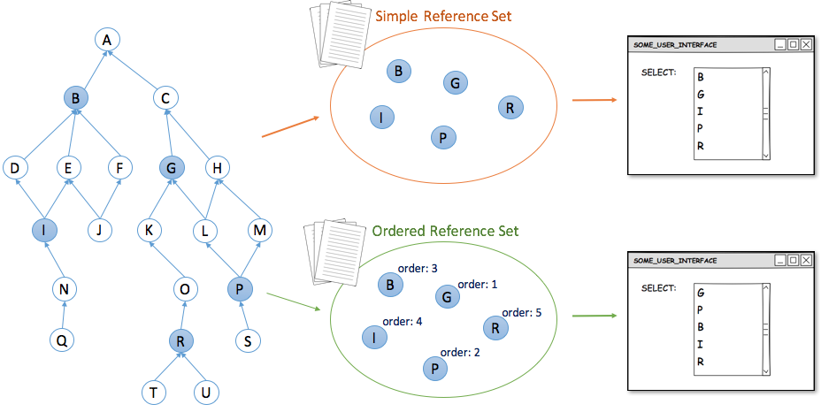
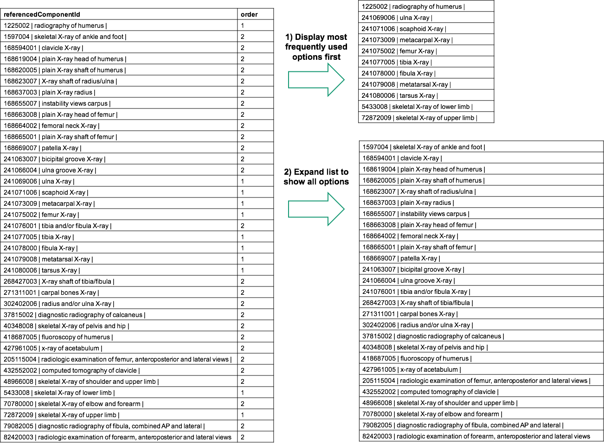

# 3.2.1.4-order-items-for-search-and-data-entry

## 3.2.1.4. Order Items for Search and Data Entry

The criteria f or a successful implementation of SNOMED CT includes the customization of SNOMED CT to meet user needs. The order in which SNOMED CT components are displayed is often important for data entry and searching. This topic is further explored in the [SNOMED CT Search and Data Entry Guide](https://confluence.ihtsdotools.org/display/DOCSEARCH/SNOMED+CT+Search+and+Data+Entry+Guide). In general, rational ordering of selectable items depends on the nature of the application and its operating environment. The table below shows examples of ordering data entry items and search results rationally.

Table 3.2.1.4-1: Examples of rational ordering

| Approach                | Description                                                                                                                                                         | Example Uses                                                             | Reference Set                                                                                                                                                                                                                |
| ----------------------- | ------------------------------------------------------------------------------------------------------------------------------------------------------------------- | ------------------------------------------------------------------------ | ---------------------------------------------------------------------------------------------------------------------------------------------------------------------------------------------------------------------------- |
| **Sequential ordering** | Annotating each subset member with an integer, which specify the consecutive order of the members. Two subset members do not have the same number assigned to them. | Displaying descriptions sequentially according to their specified order. | [Ordered component reference set](https://github.com/IHTSDO/snomedct-refset-guide/blob/main/3%20requirements-and-use-cases/3.2%20use-cases/3.2.1%20search-and-data-entry/5.3.-Ordered-Component-Reference-Set_45527039.html) |

**Prioritization**| Annotating each subset member with a an integer, which specify a priority order. Two or more subset members may have the same number assigned to them.\
\| Showing concepts with a high priority before their siblings using hierarchical display results.

* Display search results in priority order
  * Results with same rank ordered by shortest or closest match
* Displaying a rank indicator in search result list

\| [Ordered component reference set](https://github.com/IHTSDO/snomedct-refset-guide/blob/main/3%20requirements-and-use-cases/3.2%20use-cases/3.2.1%20search-and-data-entry/5.3.-Ordered-Component-Reference-Set_45527039.html)

Initially listing concepts and associated descriptions with a priority above a specified threshold and requiring additional steps to access those assigned a lower priority.

* Initial search is conducted on components with highest priority
* Allow search to be extended to lower priorities
  * If no high priority matches
  * If user requests more matches

## Sequential Ordering

Displaying items for data entry in a rational way typically involves organizing the values in a selection list in an order that is logical for the end users. As illustrated in the figure below, an [ordered reference set](https://github.com/IHTSDO/snomedct-refset-guide/blob/main/3%20requirements-and-use-cases/3.2%20use-cases/3.2.1%20search-and-data-entry/Ordered-Reference-Set_35985666.html) can be used to specify the order in which SNOMED CT components should be displayed.

<figure><figcaption><p>Figure 3.2.1.4-1: Example of how an ordered reference set can be used to order items in a drop down list</p></figcaption></figure>

Examples of presenting concepts (or descriptions) in an order that is rational or helpful for a particular purpose include:

* ```
  * Displaying numbered body parts, such as fingers, cranial nerves or vertebrae, in numeric order
  ```
  * Displaying ordinal values, such as frequencies, severities or stages, from lowest to highest

The table below shows how the order of cranial nerves can be specified in an [ordered component reference set](https://github.com/IHTSDO/snomedct-refset-guide/blob/main/3%20requirements-and-use-cases/3.2%20use-cases/3.2.1%20search-and-data-entry/5.3.-Ordered-Component-Reference-Set_45527039.html). The**order** attribute is used to indicate the sequential order of each subset member.

| refsetId        | referencedComponentId              | order                                                       |
| --------------- | ---------------------------------- | ----------------------------------------------------------- |
| \[ 609999999102 | Cranial nerve simple reference set | ]\(http://snomed.org/fictid#609999999102 "(eg:609999999102) |
| \[ 609999999102 | Cranial nerve simple reference set | ]\(http://snomed.org/fictid#609999999102 "(eg:609999999102) |
| \[ 609999999102 | Cranial nerve simple reference set | ]\(http://snomed.org/fictid#609999999102 "(eg:609999999102) |
| \[ 609999999102 | Cranial nerve simple reference set | ]\(http://snomed.org/fictid#609999999102 "(eg:609999999102) |
| \[ 609999999102 | Cranial nerve simple reference set | ]\(http://snomed.org/fictid#609999999102 "(eg:609999999102) |
| \[ 609999999102 | Cranial nerve simple reference set | ]\(http://snomed.org/fictid#609999999102 "(eg:609999999102) |
| \[ 609999999102 | Cranial nerve simple reference set | ]\(http://snomed.org/fictid#609999999102 "(eg:609999999102) |
| \[ 609999999102 | Cranial nerve simple reference set | ]\(http://snomed.org/fictid#609999999102 "(eg:609999999102) |
| \[ 609999999102 | Cranial nerve simple reference set | ]\(http://snomed.org/fictid#609999999102 "(eg:609999999102) |
| \[ 609999999102 | Cranial nerve simple reference set | ]\(http://snomed.org/fictid#609999999102 "(eg:609999999102) |
| \[ 609999999102 | Cranial nerve simple reference set | ]\(http://snomed.org/fictid#609999999102 "(eg:609999999102) |
| \[ 609999999102 | Cranial nerve simple reference set | ]\(http://snomed.org/fictid#609999999102 "(eg:609999999102) |

Prioritization

Some situations may require a set of subset members to be grouped. For example, a set of concepts may need to be grouped based on how frequently they are used within a particular specialty, department or data entry scenario. In this case, an [ordered association reference set](https://github.com/IHTSDO/snomedct-refset-guide/blob/main/3%20requirements-and-use-cases/3.2%20use-cases/3.2.1%20search-and-data-entry/5.5-Ordered-Association-Reference-Set_45527036.html) may be used for prioritization, instead of a purely sequential ordering of each member. Prioritization is similar to sequential ordering, but also supports assigning the same rank to multiple components. A common use of prioritization is to support rational ordering of concepts or descriptions for display of data entry items and search results. More advanced uses may also be required, for example where the priority order is used to trigger certain decision support features or data entry options.

<figure><figcaption><p>Figure 3.2.1.4-2: Using a priority order to display data entry options</p></figcaption></figure>
