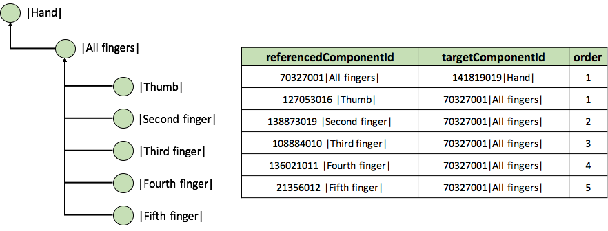

# 3.2.1.5. Alternative Hierarchical View

[Ordered association reference sets](https://github.com/IHTSDO/snomedct-refset-guide/blob/main/3%20requirements-and-use-cases/3.2%20use-cases/3.2.1%20search-and-data-entry/5.5-Ordered-Association-Reference-Set_45527036.html) can be used to specify and display a customized navigation hierarchy. Alternative hierarchical representations of SNOMED CT can support data entry by satisfying the requirements of a specific use case, and addressing some of the challenges of displaying an unordered polyhierarchy (as defined by SNOMED CT's subtype structure).

The figure below shows the way a navigation hierarchy is represented. The example reference set contains a set of description components used to describe finger structures.

The | All fingers | components is linked to the | Hand |, and the | Thumb | is linked to the | All fingers component | The | Thumb | is placed first because it has the order value 1. Similarly, the components for | Second finger |, | Third finger |, | Fourth finger | and | Fifth finger | are also linked to the | All finger | component in the order specified by the order value. As shown in the figure the direction of the associations goes from the referenceComponentId to the linkedToId, so the components referenced by the linkedToId are used to form the groups specified in the hierarchy

| id | effective Time | active | moduleId    | refsetId     | refsetId\_term                        | referencedComponentId | referencedComponentId\_term | targetComponentId | targetComponentId\_term | order |
| -- | -------------- | ------ | ----------- | ------------ | ------------------------------------- | --------------------- | --------------------------- | ----------------- | ----------------------- | ----- |
| …  | 20160731       | 1      | 19999999103 | 159999999105 | Associations as ordered reference set | 70327001              | All fingers                 | 141819019         | Hand                    | 1     |
| …  | 20160731       | 1      | 19999999103 | 159999999105 | Associations as ordered reference set | 127053016             | Thumb                       | 70327001          | All fingers             | 1     |
| …  | 20160731       | 1      | 19999999103 | 159999999105 | Associations as ordered reference set | 138873019             | Second finger               | 70327001          | All fingers             | 2     |
| …  | 20160731       | 1      | 19999999103 | 159999999105 | Associations as ordered reference set | 108884010             | Third finger                | 70327001          | All fingers             | 3     |
| …  | 20160731       | 1      | 19999999103 | 159999999105 | Associations as ordered reference set | 136021011             | Fourth finger               | 70327001          | All fingers             | 4     |
| …  | 20160731       | 1      | 19999999103 | 159999999105 | Associations as ordered reference set | 21356012              | Fifth finger                | 70327001          | All fingers             | 5     |

<figure><figcaption>
Figure 3.2.1.5-1: Navigation hierarchy example.
</figcaption></figure>

The usability of the [ordered association reference set](https://github.com/IHTSDO/snomedct-refset-guide/blob/main/3%20requirements-and-use-cases/3.2%20use-cases/3.2.1%20search-and-data-entry/5.5-Ordered-Association-Reference-Set_45527036.html) for representing alternative hierarchy can be maximized by:

* Constraining the number of levels in the hierarchy and/or the number of concepts at each level.
  * Using many levels, each with a relatively small number of concepts, allows the most common options to be displayed with a higher priority.
  * Using fewer levels, each with a relatively large number of concepts can reduce the number of levels that needs to be navigated to find an appropriate concept.
  * Options that are never (or rarely) used can be excluded from a customized navigation hierarchy to limit the range of choices available.
* Ordering each concept at the same hierarchical level, to match user preferences or to facilitate faster access to more frequently used options.
* Ensuring that the navigation hierarchy is adapted to meet the requirements of a specific use case, without affecting the correctness of the subtype hierarchy (and associated logical inferences).
