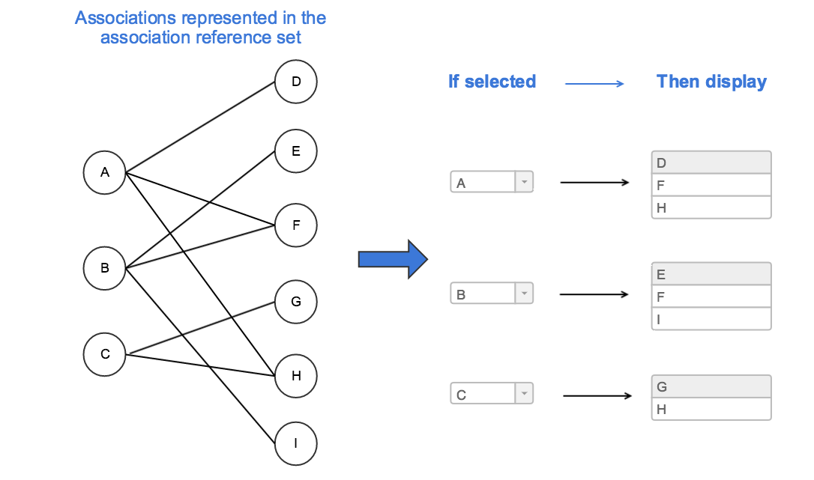

# 3.2.1.6. Use Case Specific Associations

SNOMED CT represents relationships between concepts that are necessarily (i.e. always) true. However, other relationships between concepts may exist in specific situations or use cases. An [5.4 Association Reference Set](https://github.com/IHTSDO/snomedct-refset-guide/blob/main/3%20requirements-and-use-cases/3.2%20use-cases/3.2.1%20search-and-data-entry/5.4-Association-Reference-Set_35985671.html) can be used to represent these additional relationships, which are not necessarily true, but which are needed for a specific purpose. Examples include:

* Associations between procedures and the clinical findings that serve as an indication for that procedure. These associations enable relevant procedures to be displayed when specific clinical findings are selected.
* Associations between a medication and its known side effects. These associations enable relevant side effects to be displayed when specific medications are selected
* Associations between a disease and the set of possible symptoms that may be experienced. These associations enable relevant diseases to be displayed when a set of symptoms are selected.

[5.4 Association Reference Set](https://github.com/IHTSDO/snomedct-refset-guide/blob/main/3%20requirements-and-use-cases/3.2%20use-cases/3.2.1%20search-and-data-entry/5.4-Association-Reference-Set_35985671.html) can be used to constrain (or guide) data entry into fields, where the value is dependent on (or has some type of association with) the value of another field. While other technical solutions are possible, the [5.2.1.4 Association Reference Set](https://confluence.ihtsdotools.org/display/DOCRELFMT/5.2.1.4+Association+Reference+Set) provides a standardized way of representing and distributing the associations required to support this functionality. The figure below illustrates how an [5.2.1.4 Association Reference Set](https://confluence.ihtsdotools.org/display/DOCRELFMT/5.2.1.4+Association+Reference+Set) could be used for this purpose.

<figure><figcaption>
Figure 3.2.1.6-1: Using associations to define dependencies between fields
</figcaption></figure>
