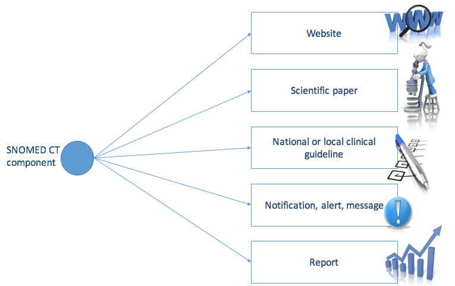

# 3.2.2. Knowledge Linkage

Linking SNOMED CT components to knowledge resources (such as clinical guidelines or decision support systems) is a way of adding significant value to electronic health records.

The diagram below illustrates the range of use cases for knowledge linkage including presenting alerts to the user, displaying relevant clinical guidelines and treatment protocols, or automatically populating an order, message or report.

<figure><figcaption>
Figure 3.2.2-1: Components annotated with additional information can support different levels of knowledge linkage
</figcaption></figure>

Reference sets can be used to enable knowledge linkage in different ways. Examples include but are not limited to:

* [Annotation reference sets](../../../3%20requirements-and-use-cases/3.2%20use-cases/3.2.2%20knowledge-linkage/Annotation-Reference-Set_35985674.html) can be used to add a linkage between a referenced component and a string-representation of a specific knowledge resources.
* [Association reference sets](../../../3%20requirements-and-use-cases/3.2%20use-cases/3.2.2%20knowledge-linkage/5.4-Association-Reference-Set_35985671.html) can be used to create associations between SNOMED CT components to enable documentation and/or decision support, using the associations as a simple rule-representation.
* [Simple map reference sets](../../../pages/createpage.action), [complex and extended map reference sets](https://confluence.ihtsdotools.org/display/DOCRELFMT/5.2.3.3+Complex+and+Extended+Map+from+SNOMED+CT+Reference+Sets) can be used to define maps from other code systems to SNOMED CT, and function as a linkage to sources of non SNOMED CT-encoded information

For a more detailed use case example, please refer to the following section:

* [3.2.2.1. Linking Concepts to Web Resources](../../../3%20requirements-and-use-cases/3.2%20use-cases/3.2.2%20knowledge-linkage/3.2.2.1.-Linking-Concepts-to-Web-Resources_35985597.html)
