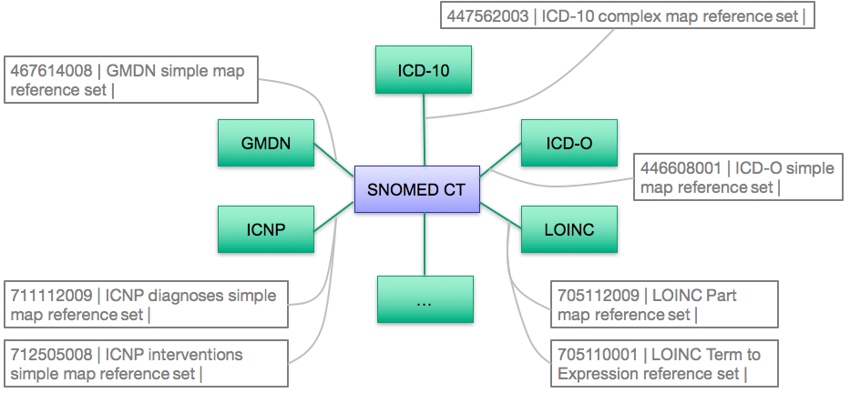

# 3.2.3.1. Maps to Statistical Classifications

Clinical information recorded using SNOMED CT may include data that is relevant to reports, statistical returns, billing claims, etc. that need to be encoded using a specific code system or a statistical classification such as ICD-10. Mapping allows relevant information to be used for those purposes, minimizing the requirement for additional manual data entry. 

Maps are represented as reference sets, which are either of type [simple](/pages/createpage.action?spaceKey=DOCRELFMT&title=5.2.9+Simple+Map+Reference+Set), [complex and extended map reference sets](https://confluence.ihtsdotools.org/display/DOCRELFMT/5.2.3.3+Complex+and+Extended+Map+from+SNOMED+CT+Reference+Sets). Special cases may also occur, which require a customized reference set to represent the map. An example of this is the [ 705110001 | LOINC Term to Expression reference set|](http://snomed.info/id/705110001 "705110001 | LOINC Term to Expression reference set |") , which is used to link LOINC Terms to SNOMED CT expressions. The standard reference set format do not support maps to SNOMED CT expressions. Hence, the type of map reference set to use depends on the features that need to be supported by the map. 

[Simple map reference sets](/pages/createpage.action?spaceKey=DOCRELFMT&title=5.2.9+Simple+Map+Reference+Set) support mapping SNOMED CT codes to a single code or a combination of codes in a target code system. However simple maps are usually only appropriate where there is an equivalent map between SNOMED CT and the values in the other code system. 

[Complex and extended map reference sets](https://confluence.ihtsdotools.org/display/DOCRELFMT/5.2.3.3+Complex+and+Extended+Map+from+SNOMED+CT+Reference+Sets) enable the representation of: 

  * Maps from a single SNOMED CT concept to a combination of codes (rather than a single code) in the target scheme 
  * Maps from a single SNOMED CT concept to choice of codes in the target scheme. In this case, the resolution of the choices may involve: 
    * Manual selection supported by advisory notes
    * Automated selection based on rules that test other relevant characteristics in the source data (e.g. age and sex of the subject, presence or absence of co-existing conditions, etc.) 
    * A combination of automated processing with manual confirmation or selection where rules are insufficient to make the necessary decisions 

The completeness of mapping between two code systems depends on the scope, level of detail provided by the two code systems and the precision of mapping required to safely meet the intended mapping use case. 

The figure below shows an except of some of the reference sets for maps between SNOMED CT and other code systems, which are available with the International Edition of SNOMED CT. However, local maps may also be developed and applied as part of an Extension to SNOMED CT. 

<figure><figcaption>
Figure 3.2.3.1-1: Excerpt of mappings in the SNOMED CT International Edition
</figcaption></figure>

