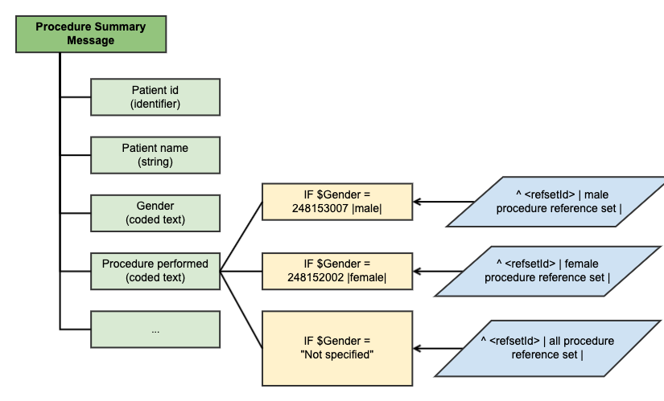

# 3.2.4.1. Constraining the Coded Content of Messages

Communication specifications define structures designed to meet particular requirements. For example, recording a decision to prescribe a particular pharmaceutical product or substance might trigger an electronic prescription sent to the pharmacy. Reference sets may also be used to specify the allowed values in messages and for constraining the codable elements in data entry models. For some bindings it may be relevant to apply certain conditions, to enable that one value set is displayed given a specified criteria, and another value set is displayed given another criteria (or set of criterions). An example of such conditional value set binding[1](https://confluence.ihtsdotools.org/display/DOCRFSPG/3.2.4.1.+Constraining+the+Coded+Content+of+Messages#Footnote1) is illustrated below.

<figure><figcaption></figcaption></figure>

Figure 3.2.4.1-1: Conditional value set binding

Table 3.2.4.1-1: Types of Reference Sets applicable for messages

| Type                                  | Description                                                                                                                                                                                                                                                                                                                                                                                                                                                                                                                                                                                                                                                                   |
| ------------------------------------- | ----------------------------------------------------------------------------------------------------------------------------------------------------------------------------------------------------------------------------------------------------------------------------------------------------------------------------------------------------------------------------------------------------------------------------------------------------------------------------------------------------------------------------------------------------------------------------------------------------------------------------------------------------------------------------- |
| **Simple reference sets**             | A [simple reference set](https://github.com/IHTSDO/snomedct-refset-guide/blob/main/3%20requirements-and-use-cases/3.2%20use-cases/3.2.4%20communication/5.1-Simple-Reference-Set_35985677.html) may be used to represent a SNOMED CT-based [value set](https://confluence.ihtsdotools.org/display/DOCGLOSS/value+set) applicable to a particular field in a message. The items to be populated in a particular field in the message can be constrained by filtering searches so that only[concepts](https://confluence.ihtsdotools.org/display/DOCGLOSS/concept) within that [reference set](https://confluence.ihtsdotools.org/display/DOCGLOSS/reference+set) are returned. |
| **Query specification reference set** | [Query specification reference sets](https://github.com/IHTSDO/snomedct-refset-guide/blob/main/3%20requirements-and-use-cases/3.2%20use-cases/3.2.4%20communication/5.2.-Query-Specification-Reference-Set_35985685.html) may be used to represent a set of [intensionally](https://confluence.ihtsdotools.org/display/DOCGLOSS/intensional+subset+definition) defined SNOMED CT subsets, where each subset represents the value set for a particular field in a communication messages. One query specification reference set may therefore be used to hold all value sets applicable within a single communication messages, or within a set of messages.                   |

| Footnotes Ref                                                                                                                  | Notes                                                                                                                                                                                                                                                |
| ------------------------------------------------------------------------------------------------------------------------------ | ---------------------------------------------------------------------------------------------------------------------------------------------------------------------------------------------------------------------------------------------------- |
| [1](https://confluence.ihtsdotools.org/display/DOCRFSPG/3.2.4.1.+Constraining+the+Coded+Content+of+Messages#FootnoteMarker1-0) | **Value set bindings** are used to express the valid values used to populate an information model artifact. For example the value set used to populate a drop down menu in a user interface or the valid values for a coded text in a message model. |
