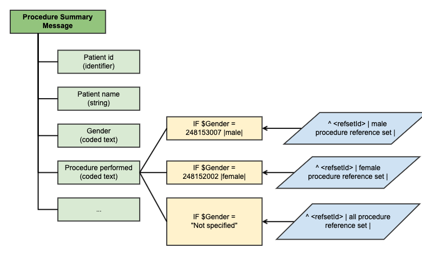

# Communication

Messages and communication services are a means of exchanging data and thus enable effective and efficient communication among healthcare professionals and between patients and providers. SNOMED CT is important for communication because it serves as a semantic foundation for the meaning expressed in a message. Hence, SNOMED CT can ensure consistent and accurate representation of the information communicated, and support correct interpretation of the clinical information within a message.

Communicating clinical data through messages support a range of purposes, including:

* Delivering accurate, accessible, and actionable health information that is targeted or tailored.
* Facilitating the meaningful use and exchange of health information among healthcare professionals.
* Supporting shared decision-making between patients and providers.
* Providing personalized self-management tools and resources.
* Building social support networks.
* Increasing health literacy skills.

## Use of SNOMED CT in Messages

Healthcare messages include fields that can be populated with codes from clinical coding schemes. [SNOMED CT](https://confluence.ihtsdotools.org/display/DOCGLOSS/SNOMED) provides [concept identifiers](https://confluence.ihtsdotools.org/display/DOCGLOSS/concept+identifier) as a means of encoding [concepts](https://confluence.ihtsdotools.org/display/DOCGLOSS/concept). These [concept identifiers](https://confluence.ihtsdotools.org/display/DOCGLOSS/concept+identifier) are suitable for use in appropriate fields of many clinical messages.

Implementations of clinical messaging typically constrain the range of values that can be applied to particular fields several reasons for this are listed in the following table.

Table 3.2.4-1: Reasons for constraining the content of fields in clinical messages

| Reason                                                                                   | Example                                                                                                                                                                                                                                                                                                                   |
| ---------------------------------------------------------------------------------------- | ------------------------------------------------------------------------------------------------------------------------------------------------------------------------------------------------------------------------------------------------------------------------------------------------------------------------- |
| To ensure that the information encoded is meaningful as a value for the specified field. | A field that is intended to describe the nature of investigation may contain a code that means "Serum glucose measurement" but should not contain a code that means "Hypoglycemia."                                                                                                                                       |
| To ensure that receiving application is able to process the message.                     | A locally added code value may be valid in a particular application but should not be used if the receiving application needs to retrieve, process or analyze the coded part of the message.                                                                                                                              |
| To ensure adequate detail and specificity.                                               | A field used to report an operative procedure could contain a code for "Abdominal procedure." However, this would not be adequate to meet the business purpose served by a message.                                                                                                                                       |
| To avoid unnecessary detail or diversity.                                                | A biochemical investigation could be reported using a code that represents various detailed aspects of the method used to perform the investigation. Such details may be unnecessary to a clinician and may complicate the analysis, charting and graphing of a series of results reported at different levels of detail. |

For a more detailed use case example, please refer to the following section:

## Constraining the Coded Content of Messages

Communication specifications define structures designed to meet particular requirements. For example, recording a decision to prescribe a particular pharmaceutical product or substance might trigger an electronic prescription sent to the pharmacy. Reference sets may also be used to specify the allowed values in messages and for constraining the codable elements in data entry models. For some bindings it may be relevant to apply certain conditions, to enable that one value set is displayed given a specified criteria, and another value set is displayed given another criteria (or set of criterions). An example of such conditional [value set binding](#user-content-fn-1)[^1] is illustrated below.

<figure><figcaption>
Conditional value set binding
</figcaption></figure>

Table: Types of Reference Sets applicable for messages

| Type                                  | Description                                                                                                                                                                                                                                                                                                                                                                                                                                                                                                                                                                                                                                                                    |
| ------------------------------------- | ------------------------------------------------------------------------------------------------------------------------------------------------------------------------------------------------------------------------------------------------------------------------------------------------------------------------------------------------------------------------------------------------------------------------------------------------------------------------------------------------------------------------------------------------------------------------------------------------------------------------------------------------------------------------------ |
| **Simple reference sets**             | A [simple reference set](https://github.com/IHTSDO/snomedct-refset-guide/blob/main/3%20requirements-and-use-cases/3.2%20use-cases/3.2.4%20communication/5.1-Simple-Reference-Set_35985677.html) may be used to represent a SNOMED CT-based [value set](https://confluence.ihtsdotools.org/display/DOCGLOSS/value+set) applicable to a particular field in a message. The items to be populated in a particular field in the message can be constrained by filtering searches so that only [concepts](https://confluence.ihtsdotools.org/display/DOCGLOSS/concept) within that [reference set](https://confluence.ihtsdotools.org/display/DOCGLOSS/reference+set) are returned. |
| **Query specification reference set** | [Query specification reference sets](https://github.com/IHTSDO/snomedct-refset-guide/blob/main/3%20requirements-and-use-cases/3.2%20use-cases/3.2.4%20communication/5.2.-Query-Specification-Reference-Set_35985685.html) may be used to represent a set of [intensionally](https://confluence.ihtsdotools.org/display/DOCGLOSS/intensional+subset+definition) defined SNOMED CT subsets, where each subset represents the value set for a particular field in a communication messages. One query specification reference set may therefore be used to hold all value sets applicable within a single communication messages, or within a set of messages.                    |

[^1]: **Value set bindings** are used to express the valid values used to populate an information model artifact. For example the value set used to populate a drop down menu in a user interface or the valid values for a coded text in a message model.
