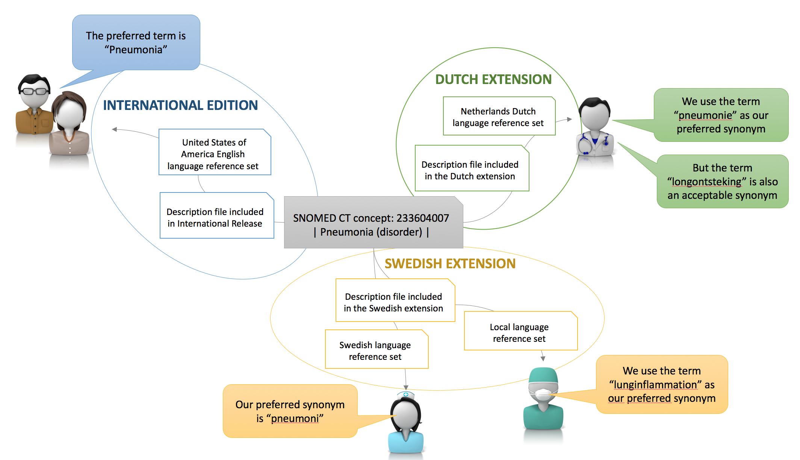

# 3.2.5.1. Indications of Acceptability of Descriptions

When SNOMED CT is being used as an interface terminology, the preferred term for each concept should be used as the default for display on the user interface. Each concept may have a different preferred term in different languages, dialects, specialties or care settings, and so these can be configured for a specific clinical environment. Preferred terms and acceptable synonyms are defined in SNOMED CT using a [language reference set](5.9.-Language-Reference-Set_35985689.html), which references the subset of descriptions used in a given language, dialect, specialty or care setting. Two language references sets are distributed with the International Edition of SNOMED CT (for US-English and UK-English), and various member countries distribute their own national language reference sets. Additional language reference sets may be created at the regional, specialty, institute or software product level to truly customize the local user’s experience. 

The most common use case for language reference sets is to specify the acceptable and preferred terms for use within a particular country or region. As illustrated below, descriptions associated with a single SNOMED CT concept can be specified as a preferred or acceptable synonym.

<figure><figcaption>
Figure 3.2.5.1-1: Language reference sets and its relation to Description files
</figcaption></figure>

  

  

