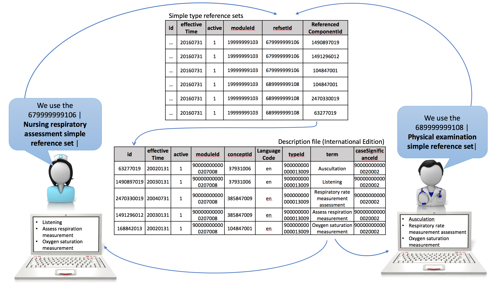
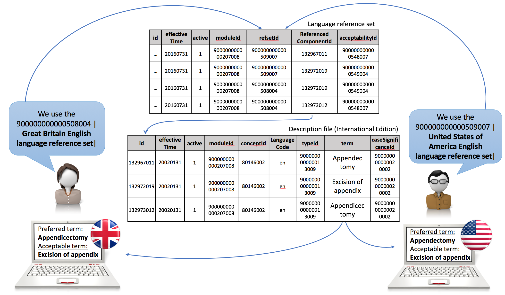

# 3.2.5.2-interface-terminology

Using SNOMED CT at the user interface level can be accomplished in various ways using different types of reference sets. Approaches include:

* Using SNOMED CT directly as interface terminology
  * using a [simple reference set](https://github.com/IHTSDO/snomedct-refset-guide/blob/main/3%20requirements-and-use-cases/3.2%20use-cases/3.2.5%20language-and-dialect/5.1-Simple-Reference-Set_35985677.html) of descriptions used for display
  * using a [language reference set](https://github.com/IHTSDO/snomedct-refset-guide/blob/main/3%20requirements-and-use-cases/3.2%20use-cases/3.2.5%20language-and-dialect/5.9.-Language-Reference-Set_35985689.html) which specifies preferred and acceptable synonyms
* Using a separate interface terminology which is mapped to SNOMED CT
  * using a simple map reference set to represent the linkage between the interface terminology and SNOMED CT concepts.

## Using SNOMED CT as an Interface Terminology

### Simple Reference Set of Descriptions

As SNOMED CT descriptions can be used directly as an interface terminology, subsets of SNOMED CT descriptions may be directly shown to a clinician at the user interface . These description subsets may be customized

* for a specific language or dialect (such as Spanish or Australian English)
* for a given clinical specialty (such as cardiology or oncology)
* for a user type (such as a doctor, nurse or patient)
* a care setting (such as an aged care home or a hospital inpatient ward) or
* a specific document or field in a health record

For each of these use cases, the set of acceptable terms and the preferred term for that clinical use can be identified. However, when searching SNOMED CT it is recommended that any term that is considered "acceptable" for use in a given context should be available to support searching for an appropriate concept, while the [preferred term](https://confluence.ihtsdotools.org/display/DOCGLOSS/preferred+term) is often used to confirm the intended meaning of the selection.

Representing a subset of descriptions can be done using a [simple reference set](https://github.com/IHTSDO/snomedct-refset-guide/blob/main/3%20requirements-and-use-cases/3.2%20use-cases/3.2.5%20language-and-dialect/5.1-Simple-Reference-Set_35985677.html), as illustrated in the diagram below. However, other types of reference set types may be feasible if additional features are required, such as specifying which descriptions are preferred or acceptable (language reference set), ordering or prioritizing the descriptions (ordered reference set), annotating the description with some textual information (annotation reference set) or associating the descriptions to other components (association reference set).

<figure><figcaption>
Figure 3.2.5.2-1: Using a simple reference set of descriptions to specify terms for display.
</figcaption></figure>

### Language Reference Set

While a simple type reference set can be used for defining a subset of descriptions, a [language reference set](https://github.com/IHTSDO/snomedct-refset-guide/blob/main/3%20requirements-and-use-cases/3.2%20use-cases/3.2.5%20language-and-dialect/5.9.-Language-Reference-Set_35985689.html) is designed to support indication of language and dialect preferences through the addition of the 'acceptability' attribute. This allows preferred and acceptable descriptions to be defined for any context of use, including within a particular country or region, within a clinical specialty or care setting, within an organization or department, or for a specific type of user.

The table below shows an excerpt from two language reference sets, which are both distributed with the International release of SNOMED CT, i.e. the [900000000000509007 | United States of America English language reference set|](http://snomed.info/id/900000000000509007) and the [900000000000508004 | Great Britain English language reference set|](http://snomed.info/id/900000000000508004) . Both reference sets reference Descriptions available in the Description file in the International Edition.

Table 3.2.5.2-1: Excerpt from the | United States of America English language reference set | and the | Great Britain English language reference set |, which are both distributed with the International release of SNOMED CT.

| id | effective Time | active | moduleId           | moduleId\_term        | refsetId           | refsetId\_term                                          | referencedComponentId | ReferencedComponentId\_term | acceptabilityId    | acceptabilityId\_term |
| -- | -------------- | ------ | ------------------ | --------------------- | ------------------ | ------------------------------------------------------- | --------------------- | --------------------------- | ------------------ | --------------------- |
| …  | 20160731       | 1      | 900000000000207008 | SNOMED CT core module | 900000000000509007 | United States of America English language reference set | 132967011             | Appendectomy                | 900000000000548007 | Preferred             |
| …  | 20160731       | 1      | 900000000000207008 | SNOMED CT core module | 900000000000509007 | United States of America English language reference set | 132972019             | Excision of appendix        | 900000000000549004 | Acceptable            |
| …  | 20160731       | 1      | 900000000000207008 | SNOMED CT core module | 900000000000508004 | Great Britain English language reference set            | 132972019             | Excision of appendix        | 900000000000549004 | Acceptable            |
| …  | 20160731       | 1      | 900000000000207008 | SNOMED CT core module | 900000000000508004 | Great Britain English language reference set            | 132973012             | Appendicectomy              | 900000000000548007 | Preferred             |

The diagram below illustrate the use of language reference sets and show the relation between the language reference set and the description file. Even though three descriptions are specified for the same concept in the description file, the language reference set specifies which of these descriptions are preferred and acceptable within a given language, dialect or organization. If a description is not referenced in the language reference set, then that particular description can be regarded as not acceptable within the context where the language reference set apply.

<figure><figcaption>
Figure 3.2.5.2-2: Use of language reference sets to specify preferred and acceptable descriptions for specific contexts.
</figcaption></figure>

### Benefits of using SNOMED CT as Interface Terminology

The benefits of directly using the terms from SNOMED CT on the user interface are that

* no mapping is required from the clinical phrases to the clinical meanings. The design of SNOMED CT already include human-readable representations of concepts
* the clinical intent of a selection can be confirmed if required using other terms linked to the same concept (such as the ‘Preferred Term’)
* the equivalence of the terms to the clinical meaning is ensured by using quality authoring processes
* the higher quality of SNOMED CT coding can consequently lead to higher quality analytics results
* there are standard mechanisms provided by SNOMED CT for distinguishing acceptable and preferred terms in different clinical contexts
* where appropriate, the standardization of preferred terms can improve patient safety (in areas such as medication management)

### Considerations

* This approach may require a transition of the user experience. However, it should be noted that new descriptions may be added to SNOMED CT to meet the expectations of the users.
* Subsets need to be created and maintained to support users in searching for and recording the appropriate SNOMED CT concepts.

## Using a Separate Interface Terminology

An implementer who is motivated to introduce SNOMED CT records, but who is also keen to keep using an existing interface terminology, may choose to map between the interface terminology and SNOMED CT to enable that SNOMED CT is used for storage. Using this approach each item in the interface terminology is bound (or mapped) to an appropriate SNOMED CT concept. When the interface term is selected, the identifier of the bound SNOMED CT concept is stored in the record. It is important when an interface terminology is being used that the mapping to SNOMED CT is of sufficient quality (ideally equivalent) to support the use cases for which the data will be used. Using an interface terminology, for example, may be useful for structured data entry, where only part of the meaning is represented by the selected term, and the rest by the surrounding interface context. A simple map reference set can be used to represent the map between the interface terminology and SNOMED CT, in the case where there are a 1:1 map between each term in the interface terminology and SNOMED CT concepts.
