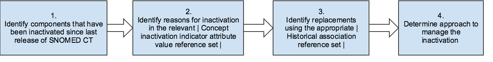

# 3.2.6.3. Managing Component Inactivation

When a component that is a member of a reference set is inactivated, the person maintaining the reference set needs to decide whether a change is required. This depends on the intended use of the reference set being maintained. In the case of a reference set that is being used to constrain data entry, inactive concepts need to be removed from the reference set or replaced by an appropriate active concept. In other reference sets it may be permissible, or even required, to retain an inactive concept in a reference set (for example if a reference set is used in the criteria for a report which may be applied to historical data).

The following figure and subsequent description introduce the overall process for identifying inactive components and using released reference sets to determine reasons for inactivation and potential replacements. 

<figure></figure>

Figure 3.2.6.3-1: Process of determine reasons for inactivation and alternative replacements

  

  1. One approach to identify the components that have been inactivated since the last release, is to compare snapshot of previous release with current delta release.
  2. The reasons for inactivation can be looked up in the  [ 900000000000480006 | Attribute value type reference set|](http://snomed.info/id/900000000000480006 "900000000000480006 | Attribute value type reference set |") for the particular component type, for example the  [ 900000000000489007 | Concept inactivation indicator attribute value reference set|](http://snomed.info/id/900000000000489007 "900000000000489007 | Concept inactivation indicator attribute value reference set |") . The reason is represented by the value of the valueId attribute. For further information, see [3.2.6.3.1. Representing Reasons for Component Inactivation](3.2.6.3.1.-Representing-Reasons-for-Component-Inactivation_35985652.html).

  3. The possible replacements for the components that have been inactivated can be determined in the appropriate  [ 900000000000522004 | Historical association reference set|](http://snomed.info/id/900000000000522004 "900000000000522004 | Historical association reference set |") . For further information, see [3.2.6.3.2. Representing Historical Associations](3.2.6.3.2.-Representing-Historical-Associations_35985650.html). 

  4. The preferred approach to manage inactivation of a component depends on the situation and the use of the reference set. However, a typical approach would be to update the reference set to apply the replacement concept instead of the inactivated concept. Please note, that some changes to the reference set may require additional updates to be performed to ensure correct use, see [6.6.2. Managing Reference Set Changes](6.6.2.-Managing-Reference-Set-Changes_35985760.html). 

  

