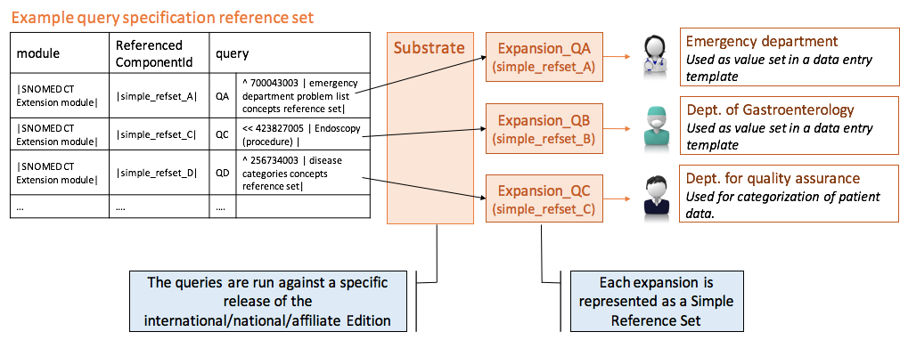

# Maintenance and Management

Managing the components used to represent the large number of clinical data entries in EHRs is an important part of the work related to maintaining the integrity and accessibility of health information. Like SNOMED CT components, reference sets are supported by a robust versioning mechanism that allows historically consistent views of SNOMED CT components and derivatives. This allows reference sets to be used to specify changes in use of concepts and descriptions in different parts of an EHR.

For more detailed use cases, please refer to the following examples:

## Constrain Value Sets

Most health records are designed and developed using one or more information models, which describe the information that is collected, stored, communicated and displayed. Some information models are designed for a specific proprietary system, while others are based on a common health information standard. Irrespective of the purpose, design and representation of the information models, the use of clinical terminology is an important part of making the models complete, meaningful and useful. Hence, a consistent approach to the interface between structural elements and terminological representations of information is required to support reliable interpretation of the meaning. Subsets of SNOMED CT components can function as [value sets](https://github.com/IHTSDO/snomedct-refset-guide/blob/main/3%20requirements-and-use-cases/3.2%20use-cases/3.2.6%20maintenance-and-management/2.2.-Value-Set_35985807.html)for any health-related information model to enable well-defined, unambiguous models of meaning.

As shown in the diagram below [simple reference sets](https://github.com/IHTSDO/snomedct-refset-guide/blob/main/3%20requirements-and-use-cases/3.2%20use-cases/3.2.6%20maintenance-and-management/5.1-Simple-Reference-Set_35985677.html)can be used to represent the subsets of SNOMED CT components to be populated as value sets within the relevant information models.

<figure><figcaption>
Relation between SNOMED CT reference sets, value sets and information models
</figcaption></figure>

## Managing Value Sets

EHR systems will typically utilize a range of different value sets to be used in different places of the system. Representing these value sets using the same terminology will support the comparison of data captured in different contexts. Additionally, using SNOMED CT to represent items value sets instead of locally defined terms enables effective management and overview of information, and helps to mitigate challenges related to redundancy and ambiguity.

[Simple reference sets](https://github.com/IHTSDO/snomedct-refset-guide/blob/main/3%20requirements-and-use-cases/3.2%20use-cases/3.2.6%20maintenance-and-management/5.1-Simple-Reference-Set_35985677.html) can be used to represent extensionally defined subsets of SNOMED CT components, whereas the [query specification reference set](https://github.com/IHTSDO/snomedct-refset-guide/blob/main/3%20requirements-and-use-cases/3.2%20use-cases/3.2.6%20maintenance-and-management/5.2.-Query-Specification-Reference-Set_35985685.html) are useful for representing the intensional definition of SNOMED CT subsets. In the [query specification reference set](https://github.com/IHTSDO/snomedct-refset-guide/blob/main/3%20requirements-and-use-cases/3.2%20use-cases/3.2.6%20maintenance-and-management/5.2.-Query-Specification-Reference-Set_35985685.html), the [expression constraints](https://confluence.ihtsdotools.org/display/DOCTIG/3.4.3.+Expression+Constraints) can be used to represent the query used for defining the set. This means that the [query specification reference set](https://github.com/IHTSDO/snomedct-refset-guide/blob/main/3%20requirements-and-use-cases/3.2%20use-cases/3.2.6%20maintenance-and-management/5.2.-Query-Specification-Reference-Set_35985685.html) can be used to manage the intensional definition of SNOMED CT subsets that function as value sets, which is illustrated below.

<figure><figcaption>
 Query specification reference set used for generating value sets for different organisational units
</figcaption></figure>

## Managing Component Inactivation

When a component that is a member of a reference set is inactivated, the person maintaining the reference set needs to decide whether a change is required. This depends on the intended use of the reference set being maintained. In the case of a reference set that is being used to constrain data entry, inactive concepts need to be removed from the reference set or replaced by an appropriate active concept. In other reference sets it may be permissible, or even required, to retain an inactive concept in a reference set (for example if a reference set is used in the criteria for a report which may be applied to historical data).

The following figure and subsequent description introduce the overall process for identifying inactive components and using released reference sets to determine reasons for inactivation and potential replacements.

<figure><figcaption>
Process of determine reasons for inactivation and alternative replacements
</figcaption></figure>

1. One approach to identify the components that have been inactivated since the last release, is to compare snapshot of previous release with current delta release.
2. The reasons for inactivation can be looked up in the [900000000000480006 | Attribute value type reference set|](http://snomed.info/id/900000000000480006) for the particular component type, for example the [900000000000489007 | Concept inactivation indicator attribute value reference set|](http://snomed.info/id/900000000000489007) . The reason is represented by the value of the valueId attribute. For further information, see [3.2.6.3.1. Representing Reasons for Component Inactivation](https://github.com/IHTSDO/snomedct-refset-guide/blob/main/3%20requirements-and-use-cases/3.2%20use-cases/3.2.6%20maintenance-and-management/3.2.6.3%20managing-component-inactivation/3.2.6.3.1.-Representing-Reasons-for-Component-Inactivation_35985652.html).
3. The possible replacements for the components that have been inactivated can be determined in the appropriate [900000000000522004 | Historical association reference set|](http://snomed.info/id/900000000000522004) . For further information, see [3.2.6.3.2. Representing Historical Associations](https://github.com/IHTSDO/snomedct-refset-guide/blob/main/3%20requirements-and-use-cases/3.2%20use-cases/3.2.6%20maintenance-and-management/3.2.6.3%20managing-component-inactivation/3.2.6.3.2.-Representing-Historical-Associations_35985650.html).
4. The preferred approach to manage inactivation of a component depends on the situation and the use of the reference set. However, a typical approach would be to update the reference set to apply the replacement concept instead of the inactivated concept. Please note, that some changes to the reference set may require additional updates to be performed to ensure correct use, see [6.6.2. Managing Reference Set Changes](https://github.com/IHTSDO/snomedct-refset-guide/blob/main/3%20requirements-and-use-cases/3.2%20use-cases/3.2.6%20maintenance-and-management/3.2.6.3%20managing-component-inactivation/6.6.2.-Managing-Reference-Set-Changes_35985760.html).

### Representing Reasons for Component Inactivation

In the International Edition of SNOMED CT three reference sets of the type [900000000000480006 | Attribute value type reference set|](http://snomed.info/id/900000000000480006) are used to indicate the reason why components have been inactivated. These are:

* [900000000000489007 | Concept inactivation indicator attribute value reference set (foundation metadata concept)|](http://snomed.info/id/900000000000489007)
* [900000000000490003 | Description inactivation indicator attribute value reference set (foundation metadata concept)|](http://snomed.info/id/900000000000490003)
* [900000000000547002 | Relationship inactivation indicator attribute value reference set (foundation metadata concept)|](http://snomed.info/id/900000000000547002)

For example, if the inactivated component is marked as [900000000000484002 | Ambiguous|](http://snomed.info/id/900000000000484002) , this will typically mean that there will be more than one component replacing the inactivated component. The possible replacements will be available in the [900000000000523009 | POSSIBLY EQUIVALENT TO association reference set (foundation metadata concept)|](http://snomed.info/id/900000000000523009) .

Another example is concepts that are inactivated because they were [900000000000482003 | Duplicate|](http://snomed.info/id/900000000000482003) . This is used if two concepts represent the same meaning, because then one of those concepts must be inactivated. The equivalent concept will be represented in the [900000000000527005 | SAME AS association reference set (foundation metadata concept)|](http://snomed.info/id/900000000000527005) . Please refer to [3.2.6.3.2. Representing Historical Associations](https://github.com/IHTSDO/snomedct-refset-guide/blob/main/3%20requirements-and-use-cases/3.2%20use-cases/3.2.6%20maintenance-and-management/3.2.6.3%20managing-component-inactivation/3.2.6.3.2.-Representing-Historical-Associations_35985650.html) to see which reference sets relate to the various reasons for inactivation.

### Representing Historical Associations

When a new version of SNOMED CT is released this may include changes to the content of the terminology. Components may have been added, inactivated or changed as described in [11.4 Versioning](https://confluence.ihtsdotools.org/display/DOCANLYT/11.4+Versioning). As part of the terminology maintenance process, it may be appropriate to evaluate both the [Representing Reasons for Component Inactivation](https://github.com/IHTSDO/snomedct-refset-guide/blob/main/3%20requirements-and-use-cases/3.2%20use-cases/3.2.6%20maintenance-and-management/3.2.6.3%20managing-component-inactivation/3.2.6.3.1.-Representing-Reasons-for-Component-Inactivation_35985652.html) and to determine appropriate alternatives.

The International Edition of SNOMED CT distributes a set of reference sets that record the reason that each inactive component was inactivated. These are referred to as "historical association" reference sets (see [4.2.3 Historical Association Reference Sets](https://github.com/IHTSDO/snomedct-refset-guide/blob/main/pages/createpage.action?spaceKey=DOCTSG\&title=4.2.3+Historical+Association+Reference+Sets) for more details). There is one historical association reference set for each type of historical association as shown in the table below.

Table: Association reference set types in the International Release of SNOMED CT

| Association reference set | Descriptions                                     |
| ------------------------- | ------------------------------------------------ |
| \[ 900000000000523009     | POSSIBLY EQUIVALENT TO association reference set |
| \[ 900000000000524003     | MOVED TO association reference set               |
| \[ 900000000000525002     | MOVED FROM association reference set             |
| \[ 900000000000526001     | REPLACED BY association reference set            |
| \[ 900000000000527005     | SAME AS association reference set                |
| \[ 900000000000528000     | WAS A association reference set                  |
| \[ 900000000000529008     | SIMILAR TO association reference set             |
| \[ 900000000000530003     | ALTERNATIVE association reference set            |
| \[ 900000000000531004     | REFERS TO concept association reference set      |

The following table holds example entries for the [900000000000526001 | Replaced by|](http://snomed.info/id/900000000000526001) reference set. With this reference set is possible to automatically identify that the inactive concept [696005 | Chronobiologic disorder|](http://snomed.info/id/696005) should be replaced with the concept [387605007 | Abnormal chronobiologic state|](http://snomed.info/id/387605007) . This type of reference set is particularly useful for ensuring consistent use of SNOMED CT over time. The reference set mechanism here provides an easy and standardized way of managing changes to coding or documentation practice over time.

Table: Sample content from 900000000000526001 | REPLACED BY association reference set |

| referencedComponentId | referencedComponentId\_term                        | targetComponentId | targetComponentId\_term                           |
| --------------------- | -------------------------------------------------- | ----------------- | ------------------------------------------------- |
| 100005                | SNOMED RT Concept                                  | 138875005         | SNOMED CT Concept                                 |
| 212002                | Salmonella III arizonae 53:k:z                     | 398450001         | Salmonella IIIb 53:k:z                            |
| 225005                | Special care of patient with contagious disease    | 133895001         | Care of patient with infectious disease           |
| 244003                | Evans and Lloyd-Thomas syndrome                    | 66659007          | Normal variation in position                      |
| 278009                | Epidural injection of neurolytic substance, lumbar | 17753007          | Epidural injection of neurolytic solution, lumbar |
| 558000                | Other disorder of the neurohypophysis, NEC         | 72442006          | Disorder of posterior pituitary                   |
| 659001                | Peptostreptococcus anaerobius                      | 413524006         | Anaerococcus tretradius                           |
| 696005                | Chronobiologic disorder                            | 387605007         | Abnormal chronobiologic state                     |
| 700002                | Salmonella III arizonae 50:z4,z23,z32:--           | 404619004         | Salmonella IIIa 50:z4,z23,z32:-                   |
| 822000                | Salmonella arizonae 53:z4,z23:--                   | 13998005          | Salmonella IV 53:z4,z23:--                        |

