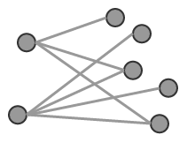
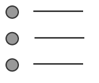
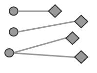
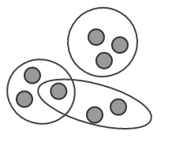

# Requirements

To decide if a reference set is needed, successful implementers of SNOMED CT must clearly understand their requirements.

The table below shows some typical requirements that may be met using SNOMED CT reference sets. The examples in this table are not exhaustive, but instead illustrate common use cases in which the category of requirement is needed. The table also shows the type (or types) of reference set that best meets each requirement. For more information on each requirement category, please click on the diagram to visit the relevant section.

Table: Requirements met by reference sets

| REQUIREMENTS                                                                                                                      | EXAMPLE USE CASES                                                                                                                                                                                                                                                                                                                                                                                                 | REFERENCE SET                                                                                                                                                                                                      |
| --------------------------------------------------------------------------------------------------------------------------------- | ----------------------------------------------------------------------------------------------------------------------------------------------------------------------------------------------------------------------------------------------------------------------------------------------------------------------------------------------------------------------------------------------------------------- | ------------------------------------------------------------------------------------------------------------------------------------------------------------------------------------------------------------------ |
| 
A Subset of Components   
                            | 

<ul><li><a href="3.2-use-cases/3.2.6-maintenance-and-management.md#constrain-value-sets">Constrain Value Sets</a></li><li><a href="3.2-use-cases/3.2.3-reporting-and-analytics.md#specifying-queries-for-retrieval-and-analysis">Specifying Queries for Retrieval and Analysis</a></li><li><a href="3.2-use-cases/3.2.5-language-and-dialect.md#interface-terminology">Interface Terminology</a></li></ul> | [Simple Reference Set](../5-reference-set-types.md#simple-reference-set)                                                                                                                                           |
| 
An Ordered List of Components 
 | 

<ul><li><a href="3.2-use-cases/3.2.1-search-and-data-entry.md#order-items-for-search-and-data-entry">Order Items for Search and Data Entry</a></li><li><a href="3.2-use-cases/3.2.1-search-and-data-entry.md#alternative-hierarchical-view">Alternative Hierarchical View</a></li></ul>                                                                                                                    | [Ordered Reference Set](../5-reference-set-types.md#ordered-component-reference-set)                                                                                                                               |
| 
A set of Associations between Components 
        | 

<ul><li><a href="3.2-use-cases/3.2.6-maintenance-and-management.md#representing-historical-associations">Representing Historical Associations</a></li><li><a href="3.2-use-cases/3.2.1-search-and-data-entry.md#use-case-specific-associations">Use Case Specific Associations</a></li></ul>                                                                                                               | [Association Reference Set](../5-reference-set-types.md#association-reference-set)                                                                                                                                 |
| 
A set of Components Annotated with Additional Information 
 | 

<ul><li><a href="3.2-use-cases/3.2.2-knowledge-linkage.md#linking-concepts-to-web-resources">Linking Concepts to Web Resources</a></li><li>Link components to a textual advice</li></ul>                                                                                                                                                                                                                   | [Annotation Reference Set](../5-reference-set-types.md#component-annotation-reference-set)                                                                                                                         |
| 
A set of Maps between SNOMED CT and Another Code System 
      | 

<ul><li><a href="3.2-use-cases/3.2.3-reporting-and-analytics.md#maps-to-statistical-classifications"> Maps to Statistical Classifications</a></li><li>Link concepts to legacy codes and data, to support migration</li></ul>                                                                                                                                                                               | 
Simple Map Reference Set 

Complex and Extended Map from SNOMED CT Reference Sets
                                                                                                                   |
| 
A Set of Sets of Components 
                              | 

<ul><li><a href="3.2-use-cases/3.2.6-maintenance-and-management.md#managing-value-sets">Managing Value Sets</a></li></ul>                                                                                                                                                                                                                                                                                  | 
<a href="../5-reference-set-types.md#simple-reference-set">Simple Reference Set</a>

 <a href="../5-reference-set-types.md#query-specification-reference-set">Query Specification Reference Set</a>
 |

## A Subset of Components

When implementing SNOMED CT in a clinical software system, such as an EHR, the use of SNOMED CT will typically involve customization. For example, selecting a subset of SNOMED CT components to be used for a particular purpose is a typical way of customizing SNOMED CT for use. Subsets of SNOMED CT components can be used to constrain the use of SNOMED CT by either including, excluding or prioritizing specific components.&#x20;

An extensionally defined subset of components, whether it is a subset of concepts, descriptions or relationships, can be represented as a **simple reference set**.&#x20;

The definition of an intensionally defined subset of components can be represented using a **query specification reference set**, while its expansion can be represented using a **simple reference set**. A subset of components may be required to support a range of different uses, as illustrated in the table below.

Table: Requirements for subsets of components

<table><thead><tr><th width="147.3125">Requirement</th><th width="183.35546875">Description</th><th width="276.99609375">Example uses</th><th>Reference Set</th></tr></thead><tbody><tr><td><strong>Subset of concepts</strong></td><td>An extensionally defined set of references to SNOMED CT concepts ------------------ An intensionally defined set of references to SNOMED CT concepts</td><td><ul><li>Restricting searches to terms associated with specified concepts</li><li>Constraining data entry</li><li>Specifying value sets for particular data items</li><li>Specifying queries for data retrieval</li></ul></td><td>
<strong>Simple reference set</strong>   -------------- <strong>Query specification reference set</strong>  

 
</td></tr><tr><td><strong>Subset of descriptions</strong></td><td>A set of references to SNOMED CT descriptions</td><td><ul><li>Restricting searches to specified sets of terms</li><li>Specifying descriptions to appear in a list of options</li></ul></td><td><strong>Simple reference set</strong> </td></tr><tr><td>
<strong>Inclusion/</strong>

<strong>Exclusion of content</strong>
</td><td>A set which contains the components to be included/ excluded</td><td><ul><li>Excluding particular components from search and/or data entry</li><li>Including a subset of concepts/descriptions for search, data entry, reporting etc.</li></ul></td><td><strong>Simple reference set</strong> </td></tr></tbody></table>

For more detailed use case examples, please refer to the following sections:

* [Constrain data entry](3.2-use-cases/3.2.1-search-and-data-entry.md#constrain-data-entry)
* [Constrain searches](3.2-use-cases/3.2.1-search-and-data-entry.md#constrain-searches)
* [Exclude content](3.2-use-cases/3.2.1-search-and-data-entry.md#exclude-content)
* [Categorising patients using subsets](3.2-use-cases/3.2.3-reporting-and-analytics.md#categorizing-patients-using-subsets)
* [Constrain value sets](3.2-use-cases/3.2.6-maintenance-and-management.md#constrain-value-sets)

## An Ordered List of Components

Organizing members of a subset into a specific order can be useful to meet certain implementation requirements, such as displaying drop down lists for data entry or search results. Members of a subset can be ordered in a variety of automated ways, including displaying the shortest term that matches the search term first, alphabetically, or randomly. However, when the required order cannot be automatically computed, it may be necessary to specify an order for each subset member. Ordered lists of SNOMED CT components (typically concepts or descriptions) can be represented using an **Ordered Reference Set**. For more information about ordering SNOMED CT components on a user interface, please refer to the [SNOMED CT Search and Data Entry Guide](https://app.gitbook.com/o/h8Z6qGxuQrzM9vbx5bPT/s/CEAcChvWjWEu16YmwNrz/).

Table: Requirements for an ordered list of components

<table><thead><tr><th width="138.984375">Requirement</th><th width="250.96484375">Description</th><th width="302.6484375">Example Uses</th><th>Reference Set</th></tr></thead><tbody><tr><td><strong>An ordered list of descriptions</strong></td><td>A subset consisting of references to specific SNOMED CT descriptions, i.e. a set of SNOMED CT Identifiers, where each included member identifies a description. Additionally, each subset member is assigned a specific order, to enable ordering or prioritizing the members.</td><td><ul><li>
Presenting terms in an order that is rational or helpful for a particular purpose in user interface controls including:
<ul><li>Simple lists</li><li>Drop down lists</li><li>Popup menus</li></ul></li><li>Ordering search results </li></ul></td><td><strong>Ordered Reference Se</strong>t </td></tr><tr><td><strong>An ordered list of concepts</strong></td><td>A subset consisting of references to specific SNOMED CT concepts, i.e. a set of SNOMED CT Identifiers. Additionally, each subset member is assigned a specific order, which enables prioritization.</td><td><ul><li>Presenting concepts in an order that is rational or helpful for a particular purpose irrespective of the term displayed</li><li>Making it easier to find concepts that are most commonly used in a particular specialty, department or data entry scenario</li></ul></td><td><strong>Ordered Reference Set</strong></td></tr></tbody></table>

For more detailed use case examples, please refer to the following sections:

* [Order Items for Search and Data Entry](3.2-use-cases/3.2.1-search-and-data-entry.md#alternative-hierarchical-view)
* [Alternative Hierarchical View](https://github.com/IHTSDO/snomedct-refset-guide/blob/main/3%20requirements-and-use-cases/3.1%20requirements/3.2.1.5.-Alternative-Hierarchical-View_35985573.html)

## A Set of Associations between Components

When SNOMED CT is implemented in electronic health records, there may be situations where explicitly stating associations between components can support effective and efficient use of SNOMED CT.

In some situations, a set of unordered associations between components may be required. In other situations, an ordered list of directed associations between components may be needed. As illustrated in the table below, unordered associations can be represented using an **association reference set**, while an ordered list of directed associations can be represented using an **ordered reference set**. Associations can be specified between components of any type. However, associations are typically used to link concepts and/or descriptions.

Table: Requirements for a set of associations between components

<table><thead><tr><th>Requirement</th><th>Description</th><th width="328.47265625">Example Uses</th><th>Reference Set</th></tr></thead><tbody><tr><td><strong>A set of directed associations between components</strong></td><td>
A set of directed associations between pairs of concepts

A set of directed associations between pairs of descriptions
</td><td><ul><li>
Grouping concepts together
<ul><li>For example, representing categories of concepts that are used for reporting</li></ul></li><li>
Historical associations between components
<ul><li>For example, associating inactive and active duplicate concepts</li></ul></li></ul></td><td><strong>Association Reference Set</strong></td></tr><tr><td><strong>An ordered list of directed associations between components</strong></td><td>An ordered list of directed associations between pairs of concepts or descriptions </td><td>
Defining alternative hierarchies for navigation and selection of concepts or descriptions. Examples include:
<ul><li>Ordering hierarchical lists of enumerated body structures such as fingers, vertebrae and cranial nerves</li><li>Organizing the display of diseases</li><li>Commonly seen in a particular specialty.</li></ul></td><td><strong>Ordered Reference Set</strong></td></tr></tbody></table>

For more detailed use case examples, please refer to the following sections:

* [Use Case Specific Associations](3.2-use-cases/3.2.1-search-and-data-entry.md#use-case-specific-associations)
* [Representing Historical Associations](3.2-use-cases/3.2.6-maintenance-and-management.md#representing-historical-associations)
* [Alternative Hierarchical View](3.2-use-cases/3.2.1-search-and-data-entry.md#alternative-hierarchical-view)

## A Set of Components Annotated with Additional Information

In some cases, an implementer may need to add additional information about each member of a subset. This information may be additional textual information or additional coded values.

Annotating each member of a subset with additional information can facilitate the processing of subset members and assist in meeting the functional requirements of a system.

Table: Requirements for a set of components annotated with additional information

<table><thead><tr><th>Requirement</th><th width="169.75">Description</th><th width="285.0546875">Example Use</th><th>Reference Set</th></tr></thead><tbody><tr><td><strong>A set of components with free text annotations</strong></td><td>A set of concepts, descriptions or relationships each annotated with a free text note</td><td>Displaying a textual note  for each concept in a list. For example, displaying an advisory note on how to request a particular procedure.</td><td><strong>Annotation reference set</strong></td></tr><tr><td>
<strong>A set of components with coded annotations</strong> 

 
</td><td>A set of concepts, descriptions or relationships each annotated with a reference to another component</td><td>Marking each concept with a specific coded value to support automated processing of a list. For example, marking each inactive concept with a code that indicates the reason they were inactivated --------------------------------- Specifying whether descriptions are preferred or acceptable in a given dialect, care setting or clinical context.</td><td>
<strong>Attribute value reference set</strong>

  -------------- <strong>Language reference set</strong>
</td></tr></tbody></table>

For more detailed use case examples, please refer to the following sections:

* [Linking concepts to web resources](3.2-use-cases/3.2.2-knowledge-linkage.md#linking-concepts-to-web-resources)
* [Representing reasons for component inactivation](3.2-use-cases/3.2.6-maintenance-and-management.md#representing-reasons-for-component-inactivation)
* [Indications of acceptability of descriptions](3.2-use-cases/3.2.5-language-and-dialect.md#indications-of-acceptability-of-descriptions)

## A Set of Maps between SNOMED CT and Another Code System

A map is an association between codes from one code system and codes from another code system, that have the same (or similar) meaning. Mapping is the process of defining a set of maps. Maps are developed in accordance with a documented rationale, for a given purpose. As a result, there may be different maps between the same pair of concepts or terms to meet different use cases.

The purpose of mapping between SNOMED CT and another code system is to provide a link between the code systems, to obtain a number of benefits. These may include:

* Data reuse - for example, SNOMED CT based clinical data can be reused to report statistical and management information using an alternative classification system
* Retaining the value of existing data when migrating to newer database formats and code systems
* Avoiding the need to enter data multiple times and preventing the associated cost and potential errors
* Promoting interoperability between terminologies, classifications and code systems

Table: Requirements for a set of maps between SNOMED CT and another code system

<table><thead><tr><th>Requirement</th><th width="258.0234375">Description</th><th>Example Use</th><th>Reference Set</th></tr></thead><tbody><tr><td>
<strong>An equivalence map</strong>

 
</td><td>A set of one-to-one bidirectional maps between SNOMED CT components and codes from another code system</td><td>Mapping legacy codes to equivalent SNOMED CT concepts</td><td><strong>Simple map reference set</strong></td></tr><tr><td>
<strong>A non-equivalence map</strong>

 
</td><td>
A set of maps from SNOMED CT concepts to codes in another code system, where the map may include:
<ul><li>one-to-many or many-to-one maps</li><li>map groups</li><li>map rules</li><li>map advice</li></ul>
------------------------------

A set of maps from another code system to SNOMED CT, where the map may include:
<ul><li>one-to-many or many-to-one maps</li><li>map groups</li><li>map rules</li><li>map advice</li></ul>

</td><td>
Representing a map from SNOMED CT to a statistical classification

------------------ Representing a map from a statistical classification to SNOMED CT
</td><td><strong>Complex and extended map reference sets</strong> ----------------- <strong>Complex and extended map reference sets</strong></td></tr></tbody></table>

## A Set of Sets of Components

Some situations may require sets of components to be implemented and managed. For example, when implementing a package of subsets.

Table: Requirements for a set of sets of components

<table><thead><tr><th width="139.51171875">Requirement</th><th>Description</th><th width="260.9765625">Example Use</th><th>Reference Set</th></tr></thead><tbody><tr><td><strong>A set of sets of components</strong></td><td>A set of intensional subset definitions    -------------------- A set of references to concepts that represent reference sets</td><td>Managing the set of intensional subset definitions that are used within a particular system, organization, domain or message ------------------------------ Managing the set of reference sets that are used within a particular system, organization, domain or message</td><td><strong>Query specification reference set</strong> -------------------- <strong>Simple reference set</strong></td></tr></tbody></table>

For more detailed use case examples, please refer to the following sections:

* [Managing value sets](3.2-use-cases/3.2.6-maintenance-and-management.md#managing-value-sets)
* [Constraining the coded content of messages](3.2-use-cases/3.2.4-communication.md#constraining-the-coded-content-of-messages)

<a href="https://docs.google.com/forms/d/e/1FAIpQLScTmbZIf0UEQwYDkY27EEWBkaiYkHSbR0_9DmFrMLXoQLyL7Q/viewform?usp=pp_url&entry.1767247133=Refset+Guide&entry.670899847=Requirements" class="button primary">Provide Feedback</a>
