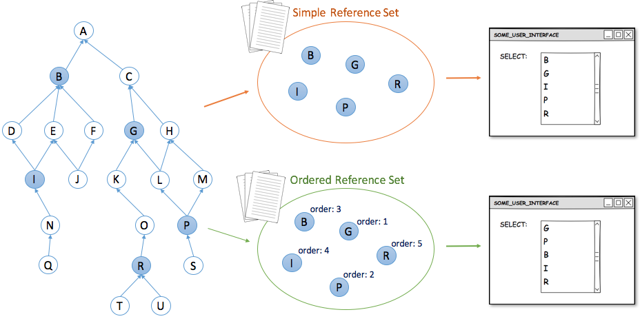
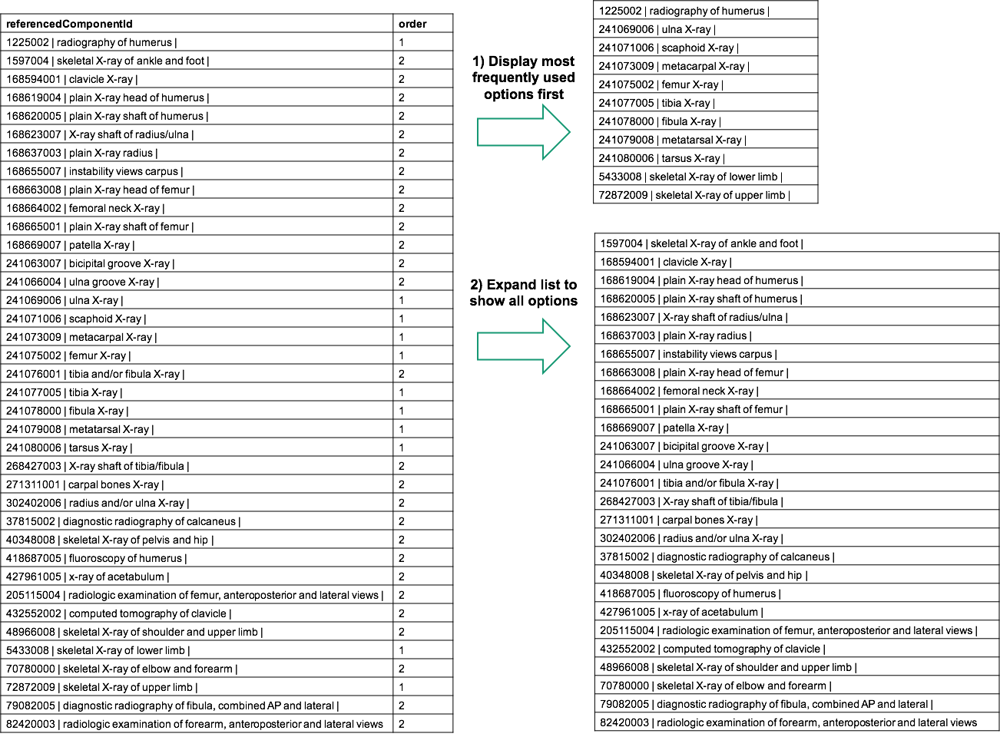

# Search and Data Entry

Many clinical applications include data entry interfaces controlled or assisted by protocols, templates or structured data entry forms. Each field on a data entry form may allow only a limited set of terms or concepts to be entered . The set of candidate term or concept may range from very small (e.g. a set of priorities for a procedure) to very large (e.g. any general diagnosis). Reference sets can be used to restrict the possible values that meet the requirements of a particular data entry protocol.

Examples of using reference sets to support search and data entry include:

* [Simple Reference Set](https://app.gitbook.com/s/irKbJsZG57nSWZA4GT0M/reference-set-release-file-specification/5.2-reference-set-types/5.2.1-content-reference-sets/5.2.1.1-simple-reference-set) can be used to constrain searches or provide values for selection lists.
* [Ordered Reference Set](https://app.gitbook.com/s/irKbJsZG57nSWZA4GT0M/reference-set-release-file-specification/5.2-reference-set-types/5.2.1-content-reference-sets/5.2.1.8-ordered-reference-set) can be used to prioritize search results or provide an alternative ordering of search results.
* [DEPRECATED: Annotation Reference Set](https://app.gitbook.com/s/irKbJsZG57nSWZA4GT0M/reference-set-release-file-specification/5.2-reference-set-types/5.2.1-content-reference-sets/5.2.1.6-deprecated-annotation-reference-set) can be used to supplement search results or data entry options with additional textual or coded information, such as advice on intended usage.
* [Language Reference Set](3.2.5-language-and-dialect.md#language-reference-set) can be used to ensure that the preferred descriptions, for a given dialect, care setting or clinical context, are displayed.

A SNOMED CT enabled application can use an appropriate reference set to display the valid data entry options and constrain text searches. Below are more detailed use case examples.

## Constrain Data Entry

In many care settings, similar data sets are collected for each patient. Clinical consultations for many conditions involve repeatable sequences of data entry. These structured and predictable data entry requirements can be met using sets of customized data entry forms designed to collect appropriate data items.

When using a structured data entry mechanism, SNOMED CT encoded data can be selected in a variety of ways. For example, the concepts or descriptions may be selected directly from a list, or the encoding may result from responses to simple choices or the entry of particular values. **Simple reference sets** can ensure that SNOMED CT codes are entered effectively and consistently.

A simple reference set of concepts may be used to represent the options available in a small selection list. Similarly, a **simple reference set** of descriptions or a **language reference set** may specify the set of descriptions available for searching in a specific coded data element. The figure below illustrates how a **simple reference set** is is used as a value set in a data entry form.

<figure><figcaption>
Using simple reference sets to constrain data entry
</figcaption></figure>

## Constrain Searches

Simple reference sets enable text searches to be constrained to those components relevant to a particular field. The [SNOMED CT Search and Data Entry Guide](https://app.gitbook.com/o/h8Z6qGxuQrzM9vbx5bPT/s/CEAcChvWjWEu16YmwNrz/) provides additional detail about how to make effective and efficient search capabilities using SNOMED CT. The figure below illustrates the use of a **simple reference set** to constrain the values returned by a text search in a data entry form. Additionally, dedicated search features support searching the content of the reference set.

<figure><figcaption>
Using simple reference sets to constrain searches
</figcaption></figure>

## Exclude Content

Even though subsets are typically used to specify content for inclusion, some situations may require particular components to be excluded from another set. Excluding sets of SNOMED CT components can be used to prevent certain concepts appearing in particular search and data entry items.

Like every subset of SNOMED CT components, it is possible to define the subset for exclusion either intensionally or extensionally . This is illustrated in the figure below. When intensionally defined, a **query specification reference set** can be used for the intensional definition, and a **simple reference set** can be used for the expansion of the set.

<figure><figcaption>
Subsets for excluding content can be either intensionally or extensionally defined
</figcaption></figure>

## Order Items for Search and Data Entry

The criteria for a successful implementation of SNOMED CT includes the customization of SNOMED CT to meet user needs. The order in which SNOMED CT components are displayed is often important for data entry and searching. This topic is further explored in the [SNOMED CT Search and Data Entry Guide](https://app.gitbook.com/o/h8Z6qGxuQrzM9vbx5bPT/s/CEAcChvWjWEu16YmwNrz/). In general, rational ordering of selectable items depends on the nature of the application and its operating environment. The table below shows examples of ordering data entry items and search results rationally.

Table: Examples of rational ordering

<table><thead><tr><th width="132.18359375">Approach</th><th width="219.8515625">Description</th><th width="369.796875">Example Uses</th><th width="164.4453125">Reference Set</th></tr></thead><tbody><tr><td><strong>Sequential ordering</strong></td><td>Annotating each subset member with an integer, which specify the consecutive order of the members. Two subset members do not have the same number assigned to them.</td><td>Displaying descriptions sequentially according to their specified order.</td><td><a href="../../5-reference-set-types.md#ordered-component-reference-set">Ordered component reference set</a></td></tr><tr><td> <strong>Prioritization</strong></td><td>
Annotating each subset member with a an integer, which specify a priority order. Two or more subset members may have the same number assigned to them.

 
</td><td>
Showing concepts with a high priority before their siblings using hierarchical display results.
<ul><li>
Display search results in priority order
<ul><li>Results with same rank ordered by shortest or closest match</li></ul></li><li>Displaying a rank indicator in search result list</li></ul>
Initially listing concepts and associated descriptions with a priority above a specified threshold and requiring additional steps to access those assigned a lower priority.
<ul><li>Initial search is conducted on components with highest priority</li><li>
Allow search to be extended to lower priorities
<ul><li>If no high priority matches</li><li>If user requests more matches</li></ul></li></ul></td><td>
<a href="../../5-reference-set-types.md#ordered-component-reference-set">Ordered component reference set</a> 

 
</td></tr></tbody></table>

### Sequential Ordering

Displaying items for data entry in a rational way typically involves organizing the values in a selection list in an order that is logical for the end users. As illustrated in the figure below, an ordered reference set can be used to specify the order in which SNOMED CT components should be displayed.

<figure><figcaption>
Example of how an ordered reference set can be used to order items in a drop down list
</figcaption></figure>

Examples of presenting concepts (or descriptions) in an order that is rational or helpful for a particular purpose include:

*
  * Displaying numbered body parts, such as fingers, cranial nerves or vertebrae, in numeric order
  * Displaying ordinal values, such as frequencies, severities or stages, from lowest to highest

The table below shows how the order of cranial nerves can be specified in an [ordered component reference set](../../5-reference-set-types.md#ordered-component-reference-set). The **order** attribute is used to indicate the sequential order of each subset member.

| refsetId                                                                                                                                               | referencedComponentId                                                                                                             | order                                                                                                                                                                                                                                                                                                                                        |
| ------------------------------------------------------------------------------------------------------------------------------------------------------ | --------------------------------------------------------------------------------------------------------------------------------- | -------------------------------------------------------------------------------------------------------------------------------------------------------------------------------------------------------------------------------------------------------------------------------------------------------------------------------------------- |
| <mark style="color:red;">609999999102</mark> <mark style="color:blue;">\|</mark> Cranial nerve simple reference set<mark style="color:blue;">\|</mark> | 11522000 <mark style="color:blue;">\|</mark> Olfactory nerve structure (body structure)<mark style="color:blue;">\|</mark>        | 1                                                                                                                                                                                                                                                                                                                                            |
| <mark style="color:red;">609999999102</mark> <mark style="color:blue;">\|</mark> Cranial nerve simple reference set<mark style="color:blue;">\|</mark> | 18234004 <mark style="color:blue;">\|</mark> Optic nerve structure (body structure)<mark style="color:blue;">\|</mark>            | 2                                                                                                                                                                                                                                                                                                                                            |
| <mark style="color:red;">609999999102</mark> <mark style="color:blue;">\|</mark> Cranial nerve simple reference set<mark style="color:blue;">\|</mark> | 56193007 <mark style="color:blue;">\|</mark> Oculomotor nerve structure (body structure)<mark style="color:blue;">\|</mark>       | 3                                                                                                                                                                                                                                                                                                                                            |
| <mark style="color:red;">609999999102</mark> <mark style="color:blue;">\|</mark> Cranial nerve simple reference set<mark style="color:blue;">\|</mark> | 39322007 <mark style="color:blue;">\|</mark> Trochlear nerve structure (body structure)<mark style="color:blue;">\|</mark>        | 4                                                                                                                                                                                                                                                                                                                                            |
| <mark style="color:red;">609999999102</mark> <mark style="color:blue;">\|</mark> Cranial nerve simple reference set<mark style="color:blue;">\|</mark> | 80622005 <mark style="color:blue;">\|</mark> Abducens nerve structure (body structure)<mark style="color:blue;">\|</mark>         | 5                                                                                                                                                                                                                                                                                                                                            |
| <mark style="color:red;">609999999102</mark> <mark style="color:blue;">\|</mark> Cranial nerve simple reference set<mark style="color:blue;">\|</mark> | 27612005 <mark style="color:blue;">\|</mark> Trigeminal nerve structure (body structure)<mark style="color:blue;">\|</mark>       | 6                                                                                                                                                                                                                                                                                                                                            |
| <mark style="color:red;">609999999102</mark> <mark style="color:blue;">\|</mark> Cranial nerve simple reference set<mark style="color:blue;">\|</mark> | 56052001 <mark style="color:blue;">\|</mark> Facial nerve structure (body structure)<mark style="color:blue;">\|</mark>           | 7                                                                                                                                                                                                                                                                                                                                            |
| <mark style="color:red;">609999999102</mark> <mark style="color:blue;">\|</mark> Cranial nerve simple reference set<mark style="color:blue;">\|</mark> | 8598002 <mark style="color:blue;">\|</mark> Vestibulocochlear nerve structure (body structure)<mark style="color:blue;">\|</mark> | 8                                                                                                                                                                                                                                                                                                                                            |
| <mark style="color:red;">609999999102</mark> <mark style="color:blue;">\|</mark> Cranial nerve simple reference set<mark style="color:blue;">\|</mark> | 21161002 <mark style="color:blue;">\|</mark> Glossopharyngeal nerve structure (body structure)<mark style="color:blue;">\|</mark> | 9                                                                                                                                                                                                                                                                                                                                            |
| <mark style="color:red;">609999999102</mark> <mark style="color:blue;">\|</mark> Cranial nerve simple reference set<mark style="color:blue;">\|</mark> | 88882009 <mark style="color:blue;">\|</mark> Vagus nerve structure (body structure)<mark style="color:blue;">\|</mark>            | 10                                                                                                                                                                                                                                                                                                                                           |
| <mark style="color:red;">609999999102</mark> <mark style="color:blue;">\|</mark> Cranial nerve simple reference set<mark style="color:blue;">\|</mark> | 15119000 <mark style="color:blue;">\|</mark> Accessory nerve structure (body structure)<mark style="color:blue;">\|</mark>        | 11                                                                                                                                                                                                                                                                                                                                           |
| <mark style="color:red;">609999999102</mark> <mark style="color:blue;">\|</mark> Cranial nerve simple reference set<mark style="color:blue;">\|</mark> | 37899009 <mark style="color:blue;">\|</mark> Hypoglossal nerve structure (body structure)<mark style="color:blue;">\|</mark>      | If there is a need to specify a customized hierarchical structure to support navigation, this can be achieved by specifying an [alternative hierarchical view](3.2.1-search-and-data-entry.md#alternative-hierarchical-view) using an [ordered association reference set](../../5-reference-set-types.md#ordered-association-reference-set). |

### Prioritization

Some situations may require a set of subset members to be grouped. For example, a set of concepts may need to be grouped based on how frequently they are used within a particular specialty, department or data entry scenario. In this case, an [ordered association reference set](../../5-reference-set-types.md#ordered-association-reference-set) may be used for prioritization, instead of a purely sequential ordering of each member. Prioritization is similar to sequential ordering, but also supports assigning the same rank to multiple components. A common use of prioritization is to support rational ordering of concepts or descriptions for display of data entry items and search results. More advanced uses may also be required, for example where the priority order is used to trigger certain decision support features or data entry options.

<figure><figcaption>
Using a priority order to display data entry options
</figcaption></figure>

## Alternative Hierarchical View

[Ordered association reference sets](../../5-reference-set-types.md#ordered-association-reference-set) can be used to specify and display a customized navigation hierarchy. Alternative hierarchical representations of SNOMED CT can support data entry by satisfying the requirements of a specific use case, and addressing some of the challenges of displaying an unordered polyhierarchy (as defined by SNOMED CT's subtype structure).

The figure below shows the way a navigation hierarchy is represented. The example reference set contains a set of description components used to describe finger structures.

The | All fingers | components is linked to the | Hand |, and the | Thumb | is linked to the | All fingers component | The | Thumb | is placed first because it has the order value 1. Similarly, the components for | Second finger |, | Third finger |, | Fourth finger | and | Fifth finger | are also linked to the | All finger | component in the order specified by the order value. As shown in the figure the direction of the associations goes from the referenceComponentId to the linkedToId, so the components referenced by the linkedToId are used to form the groups specified in the hierarchy

<table><thead><tr><th width="68.9921875">id</th><th>effective Time</th><th width="75.51953125">active</th><th>moduleId</th><th width="135.62109375">refsetId</th><th>refsetId_term</th><th>referencedComponentId</th><th>referencedComponentId_term</th><th>targetComponentId</th><th>targetComponentId_term</th><th>order</th></tr></thead><tbody><tr><td>…</td><td>20160731</td><td>1</td><td>19999999103</td><td>159999999105</td><td>Associations as ordered reference set</td><td>70327001</td><td>All fingers</td><td>141819019</td><td>Hand</td><td>1</td></tr><tr><td>…</td><td>20160731</td><td>1</td><td>19999999103</td><td>159999999105</td><td>Associations as ordered reference set</td><td>127053016</td><td>Thumb</td><td>70327001</td><td>All fingers</td><td>1</td></tr><tr><td>…</td><td>20160731</td><td>1</td><td>19999999103</td><td>159999999105</td><td>Associations as ordered reference set</td><td>138873019</td><td>Second finger</td><td>70327001</td><td>All fingers</td><td>2</td></tr><tr><td>…</td><td>20160731</td><td>1</td><td>19999999103</td><td>159999999105</td><td>Associations as ordered reference set</td><td>108884010</td><td>Third finger</td><td>70327001</td><td>All fingers</td><td>3</td></tr><tr><td>…</td><td>20160731</td><td>1</td><td>19999999103</td><td>159999999105</td><td>Associations as ordered reference set</td><td>136021011</td><td>Fourth finger</td><td>70327001</td><td>All fingers</td><td>4</td></tr><tr><td>…</td><td>20160731</td><td>1</td><td>19999999103</td><td>159999999105</td><td>Associations as ordered reference set</td><td>21356012</td><td>Fifth finger</td><td>70327001</td><td>All fingers</td><td>5</td></tr></tbody></table>

<figure><figcaption>
Navigation hierarchy example.
</figcaption></figure>

The usability of the [ordered association reference set](../../5-reference-set-types.md#ordered-association-reference-set) for representing alternative hierarchy can be maximized by:

* Constraining the number of levels in the hierarchy and/or the number of concepts at each level.
  * Using many levels, each with a relatively small number of concepts, allows the most common options to be displayed with a higher priority.
  * Using fewer levels, each with a relatively large number of concepts can reduce the number of levels that needs to be navigated to find an appropriate concept.
  * Options that are never (or rarely) used can be excluded from a customized navigation hierarchy to limit the range of choices available.
* Ordering each concept at the same hierarchical level, to match user preferences or to facilitate faster access to more frequently used options.
* Ensuring that the navigation hierarchy is adapted to meet the requirements of a specific use case, without affecting the correctness of the subtype hierarchy (and associated logical inferences).

## Use Case Specific Associations

SNOMED CT represents relationships between concepts that are necessarily (i.e. always) true. However, other relationships between concepts may exist in specific situations or use cases. An [Association Reference Set](../../5-reference-set-types.md#association-reference-set) can be used to represent these additional relationships, which are not necessarily true, but which are needed for a specific purpose. Examples include:

* Associations between procedures and the clinical findings that serve as an indication for that procedure. These associations enable relevant procedures to be displayed when specific clinical findings are selected.
* Associations between a medication and its known side effects. These associations enable relevant side effects to be displayed when specific medications are selected
* Associations between a disease and the set of possible symptoms that may be experienced. These associations enable relevant diseases to be displayed when a set of symptoms are selected.

**Association Reference Set** can be used to constrain (or guide) data entry into fields, where the value is dependent on (or has some type of association with) the value of another field. While other technical solutions are possible, the **Association Reference Set** provides a standardized way of representing and distributing the associations required to support this functionality. The figure below illustrates how an **Association Reference Set** could be used for this purpose.

<figure><figcaption>
Using associations to define dependencies between fields
</figcaption></figure>

<a href="https://docs.google.com/forms/d/e/1FAIpQLScTmbZIf0UEQwYDkY27EEWBkaiYkHSbR0_9DmFrMLXoQLyL7Q/viewform?usp=pp_url&#x26;entry.1767247133=Refset+Guide&#x26;entry.670899847=Search%20and%20Data%20Entry" class="button primary">Provide Feedback</a>
