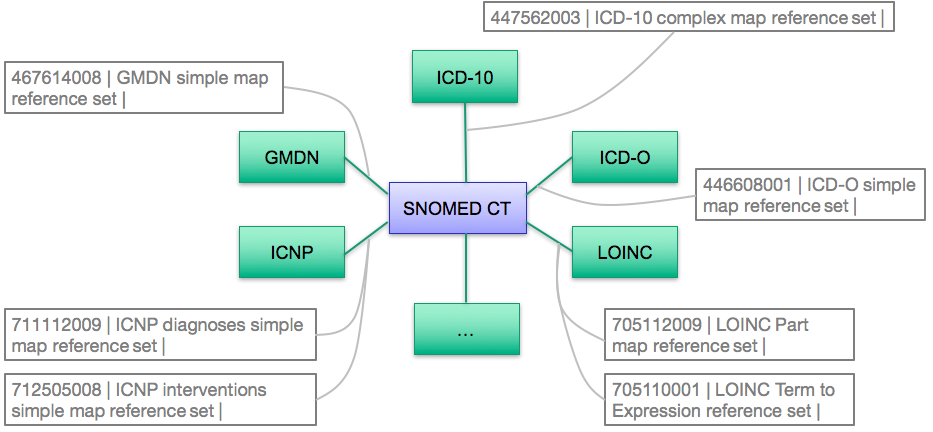
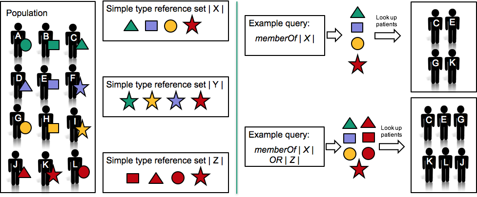
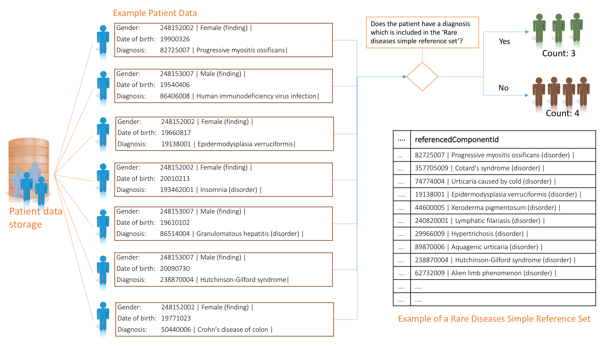
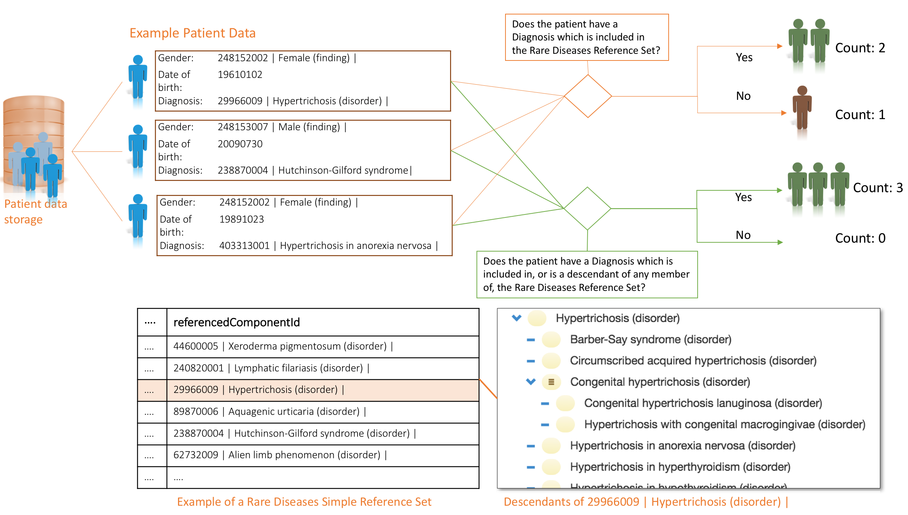

# Reporting and Analytics

The main benefits of using an EHR accrue with the implementation of effective retrieval, analysis and reuse of clinical information. Analysis of health record data may cover:

* Individual patient records to search for significant patterns that may prompt interventions
* Patient groups or cohorts, based on demographics, diagnoses, treatments or interventions
* Enterprise groups, based on teams, wards, clinics, institutions or providers
* Geographical groups, based on a local area, town, region or country

SNOMED CT has a number of unique features, which makes it capable of supporting a range of retrieval and analytics functions, which use reference sets. Examples include, but are not limited to:

* [Simple reference sets](https://github.com/IHTSDO/snomedct-refset-guide/blob/main/3%20requirements-and-use-cases/3.2%20use-cases/3.2.3%20reporting-and-analytics/5.1-Simple-Reference-Set_35985677.html) can be used to represent subsets of SNOMED CT concepts which can be used in queries to identify clinical records
* [Simple reference sets](https://github.com/IHTSDO/snomedct-refset-guide/blob/main/3%20requirements-and-use-cases/3.2%20use-cases/3.2.3%20reporting-and-analytics/5.1-Simple-Reference-Set_35985677.html) can be used to represent non-standard aggregations of concepts for specific use cases
* [Simple map reference sets](https://github.com/IHTSDO/snomedct-refset-guide/blob/main/pages/createpage.action?spaceKey=DOCRELFMT\&title=5.2.9+Simple+Map+Reference+Set), [complex and extended map reference sets](https://confluence.ihtsdotools.org/display/DOCRELFMT/5.2.3.3+Complex+and+Extended+Map+from+SNOMED+CT+Reference+Sets) can be used to define maps from other code systems to SNOMED CT so that clinical data can be prepared for analytics, and then performed using SNOMED CT
* [Simple reference sets](https://github.com/IHTSDO/snomedct-refset-guide/blob/main/3%20requirements-and-use-cases/3.2%20use-cases/3.2.3%20reporting-and-analytics/5.1-Simple-Reference-Set_35985677.html) and [ordered reference sets](https://github.com/IHTSDO/snomedct-refset-guide/blob/main/3%20requirements-and-use-cases/3.2%20use-cases/3.2.3%20reporting-and-analytics/Ordered-Reference-Set_35985666.html) can be used to define language or dialect specific sets of descriptions over which lexical searches can be performed

The document [Data Analytics with SNOMED CT](https://confluence.ihtsdotools.org/display/DOCANLYT) provides detailed information about how SNOMED CT can be used for analytics.

For more detailed use cases, please refer to the following examples:

## Maps to Statistical Classifications

Clinical information recorded using SNOMED CT may include data that is relevant to reports, statistical returns, billing claims, etc. that need to be encoded using a specific code system or a statistical classification such as ICD-10. Mapping allows relevant information to be used for those purposes, minimizing the requirement for additional manual data entry.

Maps are represented as reference sets, which are either of type [simple](https://github.com/IHTSDO/snomedct-refset-guide/blob/main/pages/createpage.action?spaceKey=DOCRELFMT\&title=5.2.9+Simple+Map+Reference+Set), [complex and extended map reference sets](https://confluence.ihtsdotools.org/display/DOCRELFMT/5.2.3.3+Complex+and+Extended+Map+from+SNOMED+CT+Reference+Sets). Special cases may also occur, which require a customized reference set to represent the map. An example of this is the [705110001 | LOINC Term to Expression reference set|](http://snomed.info/id/705110001) , which is used to link LOINC Terms to SNOMED CT expressions. The standard reference set format do not support maps to SNOMED CT expressions. Hence, the type of map reference set to use depends on the features that need to be supported by the map.

[Simple map reference sets](https://github.com/IHTSDO/snomedct-refset-guide/blob/main/pages/createpage.action?spaceKey=DOCRELFMT\&title=5.2.9+Simple+Map+Reference+Set) support mapping SNOMED CT codes to a single code or a combination of codes in a target code system. However simple maps are usually only appropriate where there is an equivalent map between SNOMED CT and the values in the other code system.

[Complex and extended map reference sets](https://confluence.ihtsdotools.org/display/DOCRELFMT/5.2.3.3+Complex+and+Extended+Map+from+SNOMED+CT+Reference+Sets) enable the representation of:

* Maps from a single SNOMED CT concept to a combination of codes (rather than a single code) in the target scheme
* Maps from a single SNOMED CT concept to choice of codes in the target scheme. In this case, the resolution of the choices may involve:
  * Manual selection supported by advisory notes
  * Automated selection based on rules that test other relevant characteristics in the source data (e.g. age and sex of the subject, presence or absence of co-existing conditions, etc.)
  * A combination of automated processing with manual confirmation or selection where rules are insufficient to make the necessary decisions

The completeness of mapping between two code systems depends on the scope, level of detail provided by the two code systems and the precision of mapping required to safely meet the intended mapping use case.

The figure below shows an except of some of the reference sets for maps between SNOMED CT and other code systems, which are available with the International Edition of SNOMED CT. However, local maps may also be developed and applied as part of an Extension to SNOMED CT.

<figure><figcaption>
Excerpt of mappings in the SNOMED CT International Edition
</figcaption></figure>

## Specifying Queries for Retrieval and Analysis

Both extensionally and intensionally defined subsets of SNOMED CT components are useful for specifying clinical queries. For example, subsets of SNOMED CT concepts can be used to categorize patient data by testing for membership in a predefined subset, which is represented as a reference set.

The [SNOMED CT Expression Constraint Language](http://snomed.org/ecl) (ECL) enables simple queries over SNOMED CT content to be expressed. While the language itself does not support querying over the full EHR content, the [ECL](http://snomed.org/ecl) could be embedded within record-based query languages (such as SQL) to represent the terminological aspects of these queries.

Related to reference sets, the [ECL](http://snomed.org/ecl) includes the ability to refer to a set of concepts that are referenced by members of a reference set. Additionally, it includes a range of features, such as refinements, disjunction, and conjunction, which support specialized queries. The _memberOf_ function evaluates to the set of concepts that are referenced by the given reference set. For example, the following expression constraint is satisfied by the set of concepts which are members of [649999999104 | Example problem list simple reference set|](http://snomed.org/fictid#649999999104) :

* memberOf [649999999104 | Example problem list simple reference set|](http://snomed.org/fictid#649999999104)

The diagram below illustrates how reference sets can be for specifying queries.

<figure><figcaption>
 Using reference sets for specifying queries
</figcaption></figure>

### Categorizing Patients Using Subsets

Subsets of SNOMED CT concepts can be used to categorize patient data by testing for membership in a predefined subset. The diagram below illustrates the use of a simple reference set which includes references to rare disease concepts. SNOMED CT does not currently have a defined mechanism to distinguish rare diseases, so this simple reference set is defined extensionally (i.e. by enumeration). This simple reference set is used to create a cohort, by categorizing patients according to their SNOMED CT encoded records, and specific values of contextual metadata. By comparing the patient diagnosis with the concepts included in the reference set it is possible to count the total number of patients who suffer from rare diseases.

<figure><figcaption>
Categorize patients using a simple reference set
</figcaption></figure>

### Categorization of Patient Data Using Subsumption Testing

A combination of reference sets and subsumption testing can be used to enable a simple, yet sophisticated, analytics feature. For example, you may want to include all of the descendants of reference set members in a particular analysis.

The diagram below illustrate the difference of categorizing patients using two approaches:

1. A subset of components.
   * Two patients are included in a query which analyzes encoded health records and checks for membership in the appropriate subset. E.g. patients with a finding included in the rare diseases reference set.
2. A subset of components and subsumption testing.
   * Three patients are included in a query which test the codes recorded in patient records and check for membership in the appropriate subset or descendants of the subset members. E.g. patients with an associated finding that is referenced in the rare diseases reference set, or any subtypes of the concepts in the reference set.

<figure><figcaption>
 Categorizing patients using a simple reference set and subsumption testing
</figcaption></figure>
