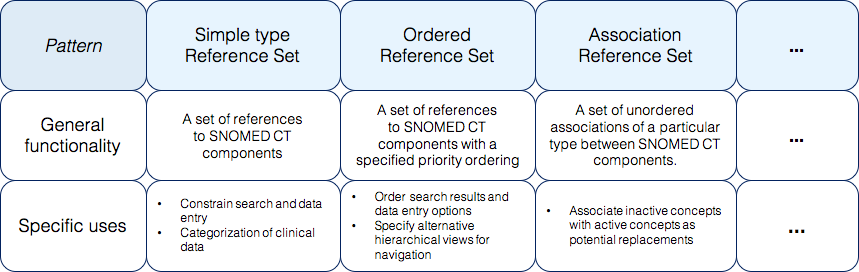

# 4.1.2. General Functionality and Specific Use

All reference set patterns provide general functionality which is enabled by the attributes and data type constraints specified for that particular pattern. 

For example, the general functionality of an [association reference set ](5.4-Association-Reference-Set_35985671.html)is to represent a set of unordered associations of a particular type between SNOMED CT components. This general functionality may be sufficient to fulfill a range of different requirements. It may be used to associate inactive components with active concepts which can be used as 

suitable replacements for the inactive concept. This use may be important for maintenance when a  single reference set is used in a range of locations, and it is required to ensure consistent use of alternatives when content is inactivated. Another use of the same pattern may be to associate findings and procedures, which enables a simple form of conditional documentation support, for example, when a particular finding has been recorded, these are the procedures which may be appropriate.

  

<figure><figcaption>
Figure 4.1.2-1: Illustration of the general functionality and specific uses of selected types of reference sets
</figcaption></figure>

  

When deciding what reference set to develop it is therefore important to be aware of what requirements there are for use of that particular reference set, in order to decide on a pattern, which reflect the general functionality that meet a specific usage.

The name of a reference set pattern also reflects the general functionality of the pattern. reference sets that are developed following a specified pattern will be assigned a description including both a name describing that particular reference set and a term representing the pattern of the reference set. For further information, see [5.1.3 Naming Conventions for Reference Sets](https://confluence.ihtsdotools.org/display/DOCRELFMT/5.1.3+Naming+Conventions+for+Reference+Sets).**  
**
