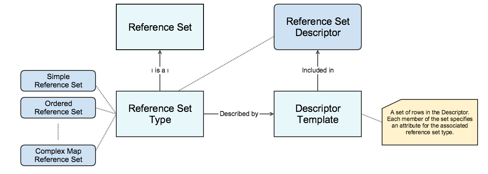

# 4. Reference Set Design

The reference set mechanism is developed to support a range of different purposes, and therefore it has a high degree of flexibility and extensibility. As evidence of the flexibility in the design, some reference set types use a unique set of attributes in addition to the common reference set attributes. The additional attributes have been specified to meet the requirements for use of that particular type of reference set. The extendibility of the design allows reference sets to be customized to suite specific or local requirements. However, to support distribution, sharing and use of a reference set, it is important that the specific reference set design is consistently specified and represented. Thus, all attributes specific for a particular reference set type must be represented in a form which allows consumers of a reference set to validate and interpret the reference set. 

The figure below provides an overview of some of the terms that are central for understanding the reference set design and how reference sets are specified and represented . Each of these terms will be elaborated in the following pages. 

_ |  <figure></figure>  
_

Figure 4-1: Relation between reference set types and descriptor templates

 _  
_
