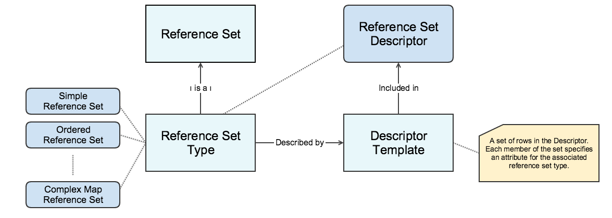
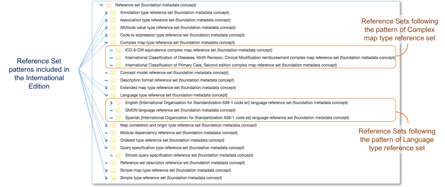
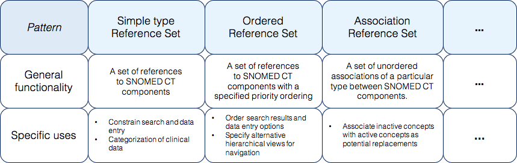
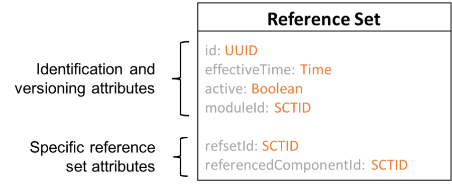
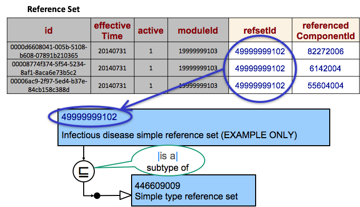
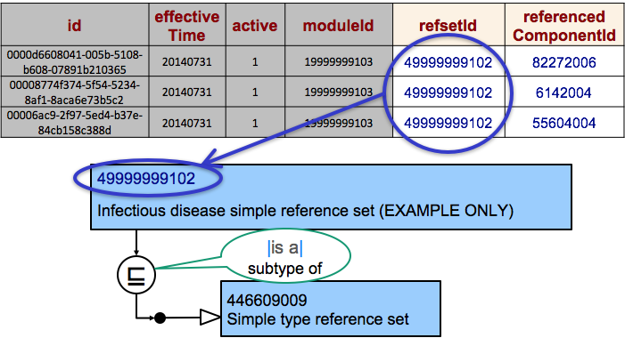
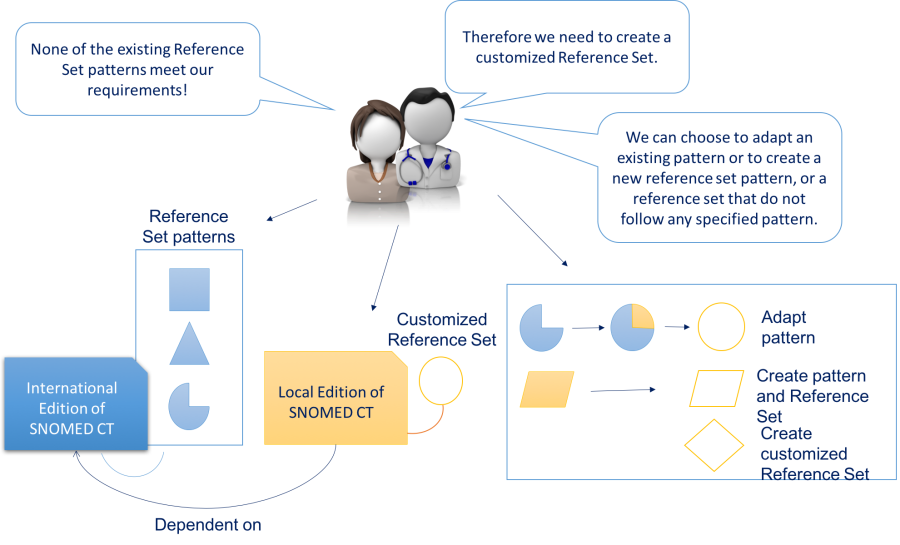

# Reference Set Design

The reference set mechanism is developed to support a range of different purposes, and therefore it has a high degree of flexibility and extensibility. As evidence of the flexibility in the design, some reference set types use a unique set of attributes in addition to the common reference set attributes. The additional attributes have been specified to meet the requirements for use of that particular type of reference set. The extendibility of the design allows reference sets to be customized to suite specific or local requirements. However, to support distribution, sharing and use of a reference set, it is important that the specific reference set design is consistently specified and represented. Thus, all attributes specific for a particular reference set type must be represented in a form which allows consumers of a reference set to validate and interpret the reference set.

The figure below provides an overview of some of the terms that are central for understanding the reference set design and how reference sets are specified and represented . Each of these terms will be elaborated in the following pages.

<figure><figcaption>
Relation between reference set types and descriptor templates
</figcaption></figure>

## Reference Set Types and Descriptors

SNOMED International specifies a set of reference set types, which describes its own specific properties. This means that reference sets that are developed to conform to a specified pattern will have the same release file format as other reference sets of the same type.

The pattern of a specific reference set type is described by a Descriptor Template. This means that the Descriptor Template is represented by a set of members of the 900000000000456007 <mark style="color:blue;">|</mark> Reference set descriptor reference set (foundation metadata concept)<mark style="color:blue;">|</mark> .

All Descriptor Templates present in the international Release of SNOMED CT can be found in the reference set Descriptor.

All reference sets that are released as part of the International Edition or from a National Release Center will have an associated Descriptor Template for the reference set. Where using a reference set for which a Descriptor Template has not been created, and additional information about the reference set is needed, the Descriptor Template of the closest ancestor of the concept describing the reference set that does have a Descriptor Template may be used. This means that a reference sets with no specified Descriptor Template inherits the Template from its supertype.

An organization that releases reference sets should only release them without Descriptor Templates if the reference set follows a predefined pattern or if it is sure that its consumers do not require the information held within the Descriptor Template. You should note that Descriptor Templates are optional for other organizations, besides from SNOMED International, that create reference sets that do not follow a predefined pattern. However, we strongly recommend to specify the reference set descriptor template in the reference set Descriptor, to support automatic processing, validation and sharing of the reference sets.The diagram below illustrates the different reference set types and highlight some of the specific reference sets that are included in the International Edition of SNOMED CT.

<figure><figcaption>
Reference set types and reference sets included in the International Edition of SNOMED CT
</figcaption></figure>

### Reference Set Descriptor

The 900000000000456007 <mark style="color:blue;">|</mark> reference set descriptor reference set<mark style="color:blue;">|</mark> is a reference set used to specify the format of all reference sets included in a release. The data type and meaning of the referenced component and each additional field within each reference set is described by this reference set. More specifically, the reference set descriptor is used to define:

1. The order of appearance of additional attributes (other than those mandatory for all reference sets). The _AttributeOrder attribute_
2. The name and purpose of the additional attributes. The _attributeDescription attribute_
3. The data types for the additional attributes. The _attributeType attribute_

The table below shows an excerpt from the Reference Set Descriptor, to illustrate how the attributes of the predefined reference set types are specified consistently.

Table: Sample of the | reference set descriptor reference set (foundation metadata concept) | (human-readable view with some attributes omitted for brevity)

<table><thead><tr><th width="64.625">...</th><th width="232.5703125">referencedComponentId</th><th>referencedComponentId_term</th><th width="159.359375">attributeDescription</th><th width="212.359375">attributeDescription_term</th><th>attributeType</th><th>attributeType_term</th><th>attributeOrder</th></tr></thead><tbody><tr><td></td><td>446609009</td><td>Simple type reference set</td><td>449608002</td><td>Referenced component</td><td>900000000000461000</td><td>Concept type component</td><td>0</td></tr><tr><td></td><td>447258008</td><td>Ordered type reference set</td><td>449608002</td><td>Referenced component</td><td>900000000000460000</td><td>Component type</td><td>0</td></tr><tr><td></td><td>447258008</td><td>Ordered type reference set</td><td>447255006</td><td>Priority order reference set attribute</td><td>900000000000478000</td><td>Unsigned integer</td><td>1</td></tr><tr><td></td><td>447258008</td><td>Ordered type reference set</td><td>447257003</td><td>"Linked to" reference set attribute</td><td>900000000000460000</td><td>Component type</td><td>2</td></tr><tr><td></td><td>900000000000480006</td><td>Attribute value type</td><td>449608002</td><td>Referenced component</td><td>900000000000460000</td><td>Component type</td><td>0</td></tr><tr><td></td><td>900000000000480006</td><td>Attribute value type</td><td>900000000000491004</td><td>Attribute value</td><td>900000000000461000</td><td>Concept type component</td><td>1</td></tr><tr><td></td><td>900000000000496009</td><td>Simple map</td><td>900000000000500006</td><td>Map source concept</td><td>900000000000461000</td><td>Concept type component</td><td>0</td></tr><tr><td></td><td>900000000000496009</td><td>Simple map</td><td>900000000000499002</td><td>Scheme value</td><td>900000000000465000</td><td>String</td><td>1</td></tr><tr><td></td><td>900000000000506000</td><td>Language type</td><td>900000000000510002</td><td>Description in dialect</td><td>900000000000462000</td><td>Description type component</td><td>0</td></tr><tr><td></td><td>900000000000506000</td><td>Language type</td><td>900000000000511003</td><td>Acceptability</td><td>900000000000461000</td><td>Concept type component</td><td>1</td></tr><tr><td></td><td>900000000000512005</td><td>Query specification type reference set</td><td>900000000000514006</td><td>Generated reference set</td><td>900000000000461000</td><td>Concept type component</td><td>0</td></tr><tr><td></td><td>900000000000512005</td><td>Query specification type reference set</td><td>900000000000515007</td><td>Query</td><td>900000000000465000</td><td>String</td><td>1</td></tr><tr><td></td><td>900000000000516008</td><td>Annotation type</td><td>900000000000518009</td><td>Annotated component</td><td>900000000000461000</td><td>Concept type component</td><td>0</td></tr><tr><td></td><td>900000000000516008</td><td>Annotation type</td><td>900000000000519001</td><td>Annotation</td><td>900000000000465000</td><td>String</td><td>1</td></tr><tr><td></td><td>900000000000521006</td><td>Association type</td><td>900000000000532006</td><td>Association source component</td><td>900000000000460000</td><td>Component type</td><td>0</td></tr><tr><td></td><td>900000000000521006</td><td>Association type</td><td>900000000000533001</td><td>Association target component</td><td>900000000000460000</td><td>Component type</td><td>1</td></tr></tbody></table>

#### Specializing a Descriptor Template

When a new reference set is created in an extension, it must (by default) conform to the reference set descriptors of its closest supertype (if one exists). Creation of a description template for a new reference set is optional in an extension, if the reference set has a supertype which itself has a descriptor template.

However, it is possible for a reference set to specialize the descriptor template of its supertype, by creating a copy and replacing the 900000000000458008 <mark style="color:blue;">|</mark> Attribute description<mark style="color:blue;">|</mark> or 900000000000459000 <mark style="color:blue;">|</mark> Attribute type<mark style="color:blue;">|</mark> values with a subtype.

For example, if a reference set has a descriptor, in which the 900000000000458008 <mark style="color:blue;">|</mark> Attribute description<mark style="color:blue;">|</mark> = 449608002 <mark style="color:blue;">|</mark> Referenced component<mark style="color:blue;">|</mark> and the 900000000000459000 <mark style="color:blue;">|</mark> Attribute type<mark style="color:blue;">|</mark> = 900000000000460005 <mark style="color:blue;">|</mark> Component type<mark style="color:blue;">|</mark> , then the reference set's subtype may replace this descriptor with one in which the 900000000000458008 <mark style="color:blue;">|</mark> Attribute description<mark style="color:blue;">|</mark> = 900000000000460005 <mark style="color:blue;">|</mark> Component type<mark style="color:blue;">|</mark> and the 900000000000459000 <mark style="color:blue;">|</mark> Attribute type<mark style="color:blue;">|</mark> = 900000000000461009 <mark style="color:blue;">|</mark> Concept type component<mark style="color:blue;">|</mark> (since 900000000000461009 <mark style="color:blue;">|</mark> Concept type component<mark style="color:blue;">|</mark> is a subtype of 900000000000460005 <mark style="color:blue;">|</mark> Component type<mark style="color:blue;">|</mark> ). In this way, the reference set descriptors may be specialized for use by the subtypes of the reference set.

### General Functionality and Specific Use

All reference set patterns provide general functionality which is enabled by the attributes and data type constraints specified for that particular pattern.

For example, the general functionality of an [association reference set ](5-reference-set-types.md#association-reference-set)is to represent a set of unordered associations of a particular type between SNOMED CT components. This general functionality may be sufficient to fulfill a range of different requirements. It may be used to associate inactive components with active concepts which can be used as suitable replacements for the inactive concept. This use may be important for maintenance when a single reference set is used in a range of locations, and it is required to ensure consistent use of alternatives when content is inactivated. Another use of the same pattern may be to associate findings and procedures, which enables a simple form of conditional documentation support, for example, when a particular finding has been recorded, these are the procedures which may be appropriate.

<figure><figcaption>
Illustration of the general functionality and specific uses of selected types of reference sets
</figcaption></figure>

When deciding what reference set to develop it is therefore important to be aware of what requirements there are for use of that particular reference set, in order to decide on a pattern, which reflect the general functionality that meet a specific usage.

The name of a reference set pattern also reflects the general functionality of the pattern. reference sets that are developed following a specified pattern will be assigned a description including both a name describing that particular reference set and a term representing the pattern of the reference set. For further information, see [Naming Conventions for Reference Sets](https://app.gitbook.com/s/irKbJsZG57nSWZA4GT0M/reference-set-release-file-specification/5.1.3-naming-conventions-for-reference-sets).

## Common Reference Set Format

Reference sets are made available as release files that represent database tables. [Each row of the table represents a member of the reference set](#user-content-fn-1)[^1]. Each reference set member is represented using the set of attributes shown in the figure below. These common attributes include the four general identification and versioning attributes (shared with components) and two specific reference set attributes. This common set of attributes is sufficient to represent a versioned subset of SNOMED CT components.

As mentioned earlier, reference sets are used for purposes that go beyond subset representation. Different types of reference set are defined for each specific purpose. The definition of each reference set type specifies additional attributes and the way these are used. In these cases, each reference set member is represented by the combination of the common and type specific attributes.

<figure><figcaption>
Attributes used in all types of SNOMED CT reference sets
</figcaption></figure>

### Identification and Versioning Attributes

The reference sets have the same four initial attributes as the content components concepts, descriptions and relationships. These attributes are used to support identification, versioning and modularization.

Table: Overview and description of the general component attributes

<table data-header-hidden><thead><tr><th width="182.51953125"></th><th></th></tr></thead><tbody><tr><td><strong>Attribute</strong></td><td><strong>Description</strong></td></tr><tr><td><strong>id</strong></td><td>The id attribute of the reference set uses the data type Universally Unique Identifier (UUID) to provide a globally unique identifier for each member of the reference set. This is different from the core Components of SNOMED CT, which use the data type SCTID. The UUIDs are 128-bit unsigned integers. Their unique values are generated by widely available algorithms and not part of the SCTID namespace. This avoids the need to track issuing of identifiers for thousands of reference set rows that are needed for some reference sets.</td></tr><tr><td><strong>effectiveTime</strong></td><td>The effectiveTime attribute uses the data type Time to specify the date on which the specific version of the component was released.</td></tr><tr><td><strong>active</strong></td><td>The active attribute uses the Boolean data type to specify whether or not the specific version of the component is active.</td></tr><tr><td><strong>moduleId</strong></td><td>The moduleId attribute identifies the module in which the component is currently being maintained.</td></tr></tbody></table>

The three attributes, id, effectiveTime and active are used together to version each component.

<figure><figcaption></figcaption></figure>

### Specific Reference Set Attributes

There are also two attributes that are shared by all reference set types, but not with the content components (concepts, descriptions and relationships). These attributes are called the refsetId and the referencedComponentId.

Table: Overview and description of the Specific reference set attributes. These attributes are present for all types of reference sets, but some reference sets have more attributes

<table data-header-hidden><thead><tr><th width="216.8359375"></th><th></th></tr></thead><tbody><tr><td><strong>Attribute</strong></td><td><strong>Description</strong></td></tr><tr><td><strong>refsetId</strong></td><td>The refsetId uses a SCTID to identify the reference set. The attribute refers to a concept and the concept's associated descriptions names the reference set. The concept is also a subtype to the concept that represents the type of reference set. One example of concept referenced by the refsetId is the concept 447566000 which description | Virtual medicinal product simple reference set | is the name of the reference set.</td></tr><tr><td><strong>referencedComponentId</strong></td><td>The referencedComponentId identifies a component referenced by the reference set. A reference set of type <a href="5-reference-set-types.md#simple-reference-set">simple reference set</a> represents a subset of SNOMED CT components. For this reference set type the referenced components are the subset members. One example of a component included in the 447566000 <mark style="color:blue;">|</mark> Virtual medicinal product simple reference set<mark style="color:blue;">|</mark> is <mark style="color:blue;">|</mark> Warfarin sodium 5mg tablet <mark style="color:blue;">|</mark></td></tr></tbody></table>

### Reference Set Member and Referenced Component

The two terms "reference set member" and "referenced component" are sometimes used interchangeably, but when working with reference sets it is important to be aware of the distinct meaning of both of these terms, which should not be confused.

A reference set member is simply a single row in a specific reference set. Each member therefore includes the identifier of the member, the membership versioning information, the identifier of the component that is referenced by that row and all the other information that is recorded in a row of the reference set. In contrast, the 'referenced component' is the concept, description or relationship whose identifier appears in the referencedComponentId of the reference set.

Table: The referenced component is the value of the referencedComponentId attribute

| Sample content from 447565001 <mark style="color:blue;">\|</mark> Virtual therapeutic moiety simple reference set<mark style="color:blue;">\|</mark> |
| ---------------------------------------------------------------------------------------------------------------------------------------------------- |

<table data-header-hidden><thead><tr><th width="392.72265625"></th><th></th></tr></thead><tbody><tr><td><strong>refsetId</strong></td><td><strong>referencedComponentId (Referenced component)</strong></td></tr><tr><td>447565001 <mark style="color:blue;">|</mark> Virtual therapeutic moiety simple reference set<mark style="color:blue;">|</mark></td><td>211009 <mark style="color:blue;">|</mark> Norethandrolone preparation<mark style="color:blue;">|</mark></td></tr><tr><td>447565001 <mark style="color:blue;">|</mark> Virtual therapeutic moiety simple reference set<mark style="color:blue;">|</mark></td><td>302007 <mark style="color:blue;">|</mark> Spiramycin<mark style="color:blue;">|</mark></td></tr><tr><td>447565001 <mark style="color:blue;">|</mark> Virtual therapeutic moiety simple reference set<mark style="color:blue;">|</mark></td><td>449005 <mark style="color:blue;">|</mark> Penicillin G procaine<mark style="color:blue;">|</mark></td></tr><tr><td>447565001 <mark style="color:blue;">|</mark> Virtual therapeutic moiety simple reference set<mark style="color:blue;">|</mark></td><td>544002 <mark style="color:blue;">|</mark> Melphalan<mark style="color:blue;">|</mark></td></tr><tr><td>447565001 <mark style="color:blue;">|</mark> Virtual therapeutic moiety simple reference set<mark style="color:blue;">|</mark></td><td>669007 <mark style="color:blue;">|</mark> Vaccinia virus vaccine<mark style="color:blue;">|</mark></td></tr><tr><td>447565001 <mark style="color:blue;">|</mark> Virtual therapeutic moiety simple reference set<mark style="color:blue;">|</mark></td><td>796001 <mark style="color:blue;">|</mark> Digoxin<mark style="color:blue;">|</mark></td></tr><tr><td>447565001 <mark style="color:blue;">|</mark> Virtual therapeutic moiety simple reference set<mark style="color:blue;">|</mark></td><td>847003 <mark style="color:blue;">|</mark> D-thyroxine preparation<mark style="color:blue;">|</mark></td></tr><tr><td>447565001 <mark style="color:blue;">|</mark> Virtual therapeutic moiety simple reference set<mark style="color:blue;">|</mark></td><td>922004 <mark style="color:blue;">|</mark> Pralidoxime<mark style="color:blue;">|</mark></td></tr><tr><td>447565001 <mark style="color:blue;">|</mark> Virtual therapeutic moiety simple reference set<mark style="color:blue;">|</mark></td><td>1039008 <mark style="color:blue;">|</mark> Mercaptopurine<mark style="color:blue;">|</mark></td></tr><tr><td>447565001 <mark style="color:blue;">|</mark> Virtual therapeutic moiety simple reference set<mark style="color:blue;">|</mark></td><td>1148001 <mark style="color:blue;">|</mark> Ticarcillin<mark style="color:blue;">|</mark></td></tr></tbody></table>

### Reference Set Identification

For practical reasons, a reference set needs to be identified and named, so it can be referred to unambiguously. In a reference set, the reference set is identified by the refsetId attribute, which refers to a concept.

This concept is a subtype of the concept 900000000000455006 <mark style="color:blue;">|</mark> Reference set (foundation metadata concept)<mark style="color:blue;">|</mark> .

As for other all concepts in SNOMED CT, descriptions and relationships are added to enable human-readable representation of the concept, and to place the concept in the SNOMED CT hierarchy. The descriptions provide the name of the reference set, and the relationship refers to the concept representing the reference set type. This is illustrated in the diagram below where the concept with the id 49999999102 has the associated description "Infectious disease simple reference set", and the relationship places the concept as a subtype of the concept 446609009 <mark style="color:blue;">|</mark> Simple type reference set (foundation metadata concept)<mark style="color:blue;">|</mark> .

<figure><figcaption></figcaption></figure>

Reference sets of a particular type are identified by concepts that are subtypes of the concept representing the reference set type.

<mark style="color:red;">900000000000983016</mark> 900000000000983016 <mark style="color:blue;">|</mark>Reference set<mark style="color:blue;">|</mark>\
446609009 <mark style="color:blue;">|</mark>Simple type reference set<mark style="color:blue;">|</mark>\
447250001 <mark style="color:blue;">|</mark>Complex map type reference set<mark style="color:blue;">|</mark>\
447258008 <mark style="color:blue;">|</mark>Ordered type reference set<mark style="color:blue;">|</mark>\
609331003 <mark style="color:blue;">|</mark>Extended map type reference set<mark style="color:blue;">|</mark>\
609430003 <mark style="color:blue;">|</mark>Concept model reference set<mark style="color:blue;">|</mark>\
705109006 <mark style="color:blue;">|</mark>Code to expression type reference set<mark style="color:blue;">|</mark>\
705111002 <mark style="color:blue;">|</mark>Map correlation and origin type reference set<mark style="color:blue;">|</mark>\
723564002 <mark style="color:blue;">|</mark>MRCM reference set<mark style="color:blue;">|</mark>\
733613001 <mark style="color:blue;">|</mark>Intensional definition reference set<mark style="color:blue;">|</mark>\
733614007 <mark style="color:blue;">|</mark>Expansion history reference set<mark style="color:blue;">|</mark>\
733618005 <mark style="color:blue;">|</mark>Ordered association type reference set<mark style="color:blue;">|</mark>\
733619002 <mark style="color:blue;">|</mark>Ordered component type reference set<mark style="color:blue;">|</mark>\
762676003 <mark style="color:blue;">|</mark>OWL expression type reference set<mark style="color:blue;">|</mark>\
900000000000456007 <mark style="color:blue;">|</mark>Reference set descriptor<mark style="color:blue;">|</mark>\
900000000000480006 <mark style="color:blue;">|</mark>Attribute value type<mark style="color:blue;">|</mark>\
900000000000496009 <mark style="color:blue;">|</mark>Simple map<mark style="color:blue;">|</mark>\
900000000000506000 <mark style="color:blue;">|</mark>Language type<mark style="color:blue;">|</mark>\
900000000000512005 <mark style="color:blue;">|</mark>Query specification type<mark style="color:blue;">|</mark>\
900000000000516008 <mark style="color:blue;">|</mark>Annotation type<mark style="color:blue;">|</mark>\
900000000000521006 <mark style="color:blue;">|</mark>Association type<mark style="color:blue;">|</mark>\
900000000000534007 <mark style="color:blue;">|</mark>Module dependency<mark style="color:blue;">|</mark>\
900000000000538005 <mark style="color:blue;">|</mark>Description format reference set<mark style="color:blue;">|</mark>

The organization responsible for creating the reference set may add intermediate subtype concepts of the reference set type concept to group together reference sets of that type for which they are responsible. For example, the simple reference sets created by the SNOMED International group responsible for General Practice / Family Practice reference sets are organized as shown below.

|

<mark style="color:red;">2920887014</mark> 2920887014 <mark style="color:blue;">|</mark>General Practice / Family Practice reference set<mark style="color:blue;">|</mark>\
450971007 <mark style="color:blue;">|</mark>GP/FP reason for encounter reference set<mark style="color:blue;">|</mark>\
450974004 <mark style="color:blue;">|</mark>Symptoms and signs reference set for GP/FP reason for encounter<mark style="color:blue;">|</mark>\
450976002 <mark style="color:blue;">|</mark>Disorders and diseases reference set for GP/FP reason for encounter<mark style="color:blue;">|</mark>\
450977006 <mark style="color:blue;">|</mark>Results reference set for GP/FP reason for encounter<mark style="color:blue;">|</mark>\
450978001 <mark style="color:blue;">|</mark>Family history reference set for GP/FP reason for encounter<mark style="color:blue;">|</mark>\
450980007 <mark style="color:blue;">|</mark>Allergies reference set for GP/FP reason for encounter<mark style="color:blue;">|</mark>\
450981006 <mark style="color:blue;">|</mark>Adverse drug reactions reference set for GP/FP reason for encounter<mark style="color:blue;">|</mark>\
450982004 <mark style="color:blue;">|</mark>Processes and procedures reference set for GP/FP reason for encounter<mark style="color:blue;">|</mark>\
450983009 <mark style="color:blue;">|</mark>Social history reference set for GP/FP reason for encounter<mark style="color:blue;">|</mark>\
450973005 <mark style="color:blue;">|</mark>GP/FP health issue reference set<mark style="color:blue;">|</mark>\
450984003 <mark style="color:blue;">|</mark>Symptoms and signs reference set for GP/FP health issue<mark style="color:blue;">|</mark>\
450985002 <mark style="color:blue;">|</mark>Disorders and diseases reference set for GP/FP health issue<mark style="color:blue;">|</mark>\
450986001 <mark style="color:blue;">|</mark>Results reference set for GP/FP health issue<mark style="color:blue;">|</mark>\
450988000 <mark style="color:blue;">|</mark>Family history reference set for GP/FP health issue<mark style="color:blue;">|</mark>\
450989008 <mark style="color:blue;">|</mark>Allergies reference set for GP/FP health issue<mark style="color:blue;">|</mark>\
450990004 <mark style="color:blue;">|</mark>Adverse drug reactions reference set for GP/FP health issue<mark style="color:blue;">|</mark>\
450991000 <mark style="color:blue;">|</mark>Processes and procedures reference set for GP/FP health issue<mark style="color:blue;">|</mark>\
450992007 <mark style="color:blue;">|</mark>Social history reference set for GP/FP health issue<mark style="color:blue;">|</mark>

## Pre-defined and Customized Reference Sets

SNOMED CT specifies a set of reference set types that follow specific patterns. However, different purposes and uses may impose different requirements. Therefore, flexibility is a core feature of the reference set mechanism. This flexibility is manifested by the fact that reference sets can be applied in ways that meet specific requirements; options include:

<table><thead><tr><th width="324.2890625">Option</th><th>Description</th></tr></thead><tbody><tr><td><strong>Create reference set based on existing pattern</strong></td><td>Creating a simple reference set, an ordered reference set (or any other reference set) using the predefined pattern for this reference set type. Without modifying or constraining the structure of this pattern.</td></tr><tr><td><strong>Create reference set based on existing pattern, however constraining the datatypes of specific attributes</strong></td><td>Create a reference set using a predefined pattern, however specializing the descriptor template, by creating a copy and replacing the <mark style="color:blue;">|</mark>Attribute description<mark style="color:blue;">|</mark> or <mark style="color:blue;">|</mark>Attribute type<mark style="color:blue;">|</mark> values with a subtype.</td></tr><tr><td><strong>Customize reference set by defining a new reference set pattern</strong></td><td>Define a new reference set pattern based on new or existing reference set types, attributes, and attribute values. (Since you could use an existing type as a starting point.)</td></tr></tbody></table>

This means that if the pattern of existing reference set types is not sufficient for local requirements, then new reference set patterns can be specified and included in a national or local SNOMED CT Extension.

### Customized Reference Sets

There might be situations where none of the defined reference set patterns are sufficient to fulfill the requirements for a specific use case for an implementing organization/project. In this case, it is possible to develop customized reference sets, which include the exact attributes necessary to meet the requirements.

If an existing pattern almost meets the requirements a developing organization may want to simply add additional attributes to an existing reference set pattern. If none of the existing patterns can be adapted it is also possible to develop a new reference set pattern or a reference set that does not follow any specified pattern. The different approaches to customizing a reference set are illustrated in the figure below.

<figure><figcaption></figcaption></figure>

<figure><figcaption></figcaption></figure>

When creating customized reference sets, it is important to ensure that the structure and content of the reference set can be automatically processed and validated. Therefore, customized reference sets should be clearly specified, which can be done specifying the reference set pattern in the [reference set descriptor](4-reference-set-design.md#reference-set-descriptor). Specifying customized reference sets in the **reference set descriptor** enables users of the reference set to validate any reference set of this particular pattern against the specified definition.

<figure><figcaption></figcaption></figure>

<a href="https://docs.google.com/forms/d/e/1FAIpQLScTmbZIf0UEQwYDkY27EEWBkaiYkHSbR0_9DmFrMLXoQLyL7Q/viewform?usp=pp_url&#x26;entry.1767247133=Refset+Guide&#x26;entry.670899847=Reference%20Set%20Design" class="button primary">Provide Feedback</a>

[^1]: To be more precise, each row of a reference set table represents a version of a member of a reference set because, like SNOMED CT components, reference set members can be revised or inactivated by adding new versions to subsequent versions of a release file.
