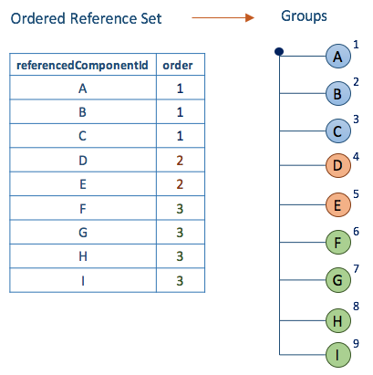

# 5.3. Ordered Component Reference Set

The design of the ordered reference set supports two overall purposes:

  1. Specifying a sequential order of a subset of components
  2. Specifying prioritized groups within a subset of components 

# Ordering

Ordered component reference set can be used to create a simple ordered list of components, i.e. a list that do not include any nesting, or groups. It can for example be used to prioritize the sort order of the descriptions with identical terms when they are displayed. It can also be used to specify the order of descriptions displayed in a simple pick list. 

<figure><figcaption>
Figure 5.3-1: Ordered reference set with no groups
</figcaption></figure>

# Prioritization

Prioritization is similar to order but multiple components may have the same rank. In this case the value of the order attribute specify a priority order for a group of components. 

  

<figure><figcaption>
Figure 5.3-2: Ordered reference set with prioritized groups.
</figcaption></figure>

## Reference Set Specific Attributes

##### Specific reference set attributes used to build an alternative hierarchical view of SNOMED CT 

Attribute| Description  
---|---  
**[referencedComponentId](https://confluence.ihtsdotools.org/display/DOCRELFMT/referencedComponentId+\(field\) "Reference term: referencedComponentId \(field\)")**|  The identifier of a SNOMED CT component that is included in the ordered list of alternative hierarchy.   
**[order](https://confluence.ihtsdotools.org/display/DOCRELFMT/order+\(field\) "Reference term: order \(field\)")**|  Specifies the sort order of the list. The list is ordered by applying an ascending sort of the order value.   
The value of order =1 represents the highest priority. A value of '0' is not allowed. Duplicate values are permitted and the sort order between two members with the same order value is not defined.   
  
  

