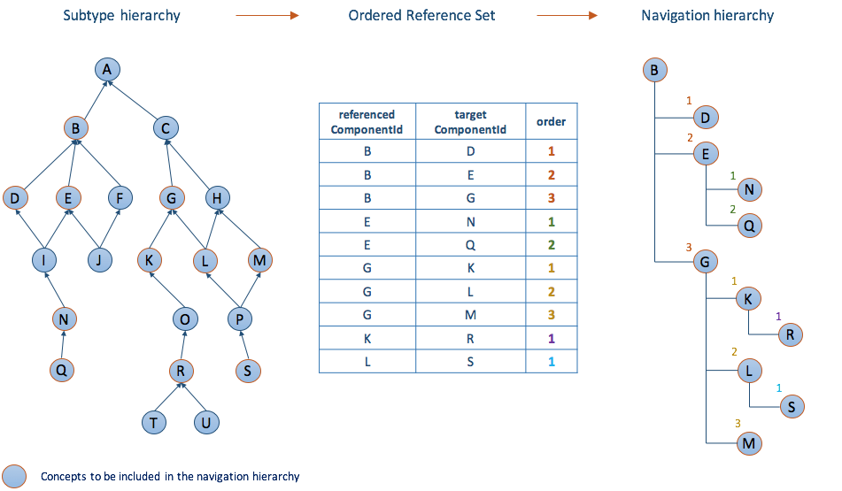

# 5.5 Ordered Association Reference Set

## Alternative Hierarchy

Some situations may require components to be rendered in an alternative hierarchy than the polyhierarchy specified by the | is a | relationships in SNOMED CT. The diagram below Illustrates how the three attributes referencedComponentId, targetComponentId and order are used to create an alternative hierarchical order of some of the concepts from the subtype hierarchy. 

<figure></figure>

<figure></figure>

## Reference Set Specific Attributes

##### Specific reference set attributes used to build an alternative hierarchical view of SNOMED CT

Attribute| Description  
---|---  
**[referencedComponentId](https://confluence.ihtsdotools.org/display/DOCRELFMT/referencedComponentId+\(field\) "Reference term: referencedComponentId \(field\)")**| The identifier of a SNOMED CT component that is included in the ordered list of alternative hierarchy.  
**[targetComponentId](https://confluence.ihtsdotools.org/display/DOCRELFMT/targetComponentId+\(field\) "Reference term: targetComponentId \(field\)")**| The identifier of a SNOMED CT component that acts as a grouper or hierarchy node, collecting together a subgroup from within the list.   
  
This field either enables reference set member linked into a number of subgroups. These subgroups can be nested allowing representation of alternative hierarchies.   
  
To place reference set members in a subgroup, all components in the same subgroup should reference the same component. This can either be a component that represents the name of that subgroup or the first member of the subgroup. In the latter case, the first row of each subgroup will contain the same identifier in referencedComponentId and targetComponent and with order =1.   
  
To associate a number of children concepts to a single parent concept, one member record should exist per child, with the referencedComponentId field referencing the parent and this field referencing the child concept. The order field is then used to order the children concepts under the parent concept.  
**[order](https://confluence.ihtsdotools.org/display/DOCRELFMT/order+\(field\) "Reference term: order \(field\)")**| Specifies the sort order of the list. The list is ordered by applying an ascending sort of the order value.   
The value of order =1 represents the highest priority. A value of '0' is not allowed. Duplicate values are permitted and the sort order between two members with the same order value is not defined.   
If the targetComponentId value is not 0, sorting occurs within subgroups that share the same targetComponentId value.  
  
  

  

