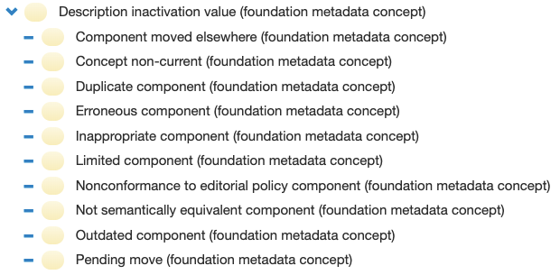

# 5.8. Attribute Value Reference Set

An attribute value reference set is a component [reference set](https://confluence.ihtsdotools.org/display/DOCGLOSS/reference+set) used to apply a tagged value to a SNOMED CT component. The pattern of the attribute value reference set is similar to that of the [association reference set](5.4-Association-Reference-Set_35985671.html), despite the fact that the components referenced in the valueId attribute must be a subtype of the concept  [ 900000000000491004 | Attribute value|](http://snomed.info/id/900000000000491004 "900000000000491004 | Attribute value |") , which include the concepts shown in 

<figure><figcaption>
and
</figcaption></figure>

<figure><figcaption>
.
</figcaption></figure>

<figure></figure>

<figure></figure>

  

<figure></figure>

<figure><figcaption>
An [ 900000000000480006 | Attribute value type reference set|](http://snomed.info/id/900000000000480006 "900000000000480006 | Attribute value type reference set |") allows a value from a specified range to be associated with a component. This type of reference set can be use for a range of purposes where there is a requirement to provide additional information about particular concepts, descriptions or relationships. In the International Edition of SNOMED CT an [ 900000000000480006 | Attribute value type reference set|](http://snomed.info/id/900000000000480006 "900000000000480006 | Attribute value type reference set |") is for example used to indicate the reason why components have been inactivated.
</figcaption></figure>

  

  * [ 900000000000489007 | Concept inactivation indicator attribute value reference set (foundation metadata concept)|](http://snomed.info/id/900000000000489007 "900000000000489007 | Concept inactivation indicator attribute value reference set \(foundation metadata concept\) |")

  * [ 900000000000490003 | Description inactivation indicator attribute value reference set (foundation metadata concept)|](http://snomed.info/id/900000000000490003 "900000000000490003 | Description inactivation indicator attribute value reference set \(foundation metadata concept\) |")

## Refset Specific Attributes

Field| Data type| Purpose  
---|---|---  
[referencedComponentId](https://confluence.ihtsdotools.org/display/DOCRELFMT/referencedComponentId+\(field\) "Reference term: referencedComponentId \(field\)")| [SCTID](https://confluence.ihtsdotools.org/display/DOCGLOSS/SCTID)| A reference to the SNOMED CT component being tagged with a value.  
[valueId](https://confluence.ihtsdotools.org/display/DOCRELFMT/valueId+\(field\) "Reference term: valueId \(field\)")| [SCTID](https://confluence.ihtsdotools.org/display/DOCGLOSS/SCTID)| The tagged value applied to the referencedComponentId. A subtype of [ 900000000000491004 | Attribute value|](http://snomed.info/id/900000000000491004 "900000000000491004 | Attribute value |") .  
  
  

  

