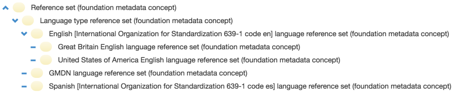
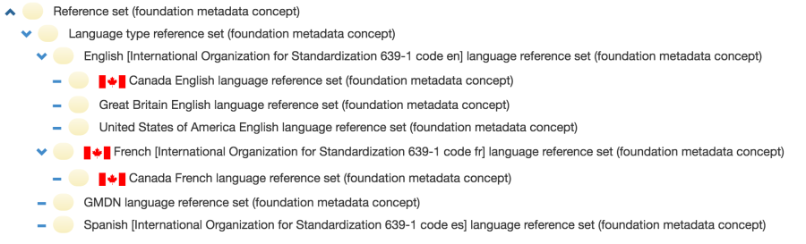
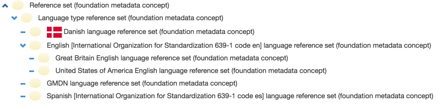
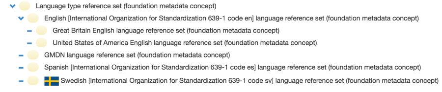

# 5.9.1. Language Reference Sets in National Editions

When SNOMED CT is translated into other languages, it requires the Extension to include a description release file containing the new descriptions with the translated and approved terms. It also requires a language reference set, which specifies the acceptability of these new descriptions. The language reference set necessary to distinguish the preferred synonym (preferred term) from the acceptable synonyms, and it is required for specifying the preferred Fully Specified Name (FSN) within that language. A concept may have more than one FSN, but only one of these may be marked as 'preferred' in a given language. A Language Reference Set is therefore used to specify which FSN description is preferred in each language or dialect.

Even when SNOMED CT is not translated into other languages, a Language Reference Set can be used within an Extension to specify which of the existing descriptions from the International Edition are preferred and accepted within the particular context where the Extension is applied. The table below illustrates that within a single SNOMED CT Edition, multiple language reference sets can be created.

<figure><figcaption>
<strong>Edition</strong>| <strong>Available Language reference sets</strong>
</figcaption></figure>

\|---\
International Edition|

<figure><figcaption></figcaption></figure>

Canadian EN Edition|

<figure><figcaption></figcaption></figure>

Danish Edition|

<figure><figcaption></figcaption></figure>

Swedish Edition|

<figure><figcaption></figcaption></figure>
