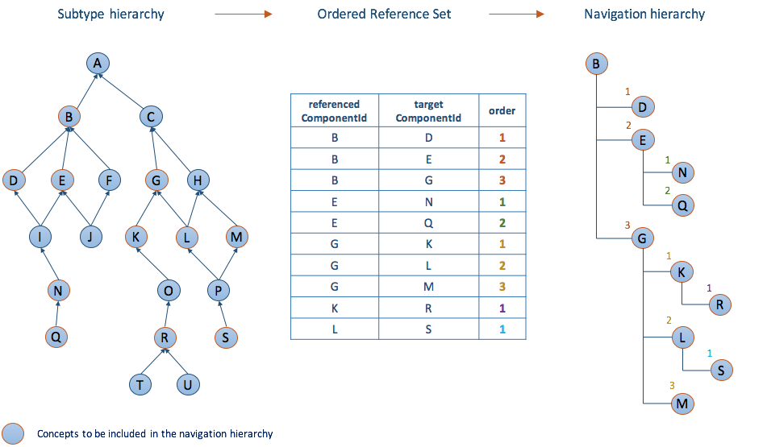

# Reference Set Types

SNOMED International specifies and distributes a range of different reference set types as part of the International release of SNOMED CT. These types of reference sets have been specified to provide a foundation for the more general requirements that may arise when implementing/enabling SNOMED CT in clinical information systems.

Each reference set type is described in a machine-readable form that follows a specific reference set pattern. An overview of the different types of reference sets is provided in [Appendix A: Overview of Reference Set Types](appendix-a-overview-of-reference-set-types.md) and the technical specification for each of these types can be found in the Release File Specification Guide, section[ Reference Set Release Files Specification](https://app.gitbook.com/s/irKbJsZG57nSWZA4GT0M/reference-set-release-file-specification).

This guide will provide guidance to the usage of a selected set of reference set types. These reference set types are included in this guide, as they relate to the practical use of SNOMED CT content in clinical information systems. This includes:

* Simple Reference Set
* Query Specification Reference Set
* Ordered Component Reference Set
* Association Reference Set
* Ordered Association Reference Set
* Component Annotation Reference Set
* Member Annotation Reference Set
* Attribute Value Reference Set
* Language Reference Set
* Human-Readable Reference Set

For details about the general functionality of each of the reference set types included in this guide, please see the section related to each these reference sets.

Other types of reference sets, such as the [simple map reference set](https://app.gitbook.com/s/irKbJsZG57nSWZA4GT0M/reference-set-release-file-specification/5.2-reference-set-types/5.2.3-map-reference-sets/5.2.3.1-simple-map-from-snomed-ct-reference-set) and the [complex and extended map reference](https://app.gitbook.com/s/irKbJsZG57nSWZA4GT0M/reference-set-release-file-specification/5.2-reference-set-types/5.2.3-map-reference-sets/5.2.3.3-complex-and-extended-map-from-snomed-ct-reference-sets) set are important for the co-existence of SNOMED CT and other code systems, but are addressed in other guides. Some reference sets are used to hold metadata, which is used for management or maintenance purposes, such as the [historical association reference set ](3-requirements-and-use-cases/3.2-use-cases/3.2.6-maintenance-and-management.md#representing-historical-associations)and the [module dependency reference set](https://app.gitbook.com/s/irKbJsZG57nSWZA4GT0M/reference-set-release-file-specification/5.2-reference-set-types/5.2.4-metadata-reference-sets/5.2.4.2-module-dependency-reference-set). These reference set types will not be covered in this guide.

## Simple Reference Set

The Simple reference set type represents an extensional definition of a subset of components. The components can be concepts, descriptions, relationships and reference sets. Therefore, the reference set contains a list of references to one or more components.

The components can be specified for inclusion or exclusion for a specified purpose. For example, the 450970008 <mark style="color:blue;">|</mark> General Practice / Family Practice reference set<mark style="color:blue;">|</mark> contains the concepts that are important for general practice and family practice medicine. In this section we will introduce the Simple type reference set format, the techniques for creation of simple reference sets and provide some examples of Simple reference sets and their usage.

Simple reference sets contain only the basic information needed to define a subset. As presented in the section about the [reference set design](4-reference-set-design.md), each member in a reference set has a referencedComponentId attribute, which is used to refer to the component that is a member of the reference set. Within the instances of this attribute, the individual references to components are stored. The diagram below illustrates an example of a simple reference set, and illustrates how the subset members are referenced in the referencedComponentId attribute.

<figure><figcaption>
Simple reference set example
</figcaption></figure>

## Query Specification Reference Set

The query specification type reference set is used to hold a series of queries used to represent the membership of a subset of SNOMED CT components.

A query contained in the reference set is run against the content of SNOMED CT (the **substrate**) to produce a subset of concepts, descriptions or relationships (the **expansion**). The query is referred to as an [intensional](2-subsets-value-sets-and-reference-sets/2.1-subset.md#intensional-subset-definition) definition of the subset. It can be run against new releases of SNOMED CT to generate an updated set of subset members. Additionally, the members of the **expansion** may also be represented in an enumerated form as a [simple reference set](5-reference-set-types.md#simple-reference-set). An enumerated representation of a subset is referred to as an [extensional](2-subsets-value-sets-and-reference-sets/2.1-subset.md#extensional-definitions) definition of a subset. The diagram below illustrates the relation between the query specification reference set and the simple reference set. The intensional definition is represented in the 'query' attribute, and the identifier for the expansion's simple reference set is represented by the concept referenced in the 'referencedComponentId' attribute.

The two tables below illustrate the relationship between the query specification type reference set and the **simple reference set**. The referencedComponentId in the query specification type reference set references a concept which represent the **simple type reference set**, which is used to hold the expansion of the intensional definition.

| id      | effectiveTime | active | moduleId    | moduleId\_term           | refsetId           | refsetId\_term                           | referencedComponentId | referencedComponentId\_term                  | query       | query\_term                                        |
| ------- | ------------- | ------ | ----------- | ------------------------ | ------------------ | ---------------------------------------- | --------------------- | -------------------------------------------- | ----------- | -------------------------------------------------- |
| \<UUID> | 20160131      | 1      | 19999999103 | Example Extension Module | 900000000000513000 | Simple query specification reference set | 739999999103          | Route of administration simple reference set | < 284009009 | Descendants of \| Route of administration value \| |

<table><thead><tr><th width="89.4609375">id</th><th>effectiveTime</th><th width="90.3359375">active</th><th>moduleId</th><th>moduleId_term</th><th width="149.78515625">refsetId</th><th width="175.5859375">refsetId_term</th><th>referencedComponentId</th><th>referencedComponentId_term</th></tr></thead><tbody><tr><td>&#x3C;UUID></td><td>20160131</td><td>1</td><td>19999999103</td><td>Example Extension Module</td><td>739999999103</td><td>Route of administration simple reference set</td><td>420254004</td><td>Body cavity route (qualifier value)</td></tr><tr><td>&#x3C;UUID></td><td>20160131</td><td>1</td><td>19999999103</td><td>Example Extension Module</td><td>739999999103</td><td>Route of administration simple reference set</td><td>419762003</td><td>Peritendinous route (qualifier value)</td></tr><tr><td>&#x3C;UUID></td><td>20160131</td><td>1</td><td>19999999103</td><td>Example Extension Module</td><td>739999999103</td><td>Route of administration simple reference set</td><td>37161004</td><td>Rectal route (qualifier value)</td></tr><tr><td>&#x3C;UUID></td><td>20160131</td><td>1</td><td>19999999103</td><td>Example Extension Module</td><td>739999999103</td><td>Route of administration simple reference set</td><td>419954003</td><td>Ileostomy route (qualifier value)</td></tr><tr><td>&#x3C;UUID></td><td>20160131</td><td>1</td><td>19999999103</td><td>Example Extension Module</td><td>739999999103</td><td>Route of administration simple reference set</td><td>445754005</td><td>Intragingival route (qualifier value)</td></tr><tr><td>&#x3C;UUID></td><td>20160131</td><td>1</td><td>19999999103</td><td>Example Extension Module</td><td>739999999103</td><td>Route of administration simple reference set</td><td>448077001</td><td>Intraepidermal route (qualifier value)</td></tr><tr><td>&#x3C;UUID></td><td>20160131</td><td>1</td><td>19999999103</td><td>Example Extension Module</td><td>739999999103</td><td>Route of administration simple reference set</td><td>420163009</td><td>Esophagostomy route (qualifier value)</td></tr><tr><td>&#x3C;UUID></td><td>20160131</td><td>1</td><td>19999999103</td><td>Example Extension Module</td><td>739999999103</td><td>Route of administration simple reference set</td><td>446442000</td><td>Transplacental route (qualifier value)</td></tr><tr><td>&#x3C;UUID></td><td>20160131</td><td>1</td><td>19999999103</td><td>Example Extension Module</td><td>739999999103</td><td>Route of administration simple reference set</td><td>448491004</td><td>Intrajejunal route (qualifier value)</td></tr><tr><td>&#x3C;UUID></td><td>20160131</td><td>1</td><td>19999999103</td><td>Example Extension Module</td><td>739999999103</td><td>Route of administration simple reference set</td><td>127490009</td><td>Gastrostomy route (qualifier value)</td></tr><tr><td>&#x3C;UUID></td><td>20160131</td><td>1</td><td>19999999103</td><td>Example Extension Module</td><td>739999999103</td><td>Route of administration simple reference set</td><td>419243002</td><td>Transcervical route (qualifier value)</td></tr><tr><td>&#x3C;UUID></td><td>20160131</td><td>1</td><td>19999999103</td><td>Example Extension Module</td><td>739999999103</td><td>Route of administration simple reference set</td><td>...</td><td>...</td></tr><tr><td>&#x3C;UUID></td><td>20160131</td><td>1</td><td>19999999103</td><td>Example Extension Module</td><td>739999999103</td><td>Route of administration simple reference set</td><td>...</td><td>...</td></tr></tbody></table>

The [Expression Constraint Language](https://app.gitbook.com/o/h8Z6qGxuQrzM9vbx5bPT/s/sOJBD7YbxAy9bD1Ko9L9/) is the recommended language for specifying queries over SNOMED CT content. This language allows for a consistent and machine-readable representation of sets of clinical meanings. This means that a set of expression constraints can be used to specify the intensional definition of a range of subsets used in a particular context. The use cases for the subset generated from the queries within a query specification reference set are similar to the use cases for [simple reference sets](5-reference-set-types.md#simple-reference-set). However, the query specification reference set type can be used anywhere a set of queries needs to be managed.

### Reference Set Specific Attributes

<table><thead><tr><th width="213.34375">Field</th><th width="114.125">Data type</th><th>Purpose</th></tr></thead><tbody><tr><td>referencedComponentId</td><td>SCTID</td><td>The identifier (<strong>refsetId</strong>) of the <strong>reference set</strong> for which members are to be generated.</td></tr><tr><td>query</td><td>String</td><td>
The serialised <strong>query</strong> that can be used to (re-)generate the <strong>reference set</strong> members.

The SNOMED CT Query Language is a formal language for representing computable queries over SNOMED CT content.
</td></tr></tbody></table>

## Ordered Component Reference Set

The design of the ordered reference set supports two overall purposes:

1. Specifying a sequential order of a subset of components
2. Specifying prioritized groups within a subset of components

### Ordering

Ordered component reference set can be used to create a simple ordered list of components, i.e. a list that do not include any nesting, or groups. It can for example be used to prioritize the sort order of the descriptions with identical terms when they are displayed. It can also be used to specify the order of descriptions displayed in a simple pick list.

<figure><figcaption>
Ordered reference set with no groups
</figcaption></figure>

### Prioritization

Prioritization is similar to order but multiple components may have the same rank. In this case the value of the order attribute specify a priority order for a group of components.

<figure><figcaption>
Ordered reference set with prioritized groups.
</figcaption></figure>

### Reference Set Specific Attributes

**Specific reference set attributes used to build an alternative hierarchical view of SNOMED CT**

<table><thead><tr><th width="217.90625">Attribute</th><th>Description</th></tr></thead><tbody><tr><td><strong>referencedComponentId</strong></td><td>The identifier of a SNOMED CT component that is included in the ordered list of alternative hierarchy.</td></tr><tr><td><strong>order</strong></td><td>Specifies the sort order of the list. The list is ordered by applying an ascending sort of the order value. The value of order =1 represents the highest priority. A value of '0' is not allowed. Duplicate values are permitted and the sort order between two members with the same order value is not defined.</td></tr></tbody></table>

## Association Reference Set

The Association type reference set represents a set of unordered associations of a particular type between components, i.e. concepts, descriptions and relationships. The referencedComponentId references the source component of the association, whereas the reference set specific attribute, the targetComponentId, references the target component of the association.

<figure><figcaption></figcaption></figure>

Associations between components can be used to form groups of components, as illustrated in the diagram below. When using an association reference set to specify group, the sort order of the group members is not specified, as when using the Ordered type reference set.

<figure><figcaption></figcaption></figure>

### Reference Set Specific Attributes

<table><thead><tr><th width="209.4765625">Field</th><th width="108.65234375">Data type</th><th>Purpose</th></tr></thead><tbody><tr><td>referencedComponentId</td><td>SCTID</td><td>The identifier of the <strong>source component</strong> of the association.</td></tr><tr><td>targetComponentId</td><td>SCTID</td><td>The identifier of the <strong>target component</strong> of the association.</td></tr></tbody></table>

## Ordered Association Reference Set

### Alternative Hierarchy

Some situations may require components to be rendered in an alternative hierarchy than the polyhierarchy specified by the <mark style="color:blue;">|</mark> is a <mark style="color:blue;">|</mark> relationships in SNOMED CT. The diagram below Illustrates how the three attributes referencedComponentId, targetComponentId and order are used to create an alternative hierarchical order of some of the concepts from the subtype hierarchy.

<figure><figcaption></figcaption></figure>

<figure><figcaption></figcaption></figure>

### Reference Set Specific Attributes

**Specific reference set attributes used to build an alternative hierarchical view of SNOMED CT**

<table><thead><tr><th width="220.27734375">Attribute</th><th>Description</th></tr></thead><tbody><tr><td><strong>referencedComponentId</strong></td><td>The identifier of a SNOMED CT component that is included in the ordered list of alternative hierarchy.</td></tr><tr><td><strong>targetComponentId</strong></td><td>
The identifier of a SNOMED CT component that acts as a grouper or hierarchy node, collecting together a subgroup from within the list.  This field either enables reference set member linked into a number of subgroups. These subgroups can be nested allowing representation of alternative hierarchies. 

To place reference set members in a subgroup, all components in the same subgroup should reference the same component. This can either be a component that represents the name of that subgroup or the first member of the subgroup. In the latter case, the first row of each subgroup will contain the same identifier in referencedComponentId and targetComponent and with order =1. 

To associate a number of children concepts to a single parent concept, one member record should exist per child, with the referencedComponentId field referencing the parent and this field referencing the child concept. The order field is then used to order the children concepts under the parent concept.
</td></tr><tr><td><strong>order</strong></td><td>Specifies the sort order of the list. The list is ordered by applying an ascending sort of the order value. The value of order =1 represents the highest priority. A value of '0' is not allowed. Duplicate values are permitted and the sort order between two members with the same order value is not defined. If the targetComponentId value is not 0, sorting occurs within subgroups that share the same targetComponentId value.</td></tr></tbody></table>

## Component Annotation Reference Set

The Component Annotation Type Reference Set is dedicated to providing additional contextual information related to specific SNOMED CT components. This reference set type allows users to annotate SNOMED CT components such as concepts, descriptions, and relationships with supplementary details. Where the 900000000000521006 <mark style="color:blue;">|</mark> Association type reference set<mark style="color:blue;">|</mark> linked a SNOMED CT component to another SNOMED CT component, the Component Annotation Type Reference Set allows a SNOMED CT component to be associated with a wide variety of information.

The primary objective of Component Annotation Type Reference Sets is to offer insights that aid in the evaluation of changes made to SNOMED CT components. These annotations serve as valuable metadata, assisting in the understanding, implementation, and management of SNOMED CT content without impacting the classification of concepts. For instance, they can include details about the rationale behind a modification, usage guidance, or any other relevant information that enriches the understanding of the component's purpose and intended use.

### Example Use Case 

One important use case for the SNOMED CT Component Annotation Type reference set, particularly regarding annotations to concepts, involves the application of attribution annotations, i.e. explaining where certain content comes from. This is helpful when different groups or organizations collaborate on the creation and maintenance of SNOMED CT content.

These annotations can include different types of information, such as hyperlinks or text in different languages. This variety of information helps to keep track of who contributed what and why. For example, web links can directly link to outside sources or contributor profiles, making things transparent and easy to follow. Supporting text in different languages helps people understand content better in different languages. These annotations are like a record book that helps keep track of contributions, encourages teamwork, and explains important details about SNOMED CT content. providing essential context for the content within SNOMED CT.

### Reference Set Specific Attributes 

Besides from the identification and versioning attributes, the component annotation reference set type has following attributes.

<table><thead><tr><th width="225.94921875">Field</th><th>Purpose</th></tr></thead><tbody><tr><td>referencedComponentId</td><td>The identifier of the component to be annotated.</td></tr><tr><td>languageDialectCode</td><td>
Specifies the language of the Annotation text using the two character ISO-639-1 code. Note that this specifies a language level only, not a dialect or country code.

<strong>NOTE:</strong> This field should be blank wherever a language code is not applicable, but never NULL.
</td></tr><tr><td>typeId</td><td>Any descendant of 1295447006 <mark style="color:blue;">|</mark>Annotation attribute (attribute)<mark style="color:blue;">|</mark> excluding 1295449009 <mark style="color:blue;">|</mark>Additional relationship attribute (attribute)<mark style="color:blue;">|</mark> and its descendants.</td></tr><tr><td>value</td><td>The Annotation itself, with a maximum size of 32Kb, represented in <a href="https://app.gitbook.com/s/irKbJsZG57nSWZA4GT0M/appendices/appendix-b.-specification-reference-information/u/utf-8">UTF-8</a> encoding.</td></tr></tbody></table>

## Member Annotation Reference Set

The Member Annotation Type Reference Set provides the ability to supplement SNOMED CT reference set members with additional informative details. This reference set type enables the association of non-defining annotations with reference set members, providing valuable contextual information about each member's significance or usage.

The objective of Member Annotation Type Reference Sets is to enhance comprehension and implementation by offering supplementary information that aids in the interpretation and utilization of reference set members. These annotations are optional but highly beneficial, offering insights into the purpose, relevance, or specific usage scenarios of individual reference set members. For instance, these annotations might include notes about how a particular member should be used, clarifications on its scope, or any other pertinent details that facilitate effective utilization within diverse healthcare settings.

### Example Use Cases 

One significant use case for the Member Annotation Type Reference Set pertains to the representation and management of change notes related to content changes.

In SNOMED CT, a single concept might possess multiple axioms, which represent logical statements defining relationships between concepts. These axioms are represented as members of the OWL Axiom reference set.

By using change notes, content authors can add comments or explanations to each axiom, helping to explain why changes were made or providing additional context about the relationships defined by these axioms. This annotation method assists in keeping track of modifications, offering insights into the reasons behind changes, and aiding in understanding the logical structure of SNOMED CT concepts.

<table data-header-hidden><thead><tr><th width="219.16015625"></th><th width="280.078125"></th><th width="193.75"></th><th width="169.5390625"></th><th width="102.8984375"></th><th width="109.66015625"></th><th width="391.28515625"></th></tr></thead><tbody><tr><td><strong>moduleId</strong></td><td><strong>refsetId</strong></td><td><strong>referencedComponentId</strong></td><td><strong>referencedMemberId</strong></td><td><strong>languageCode</strong></td><td><strong>annotationTypeId</strong></td><td><strong>Annotation</strong></td></tr><tr><td>
900000000000012004

<mark style="color:blue;">|</mark> SNOMED CT model component module<mark style="color:blue;">|</mark>
</td><td>1292995002 <mark style="color:blue;">|</mark> Member annotation with string value reference set (foundation metadata concept) <mark style="color:blue;">|</mark></td><td>91302008 <mark style="color:blue;">|</mark>Sepsis (disorder)<mark style="color:blue;">|</mark></td><td>3ddfb6d2-0874-4916-8767-8d48c781d435</td><td>en</td><td><mark style="color:blue;">|</mark> Change note<mark style="color:blue;">|</mark></td><td>In the third International Consensus Definitions for Sepsis and Septic Shock (Sepsis-3) published in 2016, the new definition eliminated the requirement for the presence of systemic inflammatory response syndrome (SIRS) to define sepsis. The sepsis is now logically defined as Organ dysfunction syndrome (disorder) with pathological process of disregulated host response due to infectious disease.</td></tr></tbody></table>

### Reference Set Specific Attributes

Besides from the identification and versioning attributes, the annotation reference set type has following attributes.

<table><thead><tr><th width="212.98828125">Field</th><th width="117.29296875">Data type</th><th>Purpose</th></tr></thead><tbody><tr><td>referencedComponentId</td><td>SCTID</td><td>
A reference to the SNOMED CT component to be included in the reference set.

The concept to which the Annotation applies.
</td></tr><tr><td>referencedMemberId</td><td>UUID</td><td>The UUID of the relevant member of the reference set in SNOMED CT.</td></tr><tr><td>languageDialectCode</td><td>String</td><td>
Specifies the language of the Annotation text using the two character ISO-639-1 code. Note that this specifies a language level only, not a dialect or country code.

<strong>NOTE:</strong> This field should be blank wherever a language code is not applicable, but never NULL.
</td></tr><tr><td>typeId</td><td>SCTID</td><td>Any descendant of 1295447006 <mark style="color:blue;">|</mark>Annotation attribute (attribute)<mark style="color:blue;">|</mark> excluding 1295449009 <mark style="color:blue;">|</mark>Additional relationship attribute (attribute)<mark style="color:blue;">|</mark> and its descendants.</td></tr><tr><td>value</td><td>String</td><td>The Annotation text itself, with a maximum size of 32Kb, represented in <a href="https://app.gitbook.com/s/irKbJsZG57nSWZA4GT0M/appendices/appendix-b.-specification-reference-information/u/utf-8">UTF-8</a> encoding.</td></tr></tbody></table>

## Attribute Value Reference Set

An attribute value reference set is a component reference set used to apply a tagged value to a SNOMED CT component. The pattern of the attribute value reference set is similar to that of the [association reference set](5-reference-set-types.md#association-reference-set), despite the fact that the components referenced in the valueId attribute must be a subtype of the concept 900000000000491004 <mark style="color:blue;">|</mark> Attribute value<mark style="color:blue;">|</mark>, which include the concepts shown in the images below.

<figure><figcaption></figcaption></figure>

<figure><figcaption></figcaption></figure>

<figure><figcaption></figcaption></figure>

<figure><figcaption></figcaption></figure>

<figure><figcaption></figcaption></figure>

An 900000000000480006 <mark style="color:blue;">|</mark> Attribute value type reference set<mark style="color:blue;">|</mark> allows a value from a specified range to be associated with a component. This type of reference set can be use for a range of purposes where there is a requirement to provide additional information about particular concepts, descriptions or relationships. In the International Edition of SNOMED CT an 900000000000480006 <mark style="color:blue;">|</mark> Attribute value type reference set<mark style="color:blue;">|</mark> is for example used to indicate the reason why components have been inactivated.

* 900000000000489007 <mark style="color:blue;">|</mark> Concept inactivation indicator attribute value reference set (foundation metadata concept)<mark style="color:blue;">|</mark>
* 900000000000490003 <mark style="color:blue;">|</mark> Description inactivation indicator attribute value reference set (foundation metadata concept)<mark style="color:blue;">|</mark>

### Refset Specific Attributes

<table><thead><tr><th width="205.6015625">Field</th><th width="123.5390625">Data type</th><th>Purpose</th></tr></thead><tbody><tr><td>referencedComponentId</td><td>SCTID</td><td>A reference to the SNOMED CT component being tagged with a value.</td></tr><tr><td>valueId</td><td>SCTID</td><td>The tagged value applied to the referencedComponentId. A subtype of 900000000000491004 <mark style="color:blue;">|</mark> Attribute value<mark style="color:blue;">|</mark> .</td></tr></tbody></table>

## Language Reference Set

Language reference sets are used to specify the acceptability and preference for using a particular description in a specific language, dialect or clinical context. To understand the importance of Language reference sets it is necessary to be aware of the characteristics of SNOMED CT Descriptions and their representation.

### Descriptions and Language Reference Set

SNOMED CT contains descriptions and each description contains both a human-readable term and some information about the term. A description is used to give meaning to a concept and provide well-understood and standard ways of referring to a concept. So, each description is associated with a specific concept, but each concept is associated to several descriptions. Additionally, the descriptions are specific to a language or dialect.

All Descriptions are of a specific type and the most common description types are the **Fully Specified Name** and **Synonym**. The Description file holds descriptions that describe SNOMED CT concepts. The description file is released with the International Edition of SNOMED CT. National or Affiliate Editions may develop their own description file, e.g. to represent description in their own language and/or dialects.

The Language reference set is essential to enable the preferred terms to be identified for each concept. Language reference sets refers to Descriptions that is used in a particular language or dialect. For each Description referenced in the language reference set a value for the acceptability of the term associated with that Description is assigned. The values for the Acceptability attribute is represented by descendants of the concept 900000000000511003 <mark style="color:blue;">|</mark> Acceptability<mark style="color:blue;">|</mark>, which is placed in the foundation metadata subhierarchy of SNOMED CT.

<table><thead><tr><th width="278.87109375">Value</th><th>Description</th></tr></thead><tbody><tr><td><strong>900000000000548007 | Preferred (foundation metadata concept) |</strong></td><td>The term associated with this description is the preferred description, of the specified Description.typeId, for the associated concept, in the language or dialect represented by this reference set. If the Description.typeId is synonym, this description is the preferred term. If the Description.typeId is fully specified name this description is the preferred fully specified name. For each concept there should be exactly one preferred description of each Description.typeId in each language reference set.</td></tr><tr><td><strong>900000000000549004 | Acceptable (foundation metadata concept) |</strong></td><td>The term associated with this description is acceptable for use in language or dialect represented by this reference set.</td></tr></tbody></table>

The following diagram shows an example of the description file included in the International Release and the US Language reference set, which is also distributed with the International Release of SNOMED CT. The language reference set states the acceptability of the descriptions, i.e. whether they are preferred or synonym. For each concept there may be any number of acceptable descriptions of each description type in each language reference set. The diagram below shows how the description file holds information about the description type, and the language reference set specify the acceptability of the descriptions.

<figure><figcaption></figcaption></figure>

Even though a concept has several descriptions of the type 900000000000013009 <mark style="color:blue;">|</mark> Synonym (core metadata concept)<mark style="color:blue;">|</mark> related to it, the **language reference set** allows automatic identification of the **preferred term**. The language reference set does not contain any terms, as these are represented in the description file. Hence, it refers to descriptions by referencing the descriptionId, and the description release file is therefore a prerequisite for retrieving the actual term when applying the language reference set .

<table><thead><tr><th width="209.4609375">Field</th><th width="112.140625">Data type</th><th>Purpose</th></tr></thead><tbody><tr><td>referencedComponentId</td><td>SCTID</td><td>The identifier of a description included in the language reference set.</td></tr><tr><td>acceptabilityId</td><td>SCTID</td><td>A subtype of 900000000000511003 <mark style="color:blue;">|</mark> Acceptability<mark style="color:blue;">|</mark> indicating whether the description is acceptable or preferred for use in the specified language or dialect.</td></tr></tbody></table>

### Language Reference Sets in National Editions

When SNOMED CT is translated into other languages, it requires the Extension to include a description release file containing the new descriptions with the translated and approved terms. It also requires a language reference set, which specifies the acceptability of these new descriptions. The language reference set necessary to distinguish the preferred synonym (preferred term) from the acceptable synonyms, and it is required for specifying the preferred Fully Specified Name (FSN) within that language. A concept may have more than one FSN, but only one of these may be marked as 'preferred' in a given language. A Language Reference Set is therefore used to specify which FSN description is preferred in each language or dialect.

Even when SNOMED CT is not translated into other languages, a Language Reference Set can be used within an Extension to specify which of the existing descriptions from the International Edition are preferred and accepted within the particular context where the Extension is applied. The table below illustrates that within a single SNOMED CT Edition, multiple language reference sets can be created.

<table><thead><tr><th width="130.93359375">Edition</th><th>Available Language reference sets</th></tr></thead><tbody><tr><td>International Edition</td><td>
<figure><figcaption></figcaption></figure>
</td></tr><tr><td>Canadian EN Edition</td><td>
<figure><figcaption></figcaption></figure>
</td></tr><tr><td>Danish Edition</td><td>
<figure><figcaption></figcaption></figure>
</td></tr><tr><td>Swedish Edition</td><td>
<figure><figcaption></figcaption></figure>
</td></tr></tbody></table>

## Human-Readable Reference Set

It is acknowledged that members and affiliates developing reference sets need to create human-readable versions of the reference sets. Human readable reference sets are used to allow reference sets to be inspected without requiring a software service to resolve the id's referenced in the reference set.

Supporting the readability of reference sets is particularly important for:

* Review
  * I.e. Subject matter experts who are involved with reviewing the content of reference sets
* Educational and dissemination
  * I.e. when explaining the structure and content of reference sets

### Purpose of Human Readable Reference Sets

SNOMED International specifies a recommended format for human-readable reference sets to

* Avoid people reinventing and coming out with different solutions
* Allow a standard representation of reference sets shared as part of agreements with other standards bodies
* Allow tooling support (whether internally or externally developed)

### Format

A column is added for the human-readable version of an attribute, with the addition of '\_term' to the attribute name.

Examples of this include

* The corresponding human-readable column for the attribute refsetId is refsetId\_term
* The corresponding human-readable column for the attribute referencedComponentId id referencedComponentId\_term.
* The corresponding human-readable column for the attribute acceptabilityId is acceptabilityId\_term

<table><thead><tr><th width="59.9140625">...</th><th>refsetId</th><th>referencedComponentId</th><th>acceptabilityId</th></tr></thead><tbody><tr><td> </td><td>900000000000508004</td><td>42969009</td><td>900000000000548007</td></tr><tr><td> </td><td>900000000000508004</td><td>42969009</td><td>900000000000549004</td></tr><tr><td> </td><td>900000000000508004</td><td>80146002</td><td>900000000000549004</td></tr><tr><td> </td><td>900000000000508004</td><td>80146002</td><td>900000000000548007</td></tr><tr><td> </td><td>900000000000508004</td><td>271737000</td><td>900000000000548007</td></tr><tr><td> </td><td>900000000000508004</td><td>271737000</td><td>900000000000549004</td></tr></tbody></table>

<table><thead><tr><th width="54.55078125">...</th><th>refsetId</th><th>refsetId_term</th><th>referencedComponentId</th><th>referencedComponentId_term</th><th>acceptabilityId</th><th>acceptabilityId_term</th></tr></thead><tbody><tr><td> </td><td>900000000000508004</td><td>GB English</td><td>42969009</td><td>Cauterisation of skin</td><td>900000000000548007</td><td>Preferred</td></tr><tr><td> </td><td>900000000000508004</td><td>GB English</td><td>42969009</td><td>Fulguration of subcutaneous tissue</td><td>900000000000549004</td><td>Acceptable</td></tr><tr><td> </td><td>900000000000508004</td><td>GB English</td><td>80146002</td><td>Excision of appendix</td><td>900000000000549004</td><td>Acceptable</td></tr><tr><td> </td><td>900000000000508004</td><td>GB English</td><td>80146002</td><td>Appendicectomy</td><td>900000000000548007</td><td>Preferred</td></tr><tr><td> </td><td>900000000000508004</td><td>GB English</td><td>271737000</td><td>Anaemia</td><td>900000000000548007</td><td>Preferred</td></tr><tr><td> </td><td>900000000000508004</td><td>GB English</td><td>271737000</td><td>Absolute anaemia</td><td>900000000000549004</td><td>Acceptable</td></tr></tbody></table>

### Characteristics of the Term 

When creating a human-readable refset it should be considered which term to include for each of the human-readable attributes. It is often preferable to include the preferred term from an appropriate dialect within the expressions to improve the human-readability of the attribute value. However, if it is required to disambiguate which hierarchy the concepts come from then the FSN can be used.

### Human-readable Annotations to Reference Set Attributes and/or Members 

Sometimes it may be relevant to add one or more columns to function as a placeholder for comments related to either specific attributes, or for the reference set member (row) as a whole. To enable that these columns can be automatically identified as non-standard specific, we recommend to use following naming convention for these columns.

The '\_'-symbol is used to represent that this column represent comments, or information, which shouldn't be included when the reference set is used as part of a SNOMED CT implementation.

It is therefore important that fields holding comments are not used for purposes important for use of the reference set. If the column is central for the machine-processable version of the reference set, then the column should be specified as a reference-specific attribute in a customized reference set ([ Pre-defined and Customized Reference Sets](4-reference-set-design.md#pre-defined-and-customized-reference-sets)) and identified in the reference set descriptor ( [Reference Set Types and Descriptors](4-reference-set-design.md#reference-set-types-and-descriptors)).

The '\_'-symbol is used as a prefix in front of a self-determined string. I.e the string can be any term which make sense for the actual situation, e.g. '_\_comment_' can be used to allow reviewers to provide a comment to the specific attribute, or '_\_alternatives'_ may be used to suggest alternative members or member values, which can be used for proposals as part of a review process while the refset is under development.

SNOMED International recommends two uses of the '\_'-symbol:

* <_attributename_>\_<_string_> is used to refer to a specific attribute value
* _\_\<string>_ is used to refer to a whole reference set row, i.e a specific version of a reference set member.

<table><thead><tr><th width="65.8125">...</th><th>refsetId</th><th>refsetTerm</th><th>referencedComponentId</th><th width="160.546875">referencedComponentTerm</th><th>referencedComponentId_comment</th><th>referencedComponentId_alternatives</th><th>acceptabilityId</th><th>acceptabilityTerm</th></tr></thead><tbody><tr><td></td><td>900000000000508004</td><td>GB English</td><td>42969009</td><td>Cauterisation of skin</td><td><em>comment related to the concept | Cauterisation of skin |</em></td><td>suggested alternative(-s)</td><td>900000000000548007</td><td>Preferred</td></tr><tr><td> </td><td>900000000000508004</td><td>GB English</td><td>42969009</td><td>Fulguration of subcutaneous tissue</td><td> </td><td> </td><td>900000000000549004</td><td>Acceptable</td></tr><tr><td> </td><td>900000000000508004</td><td>GB English</td><td>80146002</td><td>Excision of appendix</td><td><em>comment related to the concept | Excision of appendix |</em></td><td> </td><td>900000000000549004</td><td>Acceptable</td></tr><tr><td> </td><td>900000000000508004</td><td>GB English</td><td>80146002</td><td>Appendicectomy</td><td> </td><td>suggested alternative(-s)</td><td>900000000000548007</td><td>Preferred</td></tr><tr><td> </td><td>900000000000508004</td><td>GB English</td><td>271737000</td><td>Anaemia</td><td><em>comment related to the concept | Anaemia |</em></td><td>suggested alternative(-s)</td><td>900000000000548007</td><td>Preferred</td></tr><tr><td> </td><td>900000000000508004</td><td>GB English</td><td>271737000</td><td>Absolute anaemia</td><td><em>comment related to the concept | Absolute anaemia |</em></td><td> </td><td>900000000000549004</td><td>Acceptable</td></tr></tbody></table>

<table><thead><tr><th width="72.69921875">...</th><th>refsetId</th><th>refsetTerm</th><th width="206.19921875">referencedComponentId</th><th width="240.5703125">referencedComponentTerm</th><th width="217.5">acceptabilityId</th><th width="169.96484375">acceptabilityTerm</th><th>_comment</th></tr></thead><tbody><tr><td></td><td>900000000000508004</td><td>GB English</td><td>42969009</td><td>Cauterisation of skin</td><td>900000000000548007</td><td>Preferred</td><td></td></tr><tr><td> </td><td>900000000000508004</td><td>GB English</td><td>42969009</td><td>Fulguration of subcutaneous tissue</td><td>900000000000549004</td><td>Acceptable</td><td><em>comment related to the specific row</em></td></tr><tr><td> </td><td>900000000000508004</td><td>GB English</td><td>80146002</td><td>Excision of appendix</td><td>900000000000549004</td><td>Acceptable</td><td> </td></tr><tr><td> </td><td>900000000000508004</td><td>GB English</td><td>80146002</td><td>Appendicectomy</td><td>900000000000548007</td><td>Preferred</td><td> </td></tr><tr><td> </td><td>900000000000508004</td><td>GB English</td><td>271737000</td><td>Anaemia</td><td>900000000000548007</td><td>Preferred</td><td><em>comment related to the specific row</em></td></tr><tr><td> </td><td>900000000000508004</td><td>GB English</td><td>271737000</td><td>Absolute anaemia</td><td>900000000000549004</td><td>Acceptable</td><td> </td></tr></tbody></table>

### Considerations for Use of the Human-Readable Reference Set 

For all uses of human-readable reference sets and use of additional annotations it is very important that users do not include information which affects the use of the reference set within the human-readable columns (columns with the '\_' prefix). All information relevant for implementation, processing and processing of the reference set should be represented according to the standard, machine-processable format. Consequently, all columns with the '\_'-prefix should be able to be ignored when the reference set is implemented.

***

<a href="https://docs.google.com/forms/d/e/1FAIpQLScTmbZIf0UEQwYDkY27EEWBkaiYkHSbR0_9DmFrMLXoQLyL7Q/viewform?usp=pp_url&#x26;entry.1767247133=Refset+Guide&#x26;entry.670899847=Reference%20Set%20Types" class="button primary">Provide Feedback</a>
