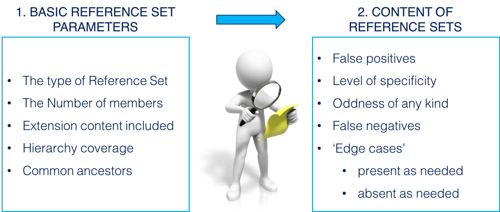

# 6.2.1.2. Evaluate Reference Sets

To determine whether a reference set is useful either to adopt or to build from, there is a range of parameters which can be assessed to determine whether a reference set is fit for the purpose or requirements that the developing organization have. The following diagram illustrates some of the central aspects that must be assessed when evaluating an existing reference set. 

<figure><figcaption>
Figure 6.2.1.2-1: Exploring existing reference sets
</figcaption></figure>

# Compare basic parameters

Firstly, the basic parameters of the existing reference set should be compared with the actual needs related to use of the new reference set. The following table provides an overview of some of the basic parameters, which should be assessed when starting to evaluate an existing reference set. Having assessed these basic parameters, it will be possible to determine whether an existing reference set is sufficient for further inspection, or whether it should be rejected as candidate source for a new reference set. 

Table 6.2.1.2-1: Overview of basic reference set parameters relevant for evaluating reference sets

Parameter| **Description**  
---|---  
Type of reference set| It should be assessed whether the functionality of the existing reference set also meet the requirements for functionality that the seeking organization have.   
The number of members| The numbers of members of the existing reference set should be compared to the required number of members in the new reference set. E.g. a reference set representing a very large subset of components may be rejected if the need is a subset to capture the overall categories (body sites) of information collected during a physical examination.   
Extension content included| It should be assessed whether the existing reference set is dependent on any other Edition than the International Edition. And if so, the existing reference set can only be adopted if it belongs to an Extension on which the developing/seeking organization also depends upon.   
Hierarchy coverage| It should be assessed whether the components referenced in the existing reference set represents concepts within hierarchies required for the new reference set. E.g. an existing reference set should be rejected if it references concepts within the Procedure hierarchy and the new reference set is to be used for recording evaluation results, i.e. concepts/descriptions of clinical findings concepts.   
  
# Inspect the Content of the Reference Set

Having compared the more basic parameters it is also important to Inspect the specific content of the existing reference set to determine the appropriateness of this to fulfill the requirements that an organization have. The following table provides an overview of typical parameters to be inspected when evaluating the content of an existing reference set. 

Table 6.2.1.2-2: Overview of typical aspects, which should be inspected when evaluating an existing reference set

**Parameter**| **Description**  
---|---  
False positives| Assess whether any of the components referenced in the existing reference set is inappropriate for the context of the new reference set and therefore should be excluded.   
Level of specificity| Assess whether the components referenced in the existing reference set are at a sufficient level of specificity, e.g. assess whether concepts are too granular or too less granular to fulfill the requirements setup for the reference set.   
“Oddness” of any type| Assess whether the coverage of the existing reference set meets immediate expectations. There might be outliers or content from other hierarchies than the primary domain for this reference set, which seems odd and therefore needs to be excluded.   
False negatives| Inspect to seek out what is desirable to include, but is likely to be missing in the existing reference set. E.g. there might be requirements which reflect local needs or practices, which cannot be expected to be included in reference sets developed by another organization or in another context.   
Edge cases| Seek out ‘Edge cases’ present as needed, absent as needed
