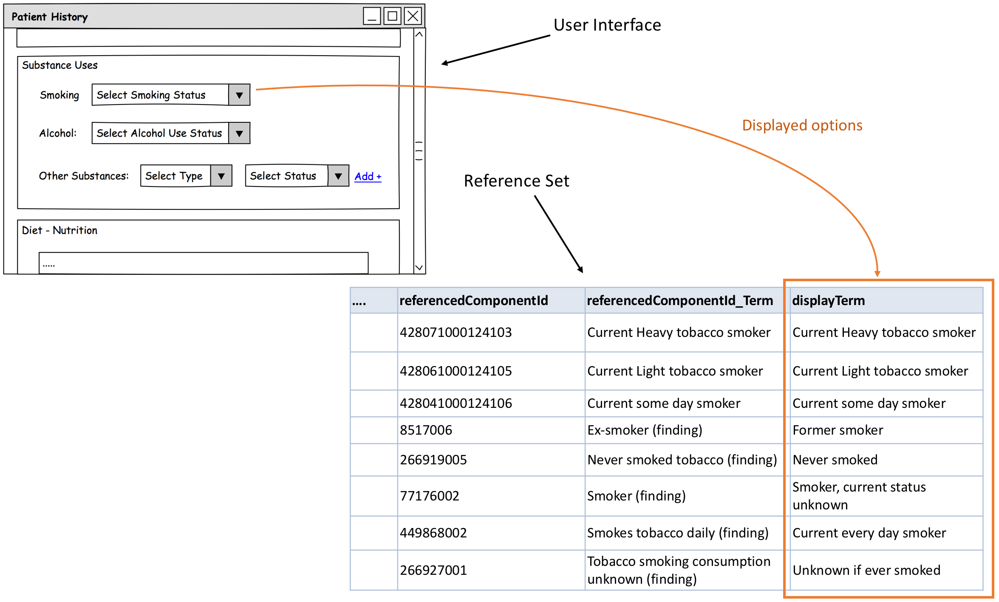
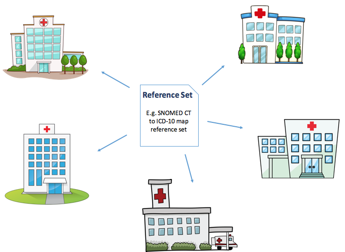

# 6.2.2. Reference Sets and Information Models

In the stage of planning and designing a reference set, the use of the reference set should be carefully analyzed. Specifically, it should be analyzed how the reference set is going to function with surrounding information models or software artefacts. 

## Bounded Reference sets

Bounded reference sets are designed to be used together with a specific information model. For example, if a reference set is developed as a value set for recording the smoking status in a specific software system, like shown in the example illustrated below. 

<figure><figcaption>
Figure 6.2.2-1: Some reference sets are designed to be bound for particular information models
</figcaption></figure>

  

When a reference set is bound to a specific information model, it is important to carefully consider how the binding affect the reference set members. So, for bounded reference sets it is important to clearly specify the relationship between the reference set and the associated information model to guide users, and to ensure correct interpretation of data, when data is subsequently retrieved for purposes such as display, analytics and communication. 

Table 6.2.2-1: Questions to consider for bounded reference sets

  

Question| Examples  
---|---  
Does the binding modify the default context of the SNOMED CT concept used?| Negation or uncertainty

  * if a procedure concept is marked as planned
  * if a clinical finding is marked as absent

Subject

  * if a clinical finding or a procedure is recorded in the context of a family member, or another subject, not being the subject of record

For more information read the section about axis modification and about context representation [3.5. Safely representing the context of recorded codes](https://confluence.ihtsdotools.org/display/DOCRSG/3.5.+Safely+representing+the+context+of+recorded+codes).  
What information model parts and related codes should be included when interpreting the meaning of data? | Different parts of the information model can be bound to SNOMED CT to express the meaning of the specific information model part. The Model as a whole, a group of data elements and each single data element can be bound to SNOMED CT. Dependent of which part of the model is bound to SNOMED CT, different methods are applied. 

  * Model (model meaning binding)
  * Data group (Concept domain model meaning binding)
  * Data element (value set binding)

  
  
## Unbounded Reference Sets

Unbounded reference sets mean that the reference set is designed to be applicable to multiple use cases, organisations or systems. An example is the SNOMED CT to ICD-10 map, which is released with the International Edition of SNOMED CT, and hence, available for use by any of the Members and affiliates. It may also be reference sets developed in a Member country to be used by all cardiovascular surgery departments in that country for reporting the procedures done and the procedure outcome. Such reference sets is distributed together with a National Edition of SNOMED CT. 

For unbounded reference sets it is important for consistent and proper use to clearly specify the purpose and use of the reference set. Therefore, written specification and guidelines should be developed and distributed together with the reference set, to ensure that users of the reference set know how to implement and use the reference set. 

<figure><figcaption>
Figure 6.2.2-2: Unbounded reference sets are designed to be applicable to multiple use cases, organisations or systems
</figcaption></figure>

  

