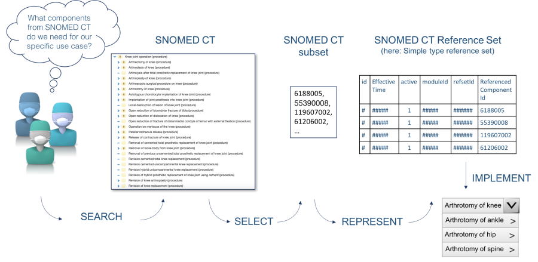

# 6.3.4.1. Develop New Reference Set

One way to create a reference set is to specify the content from SNOMED CT to be included in the reference set without looking at any existing SNOMED CT reference sets. This approach may be chosen, if no reference set is available that meets the requirements of the developing organization. It may also be because the requirements for the new reference set is so clearly defined or limited in scope that it is easier to create the reference set from scratch.

This could for example be, if a group of orthopedic surgeons are developing a subset of SNOMED CT procedure concepts to be included in a certain pick list of their local electronic health record. The group already know what options should be available in the pick list, so they choose to create their own reference set and add the required component references to this reference set, see figure below.

<figure><figcaption>
Figure 6.3.4.1-1: Creating a new reference set without looking at any existing SNOMED CT reference sets
</figcaption></figure>

Hence, you may choose to develop a new reference set if:

* No existing reference set meets you requirements
* The scope of the reference set is limited and clearly specified

Depending on the scope of content for the reference set there are different [development methods](https://github.com/IHTSDO/snomedct-refset-guide/blob/main/6%20reference-set-development/6.3%20development/6.3.4%20development-approaches/6.3.5-Development-Methods_35985743.html) that can be applied for selecting, or defining, reference set members.

Developing a new reference set also requires the developing organization to make changes to the reference set as necessary to meet evolving requirements.\*\*\
\*\*
