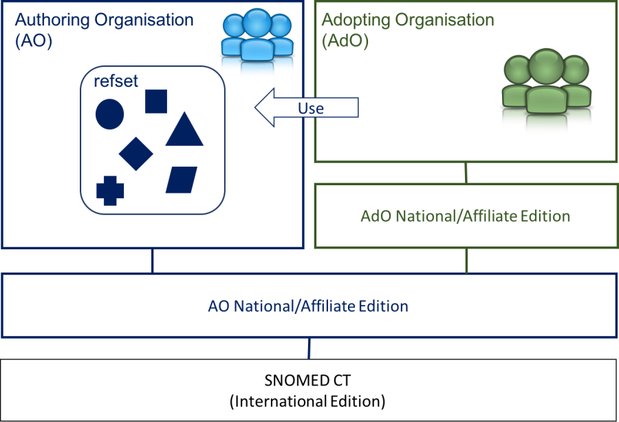

# 6.3.4.2 Adopt an Existing Reference Set

As the experience of the SNOMED CT community grows, it becomes increasingly likely that there is some existing work that will provide a useful starting point, or that can be used to validate the work that you are doing. In this case, adopting an existing reference set may be a useful approach to take for acquiring a reference set. 

Adopting an existing reference set is when the adopting organization/project use the existing reference set and future updates of that reference set as provided. This means, that the adopting organization commits to adopting any changes that are made to the source subset over time. 

To be able to adopt and existing reference set it is a prerequisite that the existing reference set is part of a module that is included in the SNOMED CT Edition used by the adopting organization. 

It is also a prerequisite that those maintaining the source subset publish changes in a predictable fashion, and the adopting project has processes in place to manage this adoption. 

<figure><figcaption>
Figure 6.3.4.2-1: Adopt reference set
</figcaption></figure>

Hence, you may choose to adopt an existing reference set if:

  * The reference set meets the requirements of your organization
  * You are confident that the existing reference set will be well-maintained
  * The reference set is part of a module that is included in the SNOMED CT Edition that you use. 

Adopting an existing reference set is an attractive solution in situations where the source subset is already being used within the communicating community, and so avoids the need for mappings to be maintained, or other strategies developed to deal with differences. 

The drawback is that if the adopting project requires changes to the contents of the subset it does not have any mechanism for requesting such changes or making them happen. 
