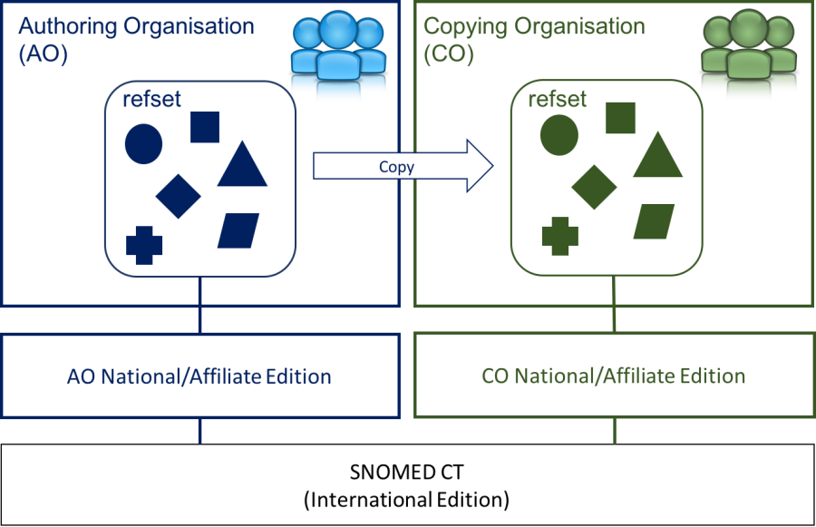

# 6.3.4.3. Copy an Existing Reference Set

In the situation where an existing reference set meets the requirements of an organization who wish to use a SNOMED CT reference set, it may be a solution to copy this reference set instead of adopting the reference set. Copying a reference set is a useful approach in the situation where the existing reference set is part of a Module which is not included in the SNOMED CT Edition that the copying organization use.

Copying an existing reference set means create a new reference set with members referencing the same components as the existing reference set.

It is important to have a clear strategy for maintenance of a copied reference set. When an organization chooses to copy an existing reference set they need to make changes to the reference set as necessary to meet their evolving requirements. Whether it is the copying organization or the authoring organization who is responsible for adding or inactivating content to the existing reference set depends on the agreement between the involved parties. It also depends on whether the authors of the existing reference set have established a process, which deals with requests for changes. In either situation the copying organization will need to apply the changes made to any new version of the original reference set to the copied reference set.

  

<figure><figcaption>
Figure 6.3.4.3-1: Copy reference set
</figcaption></figure>

  

  

Hence, you may choose to copy an existing reference set if:

  * The reference set meets the requirements of your organization
  * You are NOT confident that the existing reference set will be well-maintained
  * The existing reference set is NOT part of a module that is included in the SNOMED CT Edition that you use.

