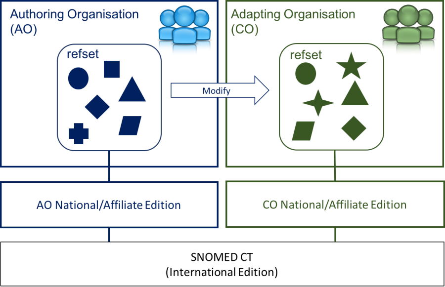

# 6.3.4.4. Adapt an Existing Reference Set

Another approach to develop a reference set, is to adapt an existing reference set. This is where an existing reference set is used as a source of inspiration for the developing organization. It may also be, that the existing reference set almost meet the requirements of the adapting organization, but some modifications are needed. The adapting organization may wish to add more content to the existing reference set, or there may be content in the existing reference set which should be excluded from the new reference set.

Like copying reference sets, adapting a reference set will include the creation of a new reference set which is authored and maintained by the adapting organization. The members of the new reference set may then reference components that are also referenced in the existing reference set, they may exclude references that are in the existing reference set, or they may add other component references to meet the requirements of the adapting organization.

<figure><figcaption>
Figure 6.3.4.4-1: Adapt reference set
</figcaption></figure>

  

  

  

Hence, you may choose to adapt an existing reference set if:

  * The reference set almost meets the requirements of your organization, but you wish to modify it to fully fulfill your requirements.

