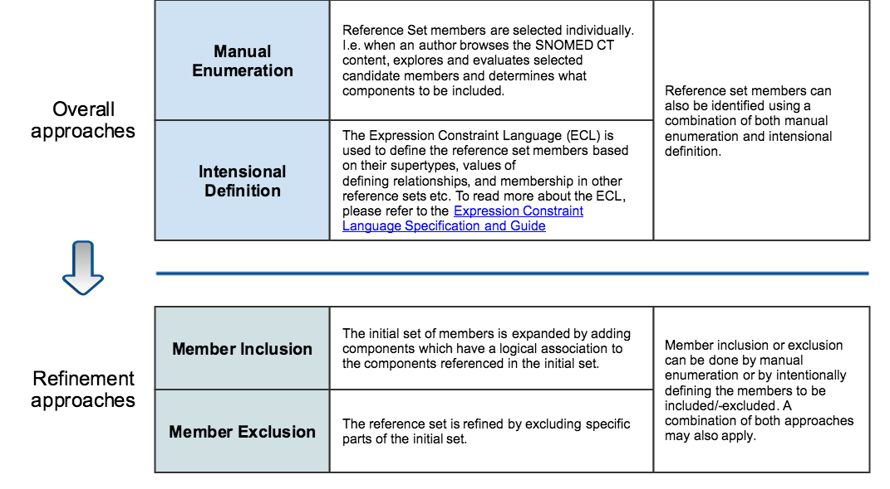

# 6.3.5 Development Methods

When developing simple reference sets, there are different methods which can be applied to determine what concepts to be included in the subset. The two overall approaches to defining the reference set members are manual [enumeration](https://github.com/IHTSDO/snomedct-refset-guide/blob/main/6%20reference-set-development/6.3%20development/2.1.1.-Subset-Definitions_35985785.html) and [intensional ](https://github.com/IHTSDO/snomedct-refset-guide/blob/main/6%20reference-set-development/6.3%20development/2.1.1.-Subset-Definitions_35985785.html)definition.

<figure><figcaption></figcaption></figure>

<figure><figcaption></figcaption></figure>

## Requirements for Manual Enumeration

Identifying reference set members by manual enumeration is useful when the number of members required is limited or when migrating from a well-specified domain. The source information may come from a variety of sources, such as:

* Subsets of concepts from other code systems
* Legacy codes (when migrating from a system that do not use SNOMED CT)
* Clinical guidelines and other knowledge resources

Manual enumeration is also useful when the reference set should be stable over time, i.e when addition of concepts, in subsequent releases of SNOMED CT, is not required to be reflected in the reference set.

## Requirements for Intensional Definition

Identifying reference set members intensionally is useful for creating subset of concepts who share a set of common characteristics, such as:

* Being a descendant of the same focus concept
* Sharing one or more attribute relationships

Intensional definition of reference set members is also useful when changes to concepts, in subsequent releases of SNOMED CT, is required to be reflected in the reference set.
