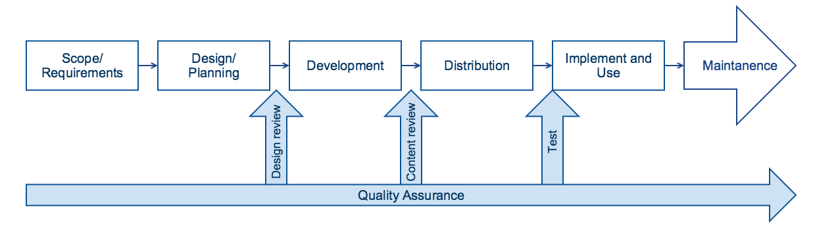

# 6.3.6 Review and Quality Assurance

Ensuring the quality of a reference set is important for the successful use of SNOMED CT. It is crucial that the content of the reference set references the concepts which represent the meaning of the data it is to be linked to. In addition, it is important that the human interpretation of the concepts referred to aligns with the logical definition provided by SNOMED CT. Even when using reference sets for less patient safety critical purposes, the quality of the reference set needs to be sufficient to be trusted to serve its purpose. 

# Stages of Quality Assurance

Reviewing a reference set is important throughout the reference set development process, however at least three types of validation should be emphasized, see illustration below. 

  * Design review: The overall objective with this review is to verify whether the reference set design meets the requirements. 
  * Content review: The overall objective with this review is to verify whether the selected reference set members are sufficient for the context where the reference set is to be used.
  * Test: The overall objective with testing the reference set is to validate the reference set in the context where it is to be used. Testing is done to assure that the reference set meets the needs of the involved stakeholders.   

<figure></figure>

Figure 6.3.6-1: Quality assurance stages

# Review

Reviewing a reference set before testing it in the context of its usage is important in order to correct the most distinctive errors, such as content gaps or disagreements about selection of concepts. Additionally, reviewing a reference set is important, because it is much easier to make major adjustments as early as possible. In addition, the adaptability of the reference set increases the higher the quality of the reference set, according to the perspective of the subset users. The level of quality assurance needed will of course be dependent on the practical use case of the reference set. 

The checks that should be done as part of the review process include:

  1. Check that all concept ids are current (that there is no references to inactive concepts)
  2. Check that all concepts included in the reference set are appropriate to the use case
  3. Check that the terms used to describe these concept ids are appropriate
  4. Check that there are no gaps in content. I.e. concepts that should be included in the reference set that aren't
  5. Check that there is clear context and meaning, which align with the surrounding models that the reference set is to be used with 

## Skills and Roles

The people involved with reviewing the reference set should be by a combination of domain experts and SNOMED CT experts. 

  * Domain experts: There may be different types of domain experts, but at least two types of domain experts can be specified : 
    * Clinical domain experts: Persons who have knowledge about the use of the reference set and knowledge about the context where the subset is going to function. Often, clinical domain experts will be clinical users who have the sufficient level of clinical knowledge, to evaluate whether the scope and the content of the reference set is sufficient. 
    * Technical domain experts: Persons who have knowledge about the technical environment where the reference set is going to be implemented. technical experts should have knowledge about the various models to which this reference set should be bound. Often, these experts will have a technical background, for example software architects, programmers, IT-managers. These experts are especially important at an early stage of the reference set development process, to review and validate the design of the reference set in relation to the requirements set out by the technical infrastructure. 
  * SNOMED CT Experts: Persons who have the sufficient knowledge about SNOMED CT to review the concepts selected for a specific purpose. These persons should be able to assess whether the definition of the selected reference set members suite the domain of the reference set. For example, if the reference set represents a problem list, then the included members should reference clinical finding concepts. This group is also serve an additional, supportive role in terms of guiding the domain experts in reaching correct interpretation of the reference set structure and content. 

## Review approaches

SNOMED International does not recommend ONE specific approach for review of reference sets, but blinded approaches are typically a feasible approach to achieve high quality reference set. Alternatively, or additionally, a combination of review methods can be recommendable to ensure a reliable and usable review process. Ideally, reference sets should be reviewed iteratively until the reviewers are satisfied. Examples of the approaches to take are illustrated in the following table. 

##### Reference set review approaches.

Approach| Description  
---|---  
Single author single reviewer| In this approach one person author the reference set, i.e. determines the content to be included, while another person reviews the selected reference set members. The reviewer may also add comments against the proposal and suggest alternative content. In a really small team, the author and reviewer may be the same person. However this is not ideal, and it is highly recommended to include two or more people in the review process.  
Cross-review| Using this approach the reference set development work is divided evenly between two or more authors of the reference set. 

  1. The authors divide the material between, so they are each responsible for the initial development of a specific part of the reference set. 
  2. The authors then swap their material and they each review each other's material.

This approach can be very efficient if time is short, because you can spread both the development and the review load between more than one person – however, reviewing someone else’s material may not always as effective (in terms of quality) as the dual blinded approach.  
Dual blind review with an adjudicator| This approach is useful in a slightly bigger team than required for the single mapper single reviewer approach. This approach includes following steps:

  1. Two authors develop a draft reference set based on exactly the same material
  2. Their reference sets are then compared, to identify any differences. If any differences are found, then 
  3. The adjudicator compares the reference set differences and decides which is appropriate. In some cases, the adjudicator may ask the authors to provide their reasoning for their choice of reference set members, and this may be used to help make the decision. 

This approach can produce higher quality reference sets, because each author is independently cross-checking each other's material without being biased by the decisions of the other author. While this approach takes longer during the development phase (because both authors need to develop a draft of the whole reference set ), the review phase can be a lot quicker (because the adjudicator only needs to check the parts that the authors disagreed on).   
Workshop| Validation workshops is workshops dedicated to review and validate the design and/or content of a reference set. In these workshops the content or uncertainties are discussed in details, or test-persons are asked to prioritize and assess specific subset members etc. The participants may have had a chance to review the reference set individually prior to the workshop to prepare questions and comments for discussion. The number of people in the workshop and their roles should be considered and selected dependent of the format and the scope of a specific workshop.This approach is time consuming which should be acknowledged already in the planning stage. However, this approach may also be rewarding. Workshops often give rise to detailed discussions or unplanned discussions of relevant issues, but at the sametime workshops provide an opportunity of increased ownership and participation among the participants, which may have a positive effect on the adoption of the reference set. It is recommended to plan these workshops in detail and to include a set of workshops. The number of workshops necessary depends on the size of the reference set, and how the feedback sharing is conducted.   
  
# Test

In addition to the abstract assurance of the subset in isolation, there may be a requirement for a level of testing to be undertaken in healthcare systems, and tested under the exact circumstances of intended use. This may be undertaken by releasing a technology preview targeted at specific bodies for feedback. An impact assessment and, most importantly, safety testing will need to take place upon deployment of the subset into systems, particularly where significant changes have taken place. 
