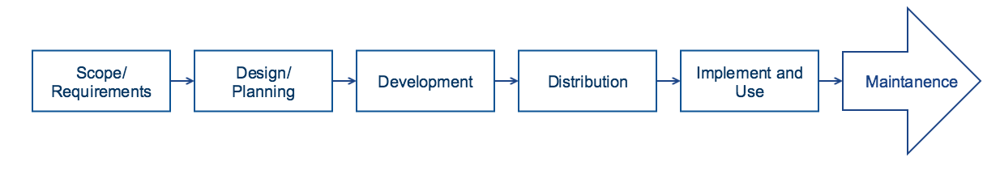

# Reference Set Development

## General Development Process

The lifecycle of reference set work spans from the point where there is an initial idea related to a specific clinical information requirement based on SNOMED CT through reference set development to long term maintenance. At each stage it is essential that a defined process is followed which ensures the quality and validity of the product is maintained. The following figure provides an overview of the steps that are relevant to any project that either builds its own reference set, or adapts reference sets authored from elsewhere. The general process is similar to the process used when developing other information artefacts, and as for many development processes it is essential to be clear and specific about the requirements to be met, and to ensure that these requirements drive the design and implementation of the artefact. Related to reference set development this means that the process is not just about creating a reference set, but more about how to address the requirements, and this will often mean a combination of development of different reference sets.

The overview provided in following diagram is not intended to imply that a waterfall methodology should be used to develop a reference set. It may be delivered using agile or iterative project methodologies, with the reference set and supporting project documentation evolving as the project develops.

<figure><figcaption>
Reference set development process
</figcaption></figure>

***

<a href="https://docs.google.com/forms/d/e/1FAIpQLScTmbZIf0UEQwYDkY27EEWBkaiYkHSbR0_9DmFrMLXoQLyL7Q/viewform?usp=pp_url&entry.1767247133=Refset+Guide&entry.670899847=Reference%20Set%20Development" class="button primary">Provide Feedback</a>
