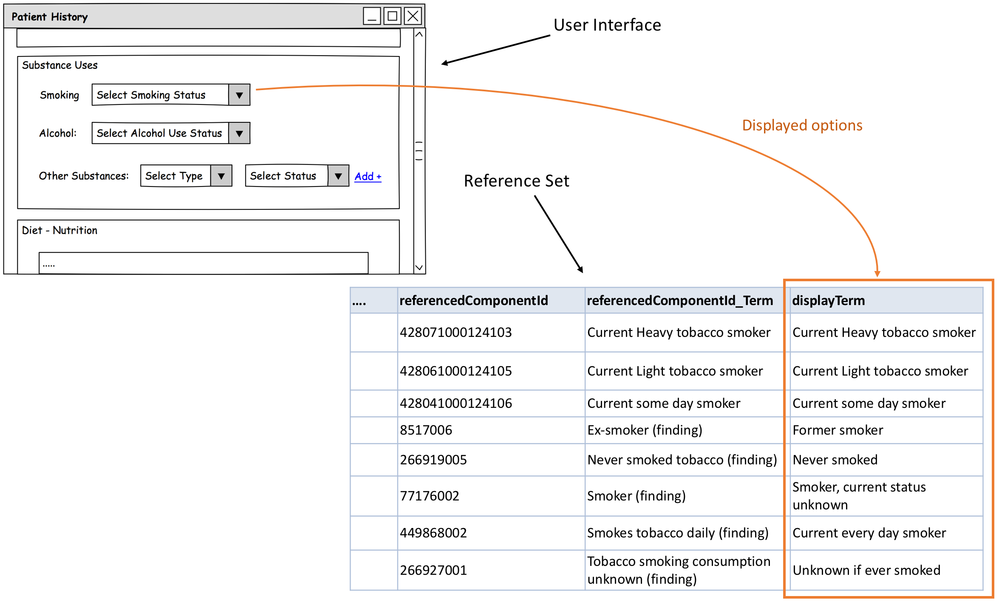
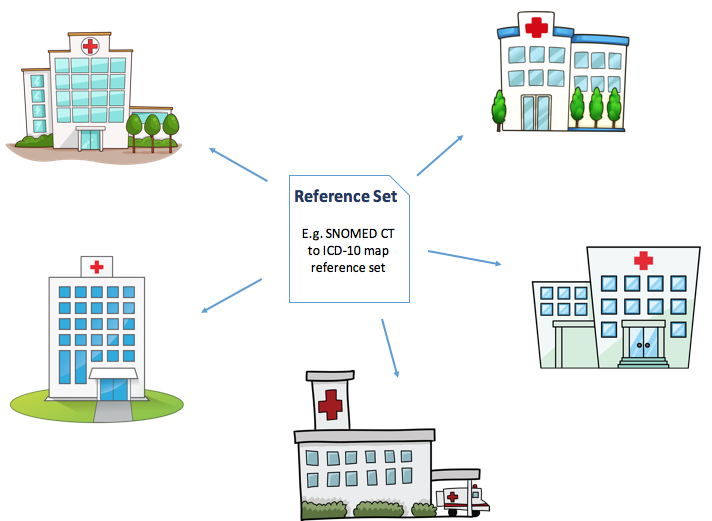

# Design and Planning

Careful planning in the initial stage is crucial for successful completion of the reference set development and onwards use of the reference set. Following considerations should be included in any reference set development process.&#x20;

Table: Considerations important when designing the reference set and planning the development process

<table><thead><tr><th width="157.390625">Topic</th><th>Description</th></tr></thead><tbody><tr><td>Resources</td><td>Determine the resources available for developing and maintenance of the reference set.</td></tr><tr><td>Dependencies</td><td>
Dependencies of the reference set
<ul><li>What module and release of SNOMED CT is the reference set dependent on?</li><li>What other terminology and/or software artefact should the reference set function with? (see section on <a href="6.2-design-and-planning.md#reference-sets-and-information-models">Reference Sets and Information Models</a>)</li></ul></td></tr><tr><td>Reference set type</td><td>
What type of reference set is required?
<ul><li>Is one of the existing reference set patterns sufficient?</li><li>Should a customized reference set be specified, and if so what additional attributes should be included?</li></ul></td></tr><tr><td>People</td><td>
Developing a new reference set requires a broad skillset, so it should be determined who will develop the reference set. Each of the steps related to developing reference sets can involve a range of people in different roles, a number of interdependent activities and a suite of related documents and artifacts. It is important to understand the characteristics of the people involved and their roles across the stages in the reference set lifecycle. 
<ul><li>
Some of the important skills required when developing reference sets include:
<ul><li>clinical insight. To know what content is relevant for the specific purpose.</li><li>sufficient knowledge on SNOMED CT. To support correct use of SNOMED CT, for example selection of appropriate concepts or defining the correct query.</li><li>knowledge about the technical environment where the subset is going to function. In order to ensure an appropriate representation of the subset to be integrated in an IT-system.</li></ul></li></ul></td></tr><tr><td>Development approach and methods</td><td>
What approach should be taken to develop the reference set?
<ul><li>Does any existing reference set meet the requirements for this new reference set or is there a need to build a new reference set from scratch? (see section on <a href="6.2-design-and-planning.md#exploring-and-evaluating-reference-sets">Exploring and Evaluating Reference Sets</a>)</li></ul></td></tr><tr><td>Tools</td><td>
What tools should be used to support reference set development, distribution and maintenance process? There will be a suite of tools provided which can support the creation and management of reference sets, including tools for:
<ul><li>Selection of reference set members, or definition of the query needed to retrieve reference members. Such tool will typically allow collaborative approaches to be pursued.</li><li>Support review by subject matter experts and others involved with creation and quality assurance</li><li>Managing requests for change through a reporting mechanism that will allow potential changes to the reference set to be identified.</li><li>
Updating the reference set, e.g. when changes has been requested, or when new releases of the Editions on which the reference set is dependent upon is freed.
<ul><li>SNOMED International provides a range of services and tools to support working with SNOMED CT, and the suite of services continue to grow. Specifically, the SNOMED International reference set management tool, which is useful the creation and management of both intensionally and extensionally defined subsets.</li></ul></li></ul></td></tr><tr><td>Timeline</td><td>Determine when the reference set should be ready for routine use, i.e. schedule deadlines for the difference phases of the development process.</td></tr><tr><td>Quality assurance</td><td>What level of quality is required for the reference set? E.g. is the reference set used to represent safety critical information for patients, or is the reference set used to form broader categories of patient groups. It should be determined how the required level of quality is obtained and ensured throughout the development process.</td></tr><tr><td>Distribution</td><td>How will the reference set be distributed? Answering this question will depend very much on who the authors of the reference set is and where the reference set going to be used. If the reference set is used as a national reference set, i.e. a reference set which is used across a range of hospitals or organizations, distribution is likely to be done via a central service. Locally defined reference sets, e.g. used as part of configuring an EHR is likely to be managed and distributed from a local terminology storage environment and integrated directly to the system.</td></tr><tr><td>Integration</td><td>How, who and when to integrate the reference set into the environment where it is going to function? Decide on an approach to integration and determine what bindings and/or integration tasks to be performed.</td></tr><tr><td>Maintenance</td><td>Will new versions of the reference set be integrated regularly or as in integrated part of a greater maintenance process together with other software/terminology artefacts?</td></tr></tbody></table>

## Exploring and Evaluating Reference Sets

As part of the design and planning of a new reference set may it may be enumerative to look at reference sets developed by other organisations. Existing reference sets may be useful for inspiration or they may be sufficient for either adoption or adaption. In either case exploring existing reference sets and evaluate whether these reference sets meet the requirements identified for this particular reference set should be considered.

### Discover Existing Reference Sets

In order to be able to adopt or adapt an existing reference set, you need to know what reference sets already exist. As there is no common library of SNOMED CT reference sets an authoring organization should apply alternative search strategies to explore what reference sets has already been developed.

Table: Overview of potential sources of reference sets that can be approached when seeking for existing reference sets

<table><thead><tr><th width="235.0546875">Potential Source</th><th>Description</th></tr></thead><tbody><tr><td>SNOMED International Browser</td><td>The online browser provide access to the International release of SNOMED CT and a range of national Editions, including reference sets defined within these Editions. The available reference sets should be represented as foundation metadata concepts and present as descendants of the concept 900000000000455006</td></tr><tr><td>National Release Centers</td><td>reference sets which are not included as national Extensions to SNOMED CT may also be acquired from the National Release Center. Each SNOMED CT Member has a National Release Center and information about these is provided by SNOMED International website, <a href="http://www.snomed.org/members/">http://www.snomed.org/members/</a>.</td></tr><tr><td>Personal networks/-Community of Practice</td><td>Explore your personal SNOMED CT network or the community of practice. The website <a href="https://www.snomed.org/snomed-in-action">www.snomed.org/snomed-in-action</a> provides access to information about existing SNOMED CT implementation initiatives. Some of these includes development and implementation of reference sets or subsets, so this is also a useful starting point for further exploration. Furthermore, attending the SNOMED Expo will also allow you to meet with persons directly involved with reference set development. You can find information about this event via SNOMED International website: <a href="https://www.snomed.org/events">https://www.snomed.org/events</a></td></tr><tr><td>Web-based search</td><td>It may be useful to run a broad search on SNOMED CT reference sets or subsets using some of the great, commercial and non-topic specific search engines. This approach may result in identifying SNOMED CT subsets that use an alternative representation than the reference set format, or identifying clinical guidelines or recommendations that can help to specify the requirements for the content of the reference set. So, this approach is typically useful for getting inspiration to the content of the reference set to be developed.</td></tr><tr><td>Health IT vendors</td><td>It may very well be useful to explore what Terminology products and services are provided by Heath IT vendors. Providers of terminology servers and services may also have access to specific reference sets.</td></tr></tbody></table>

### Evaluate Reference Sets

To determine whether a reference set is useful either to adopt or to build from, there is a range of parameters which can be assessed to determine whether a reference set is fit for the purpose or requirements that the developing organization have. The following diagram illustrates some of the central aspects that must be assessed when evaluating an existing reference set.

<figure><figcaption>
Exploring existing reference sets
</figcaption></figure>

#### Compare basic parameters

Firstly, the basic parameters of the existing reference set should be compared with the actual needs related to use of the new reference set. The following table provides an overview of some of the basic parameters, which should be assessed when starting to evaluate an existing reference set. Having assessed these basic parameters, it will be possible to determine whether an existing reference set is sufficient for further inspection, or whether it should be rejected as candidate source for a new reference set.

Table: Overview of basic reference set parameters relevant for evaluating reference sets

<table><thead><tr><th width="206.54296875">Parameter</th><th>Description</th></tr></thead><tbody><tr><td>Type of reference set</td><td>It should be assessed whether the functionality of the existing reference set also meet the requirements for functionality that the seeking organization have.</td></tr><tr><td>The number of members</td><td>The numbers of members of the existing reference set should be compared to the required number of members in the new reference set. E.g. a reference set representing a very large subset of components may be rejected if the need is a subset to capture the overall categories (body sites) of information collected during a physical examination.</td></tr><tr><td>Extension content included</td><td>It should be assessed whether the existing reference set is dependent on any other Edition than the International Edition. And if so, the existing reference set can only be adopted if it belongs to an Extension on which the developing/seeking organization also depends upon.</td></tr><tr><td>Hierarchy coverage</td><td>It should be assessed whether the components referenced in the existing reference set represents concepts within hierarchies required for the new reference set. E.g. an existing reference set should be rejected if it references concepts within the Procedure hierarchy and the new reference set is to be used for recording evaluation results, i.e. concepts/descriptions of clinical findings concepts.</td></tr></tbody></table>

#### Inspect the Content of the Reference Set

Having compared the more basic parameters it is also important to Inspect the specific content of the existing reference set to determine the appropriateness of this to fulfill the requirements that an organization have. The following table provides an overview of typical parameters to be inspected when evaluating the content of an existing reference set.

Table: Overview of typical aspects, which should be inspected when evaluating an existing reference set

<table><thead><tr><th width="207.27734375">Parameter</th><th>Description</th></tr></thead><tbody><tr><td>False positives</td><td>Assess whether any of the components referenced in the existing reference set is inappropriate for the context of the new reference set and therefore should be excluded.</td></tr><tr><td>Level of specificity</td><td>Assess whether the components referenced in the existing reference set are at a sufficient level of specificity, e.g. assess whether concepts are too granular or too less granular to fulfill the requirements setup for the reference set.</td></tr><tr><td>“Oddness” of any type</td><td>Assess whether the coverage of the existing reference set meets immediate expectations. There might be outliers or content from other hierarchies than the primary domain for this reference set, which seems odd and therefore needs to be excluded.</td></tr><tr><td>False negatives</td><td>Inspect to seek out what is desirable to include, but is likely to be missing in the existing reference set. E.g. there might be requirements which reflect local needs or practices, which cannot be expected to be included in reference sets developed by another organization or in another context.</td></tr><tr><td>Edge cases</td><td>Seek out ‘Edge cases’ present as needed, absent as needed</td></tr></tbody></table>

## Reference Sets and Information Models

In the stage of planning and designing a reference set, the use of the reference set should be carefully analyzed. Specifically, it should be analyzed how the reference set is going to function with surrounding information models or software artefacts.

### Bounded Reference sets

Bounded reference sets are designed to be used together with a specific information model. For example, if a reference set is developed as a value set for recording the smoking status in a specific software system, like shown in the example illustrated below.

<figure><figcaption>
Figure 6.2.2-1: Some reference sets are designed to be bound for particular information models
</figcaption></figure>

When a reference set is bound to a specific information model, it is important to carefully consider how the binding affect the reference set members. So, for bounded reference sets it is important to clearly specify the relationship between the reference set and the associated information model to guide users, and to ensure correct interpretation of data, when data is subsequently retrieved for purposes such as display, analytics and communication.

Table: Questions to consider for bounded reference sets

<table><thead><tr><th width="309.60546875">Question</th><th width="463.484375">Examples</th></tr></thead><tbody><tr><td>Does the binding modify the default context of the SNOMED CT concept used?</td><td>
Negation or uncertainty 
<ul><li>if a procedure concept is marked as planned</li></ul><ul><li>if a clinical finding is marked as absent</li></ul>
Subject 
<ul><li>if a clinical finding or a procedure is recorded in the context of a family member, or another subject, not being the subject of record</li></ul></td></tr><tr><td>What information model parts and related codes should be included when interpreting the meaning of data?</td><td>

Different parts of the information model can be bound to SNOMED CT to express the meaning of the specific information model part. The Model as a whole, a group of data elements and each single data element can be bound to SNOMED CT. Dependent of which part of the model is bound to SNOMED CT, different methods are applied.
<ul><li>Model (model meaning binding)</li><li>Data group (Concept domain model meaning binding)</li><li>Data element (value set binding)</li></ul></td></tr></tbody></table>

### Unbounded Reference Sets

Unbounded reference sets mean that the reference set is designed to be applicable to multiple use cases, organisations or systems. An example is the SNOMED CT to ICD-10 map, which is released with the International Edition of SNOMED CT, and hence, available for use by any of the Members and affiliates. It may also be reference sets developed in a Member country to be used by all cardiovascular surgery departments in that country for reporting the procedures done and the procedure outcome. Such reference sets is distributed together with a National Edition of SNOMED CT.

For unbounded reference sets it is important for consistent and proper use to clearly specify the purpose and use of the reference set. Therefore, written specification and guidelines should be developed and distributed together with the reference set, to ensure that users of the reference set know how to implement and use the reference set.

<figure><figcaption>
Unbounded reference sets are designed to be applicable to multiple use cases, organisations or systems
</figcaption></figure>

***

<a href="https://docs.google.com/forms/d/e/1FAIpQLScTmbZIf0UEQwYDkY27EEWBkaiYkHSbR0_9DmFrMLXoQLyL7Q/viewform?usp=pp_url&entry.1767247133=Refset+Guide&entry.670899847=Design%20and%20Planning" class="button primary">Provide Feedback</a>
