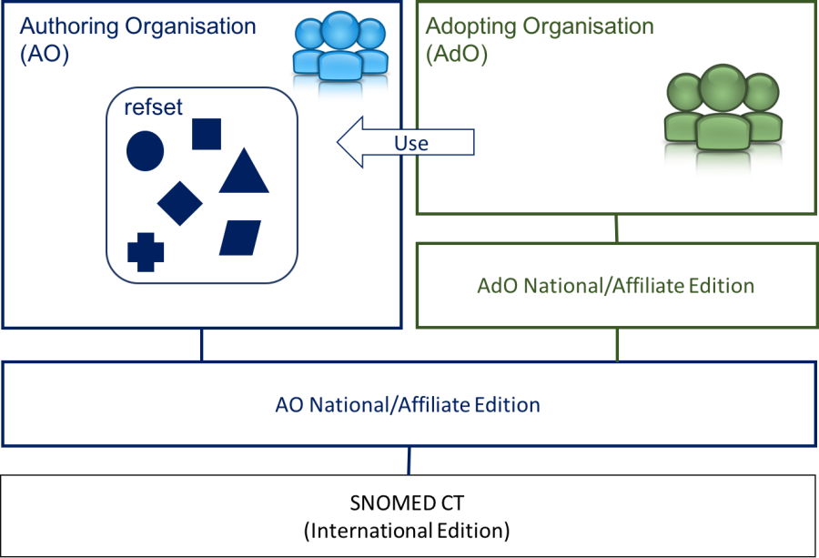
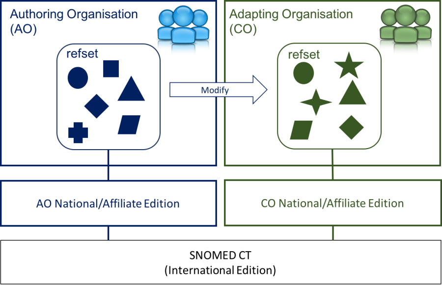
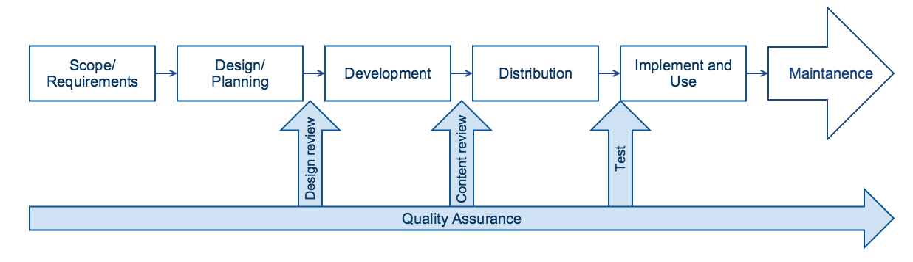

# Development

In this part topics related to the actual reference set development process are presented.

## Prerequisites for Creating a Reference Set

As part of developing a new reference set it should be created and identified as part of the Edition that it belongs to.

When creating a new reference set, the organization developing the reference set will need access to a namespace in order to generate SCTIds. Within their namespace, a moduleId concept (with an FSN and Preferred Term) should be added, placed in the [900000000000443000 <mark style="color:blue;">|</mark> Module (core metadata concept)<mark style="color:blue;">|</mark>](http://snomed.info/id/900000000000443000) subhierarchy within the metadata, for each authoring organization.

To specify any reference set it is necessary to identify the reference set by creating a concept and name the reference set by associated descriptions. The concepts should be a subtype of the relevant reference set type concept in the foundation metadata hierarchy. This could for example be as a descendant of the [446609009 <mark style="color:blue;">|</mark> Simple type reference set (foundation metadata concept)<mark style="color:blue;">|</mark>](http://snomed.info/id/446609009) , or the [900000000000512005 <mark style="color:blue;">|</mark> Query specification type reference set (foundation metadata concept)<mark style="color:blue;">|</mark>](http://snomed.info/id/900000000000512005) . The latter is used for intensional reference set definitions. Following table shows the steps to follow when creating a new reference set.

## Authoring Reference Sets

Authoring reference sets in an extension may involve creating a new reference set, inactivating a reference set or modifying a reference set. Additionally, reference set members may also be added, modified or inactivated in an extension.

The sections that follow will examine the purpose, principles and process for each of these authoring tasks.

**Authoring Reference Sets**

* [ Create a New Reference Set](6.3-development.md#create-a-new-reference-set)
* [Modify a Reference Set](6.3-development.md#modify-a-reference-set)
* [End Support for a Reference Set](6.3-development.md#end-support-of-a-reference-set)

**Authoring Reference Set Members**

* [ Add Members to a Reference Set](6.3-development.md#add-members-to-a-reference-set)
* [Modify Members of a Reference Set](6.3-development.md#modify-members-of-a-reference-set)
* [Remove Members from a Reference Set](6.3-development.md#remove-members-from-a-reference-set)

### Create a New Reference Set

#### Principles

When creating a new reference set it is important that the reference set metadata concept (which identifies and names the reference set) and the associated reference set members belongs to a module of the reference set producer. I.e. if a reference set is created as part of an extension, the reference set metadata concept should belong to a module within the namespace of the extension producer.&#x20;

All reference sets follow a logical model. Each reference set type is represented by a specific data structure which enables a specific functionality. SNOMED International specifies a set of reference set types, which can be used to support a set of terminology management  purposes. SNOMED CT Members (National Release Centers) and Affiliates may also create reference sets to assist with localization and effective implementation of SNOMED CT. In general, an extension producer can create a reference set within their extension, but the reference set type should be defined in either

*
  * The producers extension
  * The International Edition
  * Other extensions (which the producers extension modules are dependent on)

For more information about the different reference set types and their data structures, please refer to the [reference set release file specification](https://confluence.ihtsdotools.org/display/DOCRELFMT/5+Reference+Set+Release+Files+Specification).

Please note that for all reference sets, there should be guidance on what is possible and what is not possible. For some International reference sets, it is acceptable and even required to add extension rows to the International reference set. For example, the Module Dependency Refset, the MRCM Module Scope Refset, and Language Refset. This is not necessarily applicable to all reference sets. Over time, further guidance in this area will be developed.

#### Process

The table below provides a summary of the process to follow when creating a new reference set.

**Define the reference set in the metadata hierarchy**

The following steps should be taken for creating the reference set concept:

<table><thead><tr><th width="190.296875">File Type</th><th>Process</th></tr></thead><tbody><tr><td>Concept file</td><td><ol><li>Create a concept for the reference set</li></ol></td></tr><tr><td>Description file</td><td><ol start="2"><li>Add up to three Descriptions for the reference set concept. I.e. the FSN, the Preferred Term and optionally the purpose, see <a href="https://confluence.ihtsdotools.org/display/DOCRELFMT/5.1.3+Naming+Conventions+for+Reference+Sets">Naming Conventions for Reference Sets</a></li></ol></td></tr><tr><td>Language reference set</td><td><ol start="3"><li>Specify the acceptability of the descriptions in the applied Language Reference Set </li></ol></td></tr><tr><td>Relationship file</td><td><ol start="4"><li>Add an | is a | Relationship to link the reference set to the appropriate pattern</li></ol></td></tr></tbody></table>

**Define the reference set Attributes within the metadata hierarchy**

Add new concepts for each of the reference set member attributes, if necessary. If the reference set attributes describing the pattern are adequate to describe the reference set's attributes, then these can be used instead. You may add new concepts for some of the attributes, and reuse existing concepts for other attributes, if you wish.

Following steps should be taken for each attribute that you wish to create:

<table><thead><tr><th width="177.15625">File Type</th><th>Process</th></tr></thead><tbody><tr><td>Concept</td><td><ol><li>Add a concept for the attribute</li></ol></td></tr><tr><td>Description</td><td><ol start="2"><li>Add Descriptions for each of the new attribute.</li></ol></td></tr><tr><td>Language Reference Set</td><td><ol start="3"><li>Specify the acceptability of the descriptions in the applied Language Reference Set </li></ol></td></tr><tr><td>Relationship</td><td><ol start="4"><li>Link the attribute with an | is a | Relationship into the <a href="http://snomed.info/id/900000000000457003">900000000000457003 <mark style="color:blue;">|</mark> Reference set attribute (foundation metadata concept)<mark style="color:blue;">|</mark></a> hierarchy</li></ol></td></tr></tbody></table>


If new attribute values need to be created these should also be added as SNOMED CT concepts and placed as subtypes of the concept [900000000000457003 <mark style="color:blue;">|</mark> Reference set attribute (foundation metadata concept)<mark style="color:blue;">|</mark>](http://snomed.info/id/900000000000457003) , following the process described above.


**Create the Descriptor for the reference set**

If the reference set does not follow an existing reference set pattern, the additional attributes specific for this customized reference set should be included in the [Descriptor reference set](https://confluence.ihtsdotools.org/display/DOCRELFMT/5.1.2.+Extending+the+Basic+Reference+Set+Member+File+Format).

<table data-header-hidden><thead><tr><th width="185.53125"></th><th></th></tr></thead><tbody><tr><td>Reference Set Descriptor Reference Set</td><td>A new reference set member is created in the reference set Descriptor for each attribute in the reference set pattern. For guidance on creating a reference set member, please see <a href="6.3-development.md#add-members-to-a-reference-set">Add Members to a Reference Set</a>. For further introduction to the reference set Descriptor, please see <a href="../4-reference-set-design.md#reference-set-descriptor">Reference Set Descriptor</a>.</td></tr></tbody></table>

**Add members to the reference set**

Reference set members are added to the reference set, which includes specifying the attribute values for each reference set member, see [Add Members to a Reference Set](6.3-development.md#add-members-to-a-reference-set).

### Modify a Reference Set

#### Principles 

Principles for modifying reference sets include:

* Reference sets can be modified by changing the value of the _active_ attribute or the value of the _moduleId_ attribute, i.e. for activating or inactivating the reference set, or moving the reference set to another module (a module on which the current module depends).
  * The reference set metadata concept is always primitive and the concept can therefore not be changed from primitive to fully defined, or from fully defined to primitive, i.e. the value of the _definitionStatusId_ attribute should be primitive for all versions of the reference set
* The reference set type should **not** be changed, i.e. the |is a| relationship, linking the reference set to the appropriate reference set type concept should not be changed
  * &#x20;The only situation where the the reference set type may change is if the reference set was originally misplaced in the SNOMED CT hierarchy.
* If the reference set needs to be changed to a different type, (for example, from a simple reference set to an ordered component type reference set) then it would require the original reference set to be inactivated and a new reference set to be created in accordance with the Descriptor for that reference set type.&#x20;
* Reference sets that belong to a module which is not managed by the extension producer should not be modified.

#### Process 

**Modifying a reference set created within the extension module**

The process for modifying the reference set concept, is similar to the general process for modifying concepts in SNOMED CT. Therefore, please refer to [Modify Concept in an Extension](https://confluence.ihtsdotools.org/display/WIPEXTPG/5.4.2.2+Modify+Concept+in+an+Extension) for further guidance.

### End Support of a Reference Set

#### Principles 

When the owner of a reference set wants to end support for the reference set, this should be indicated by making the changes described in the process section below.

In the situation where the reference set belongs to an extension, the owner of the extension may only make these changes to a reference set that is currently in an extension module for which it is responsible. The exception to that rule is that, in the case where a responsibility for maintenance of a reference set is transferred to another organization, the organization to which responsibility is transferred is required to take some of these steps.

Prior to ending support for a reference set, it is important that the reference set producer has an overview of the extent to which the reference set is used. If a producer and owner of a reference set continues to distribute an unsupported reference set with active members, there is an inherent risk that it will continue to be used. However, deprecation formally inactivates the references set members to mim this possibility.

#### Process 

The table below provides details and considerations on the process of inactivating a reference set.

<table data-header-hidden><thead><tr><th width="233.53125"></th><th width="329.4140625"></th><th width="348.4453125"></th></tr></thead><tbody><tr><td><strong>Reason for Ending Support</strong></td><td><strong>Organization responsible currently responsible for the reference set</strong></td><td><strong>Organization accepting transfer of responsibility for the reference set</strong></td></tr><tr><td>Transfer of responsibility for maintenance to an organization that is responsible for a module on which the current module depends</td><td><ol><li>Request the newly responsible organization to issue new versions of the reference set concept, metadata and active reference set members using the same identifiers but changing the moduleId to refer to the module in which the reference set is now being maintained.</li><li>Inform users that the reference set is now being maintained by another organization.</li><li>Do not inactivate or otherwise alter any of the existing concepts or reference set members.</li><li>Ensure that documentation explaining this change is prepared and distributed to all users of the extension.</li></ol></td><td><ol><li>Create new versions of the reference set concept and related metadata. The new versions of components must have the updated effectiveTime for the relevant release date and the moduleId of the module in which the reference set will now be maintained. However, the id and all other fields must have the same values as in the original versions.</li><li>Create new versions of all active members from of the reference set. The new versions of references set members must an updated effectiveTime for the relevant release date and the moduleId of the module in which the reference set will now be maintained. However, the id, refsetId and all other fields must have the same values as in the original versions.</li></ol></td></tr><tr><td>Transfer of responsibility for maintenance to an organization that is not responsible a module on which the current module depends</td><td><ol><li>Request the newly responsible organization to create and maintain a new reference set in their own extension module. The newly created reference set concept and metadata should replicate the and includes all all the members of the original reference set that were active immediately prior to deprecation.</li><li>Inactivate the original reference set concept and metadata following the process described in <a href="https://confluence.ihtsdotools.org/display/WIPEXTPG/5.4.2.3+Inactivate+Concept+in+an+Extension">Inactivate Concept in an Extension</a>.</li><li>Inactivate all the members of the original reference set following the process described in <a href="6.3-development.md#remove-members-from-a-reference-set">Remove Members from a Reference Set</a>.</li><li>Add a row to the <a href="http://snomed.info/id/900000000000489007"><mark style="color:blue;">|</mark> Concept inactivation indicator reference set<mark style="color:blue;">|</mark></a> indicating the reason for inactivation of the reference set.</li><li>Ensure that documentation explaining this change is prepared and distributed to all users of the extension.</li></ol></td><td><ol><li>Create a new reference set following the process described in <a href="6.3-development.md#create-a-new-reference-set">Create a New Reference Set</a>. The reference set must have a newly allocated id, the updated effectiveTime for the relevant release date and the moduleId of the module in which the reference set is being created. However, the name and all other fields should have the same values as in the original versions.</li><li>Create new members of the newly created reference set following the process described in <a href="6.3-development.md#add-members-to-a-reference-set"> Add Members to a Reference Set</a>. A member must created matching each of the active members of original reference set.</li><li>Create a row in the <a href="http://snomed.info/id/900000000000526001"><mark style="color:blue;">|</mark> REPLACED BY association reference set<mark style="color:blue;">|</mark></a> indicating that the original reference set has been replaced by this reference set.</li></ol></td></tr><tr><td>Ending maintenance of without formally deprecating continued use of a reference set</td><td><ol><li>Inactivate the reference set concept, following the process described in <a href="https://confluence.ihtsdotools.org/display/WIPEXTPG/5.4.2.3+Inactivate+Concept+in+an+Extension">Inactivate Concept in an Extension</a>.</li><li>Do not inactivate the members of the reference set.</li><li>Add a row to the <a href="http://snomed.info/id/900000000000489007"><mark style="color:blue;">|</mark> Concept inactivation indicator reference set<mark style="color:blue;">|</mark></a> indicating the reason for inactivation of the reference set.</li><li>Ensure that documentation explaining this change is prepared and distributed to all users of the extension.</li></ol></td><td>-</td></tr><tr><td>Deprecating continued use of a reference set</td><td><ol><li>Inactivate the reference set concept and metadata following the process described in<a href="https://confluence.ihtsdotools.org/display/WIPEXTPG/5.4.2.3+Inactivate+Concept+in+an+Extension"> Inactivate Concept in an Extension</a>.</li><li>Inactivate all the members of the reference set following the process described in<a href="6.3-development.md#remove-members-from-a-reference-set"> Remove Members from a Reference Set</a>. </li><li>Add a row to the <a href="http://snomed.info/id/900000000000489007"><mark style="color:blue;">|</mark> Concept inactivation indicator reference set<mark style="color:blue;">|</mark></a> indicating the reason for inactivation of the reference set. </li><li>Ensure that documentation explaining this change is prepared and distributed to all users of the extension.</li></ol></td><td>-</td></tr></tbody></table>

#### Distribution of an Inactivated Reference Set and its Members 

If the extension producer wants to avoid users from needing to import a deprecated or transferred reference set in future releases, the inactivated reference set may be separated from the main extension release (e.g. it could be in a separate release package, or accessible via a separate service or from a static location). Changes in packaging must be formally notified to users of the extension in advance of the change.


It is essential that the inactive reference set concept, metadata and reference set members are included in the first release of the original release package after the changes are made. Otherwise users applying delta updates will not be aware that the change has been made.


## Authoring Reference Set Members

### Add Members to a Reference Set

#### Principles 

Specifying members of a reference set can be done in different ways. It will depend on the requirements for the reference set what approach is feasible and possible. Please refer to the [Development Approaches](6.3-development.md#development-approaches) and [Development Methods](6.3-development.md#development-methods) sections for detailed instructions on the approaches and methods for identifying the SNOMED CT components that will be referenced by the members of the reference set.

However, each reference set member will be represented in the reference set in accordance with the following principles and process.

Reference set members may be added to reference sets belonging to modules in

* The producers extension
* The International Edition
* Other extensions (which the producers extension modules are dependent on)

Reference set members created in the extension should be created within the module of the extension producer, so that it is possible to distinguish the reference set members created within the producers extension from reference set members created by other organisations (i.e. belonging to other modules).

#### Referenced Components 

Even though the individual reference set members belong to the module of the extension producer, the actual components that are referenced by the reference set member, may belong to modules in&#x20;

* The International Edition
* The extension in which the reference set and its members are produced
* Other extensions (which the producers extension modules are dependent on)

#### Process 

The table below provides a summary of the process to follow when adding members to a reference set.

<table><thead><tr><th width="161.15234375">File Type</th><th>Process</th></tr></thead><tbody><tr><td>Reference Set</td><td>A new refset row is created with a unique <em>id</em>. The data type for this id is UUID and the id can be generated using a UUID generator. Note that a namespace identifier will not be part of this id.</td></tr><tr><td></td><td>

Versioning and module identification attributes are set accordingly:
<ul><li><em>effectiveTime</em> is set to the date the extension will be published</li><li><em>active</em> is set to reflect the status of the reference set member, i.e. 1 for active</li><li><em>moduleId</em> is set to identify a module concept managed by the extension producer</li></ul></td></tr><tr><td></td><td>

Attributes common for all reference set types are set accordingly:
<ul><li><em>refsetId</em> is set to the identifier of the concept used to identify and name the reference set. Note, the value of <em>refsetId</em> will be the same for all members in the reference set</li><li><em>referencedComponentId</em> is set to the identifier of the SNOMED CT component or reference set, which is referenced by this specific reference set member</li></ul></td></tr><tr><td></td><td>Attributes specific to the reference set type are set. For more information, please refer to the <a href="https://confluence.ihtsdotools.org/display/DOCRELFMT/4.2.+Reference+Set+Types">release file specification</a>.</td></tr></tbody></table>

### Modify Members of a Reference Set

#### Principles 

Principles for modifying reference sets include:

* Reference sets can be modified by
  * Adding or inactivating reference set members. Please refer to the guidance on [Add Members to a Reference Set](6.3-development.md#add-members-to-a-reference-set) or  [Remove Members from a Reference Set](6.3-development.md#remove-members-from-a-reference-set).
  * Modifying mutable attribute values of reference set members. To see what attributes are mutable for each reference set type, please refer to the specification of the specific reference set type in the [reference set release files specification](https://confluence.ihtsdotools.org/display/WIPRELFMT/4.+Reference+Set+Release+Files+Specification?src=breadcrumbs-parent). If the reference set type is a locally defined reference set, please consider any mutability constraints on the individual attributes.
* Don't modify immutable attributes of a reference set.
  * In the case where the modification of an immutable attribute is required, this should be done by inactivating the reference set member and creating a new reference set member with the required, updated values.
* If circumstances require you to modify reference set members that belong to another module than the producers extension, following options exist:
  * Inactivating the specific reference set member in your own module and create a new reference set member with the updated value
    * The benefit of this approach is that you retain the definition and representation of the reference set member as it was intended by its original authors, and the new reference set member will be easily identified as a local reference set member, as the identifier of that reference set member is not available in the original reference set &#x20;
  * Create a new version of the specific reference set member in your own module, and make the necessary modifications

#### Process 

The table below provides a summary of the process to follow when modifying an existing member in a Reference Set.

Table: Modify reference set member

<table><thead><tr><th width="191.859375">File Type</th><th>Process</th></tr></thead><tbody><tr><td>Concept</td><td>The metadata concept representing the reference set is retained</td></tr><tr><td>Reference Set</td><td>A new reference set row is created and the <em>id</em> is retained from the previous version of the refset member.</td></tr><tr><td></td><td>

Versioning and module identification attributes are set accordingly:
<ul><li><em>effectiveTime</em> is set to the date the extension will be published</li><li><em>active</em> is set to reflect the status of the reference set member, i.e. '1' for active and '0 'for inactive</li><li><em>moduleId</em> is set to identify a module managed by the extension producer</li></ul></td></tr><tr><td></td><td>

Attributes common for all reference set types are set accordingly:
<ul><li><em>refsetId</em> is retained as the value from the previous version of this refset member. A member cannot move from one reference set to another</li><li>
referencedComponentId id retained as the value from the previous version of this refset member. A member cannot change the component which it refers to.
<ul><li>In this case, the existing member record should be inactivated, and a new one created.</li></ul></li></ul></td></tr><tr><td></td><td>

Attributes specific to the reference set type are set accordingly:
<ul><li><em>additional attributes</em> - may be updated with a value, of type (and possibly range) limited by the descriptor record for this Reference Set attribute</li></ul></td></tr></tbody></table>

### Remove Members from a Reference Set

#### Principles 

Any inactivation of reference set members should be done in the module of the reference set producer.&#x20;

#### Process 

The table below provides a summary of the process to follow when removing members from a reference set.

<table><thead><tr><th width="132.359375">File Type</th><th>Process</th></tr></thead><tbody><tr><td>Reference Set</td><td>
<strong>The following steps should be taken to inactivate a reference set member</strong>

Create a new version of the reference set member to be inactivated.

Versioning and module identification attributes are set accordingly:
<ul><li><em>effectiveTime</em> is set to the date the extension will be published</li><li><em>active</em> is set to reflect the status of the reference set member, i.e. 0 for inactive</li><li><em>moduleId</em> is set to identify a module managed by the extension producer</li></ul>
All other attribute values are retained.
</td></tr></tbody></table>

## Development Approaches

Developing reference sets can be done in different ways, depending on requirements, resources and skills of the organization who wish to develop a reference set. In some situation it may be the best approach to build the reference set without making use of or relying on any previous work for assistance. In other situations, existing reference sets may meet the requirements for another organization that wants to develop a reference set, and in these cases there are different approaches to utilize the existing work. In this section we introduce different general approaches to the creation of SNOMED CT reference sets.

### Develop New Reference Set

One way to create a reference set is to specify the content from SNOMED CT to be included in the reference set without looking at any existing SNOMED CT reference sets. This approach may be chosen, if no reference set is available that meets the requirements of the developing organization. It may also be because the requirements for the new reference set is so clearly defined or limited in scope that it is easier to create the reference set from scratch.

This could for example be, if a group of orthopedic surgeons are developing a subset of SNOMED CT procedure concepts to be included in a certain pick list of their local electronic health record. The group already know what options should be available in the pick list, so they choose to create their own reference set and add the required component references to this reference set, see figure below.

<figure><figcaption>
 Creating a new reference set without looking at any existing SNOMED CT reference sets
</figcaption></figure>


Hence, you may choose to develop a new reference set if:

* No existing reference set meets you requirements
* The scope of the reference set is limited and clearly specified


Depending on the scope of content for the reference set there are different [development methods](6.3-development.md#development-methods) that can be applied for selecting, or defining, reference set members.

Developing a new reference set also requires the developing organization to make changes to the reference set as necessary to meet evolving requirements.

### Adopt an Existing Reference Set

As the experience of the SNOMED CT community grows, it becomes increasingly likely that there is some existing work that will provide a useful starting point, or that can be used to validate the work that you are doing. In this case, adopting an existing reference set may be a useful approach to take for acquiring a reference set.

Adopting an existing reference set is when the adopting organization/project use the existing reference set and future updates of that reference set as provided. This means, that the adopting organization commits to adopting any changes that are made to the source subset over time.

To be able to adopt and existing reference set it is a prerequisite that the existing reference set is part of a module that is included in the SNOMED CT Edition used by the adopting organization.

It is also a prerequisite that those maintaining the source subset publish changes in a predictable fashion, and the adopting project has processes in place to manage this adoption.

<figure><figcaption>
 Adopt reference set
</figcaption></figure>


Hence, you may choose to adopt an existing reference set if:

* The reference set meets the requirements of your organization
* You are confident that the existing reference set will be well-maintained
* The reference set is part of a module that is included in the SNOMED CT Edition that you use.


Adopting an existing reference set is an attractive solution in situations where the source subset is already being used within the communicating community, and so avoids the need for mappings to be maintained, or other strategies developed to deal with differences.

The drawback is that if the adopting project requires changes to the contents of the subset it does not have any mechanism for requesting such changes or making them happen.

### Copy an Existing Reference Set

In the situation where an existing reference set meets the requirements of an organization who wish to use a SNOMED CT reference set, it may be a solution to copy this reference set instead of adopting the reference set. Copying a reference set is a useful approach in the situation where the existing reference set is part of a Module which is not included in the SNOMED CT Edition that the copying organization use.

Copying an existing reference set means create a new reference set with members referencing the same components as the existing reference set.

It is important to have a clear strategy for maintenance of a copied reference set. When an organization chooses to copy an existing reference set they need to make changes to the reference set as necessary to meet their evolving requirements. Whether it is the copying organization or the authoring organization who is responsible for adding or inactivating content to the existing reference set depends on the agreement between the involved parties. It also depends on whether the authors of the existing reference set have established a process, which deals with requests for changes. In either situation the copying organization will need to apply the changes made to any new version of the original reference set to the copied reference set.

<figure><figcaption>
 Copy reference set
</figcaption></figure>


Hence, you may choose to copy an existing reference set if:

* The reference set meets the requirements of your organization
* You are NOT confident that the existing reference set will be well-maintained
* The existing reference set is NOT part of a module that is included in the SNOMED CT Edition that you use.


### Adapt an Existing Reference Set

Another approach to develop a reference set, is to adapt an existing reference set. This is where an existing reference set is used as a source of inspiration for the developing organization. It may also be, that the existing reference set almost meet the requirements of the adapting organization, but some modifications are needed. The adapting organization may wish to add more content to the existing reference set, or there may be content in the existing reference set which should be excluded from the new reference set.

Like copying reference sets, adapting a reference set will include the creation of a new reference set which is authored and maintained by the adapting organization. The members of the new reference set may then reference components that are also referenced in the existing reference set, they may exclude references that are in the existing reference set, or they may add other component references to meet the requirements of the adapting organization.

<figure><figcaption>
 Adapt reference set
</figcaption></figure>


Hence, you may choose to adapt an existing reference set if:

* The reference set almost meets the requirements of your organization, but you wish to modify it to fully fulfill your requirements.


## Development Methods

When developing simple reference sets, there are different methods which can be applied to determine what concepts to be included in the subset. The two overall approaches to defining the reference set members are manual [enumeration](../2-subsets-value-sets-and-reference-sets/2.1-subset.md#extensional-subset-definition) and [intensional ](../2-subsets-value-sets-and-reference-sets/2.1-subset.md#intensional-subset-definition)definition.

<figure><figcaption></figcaption></figure>

<figure><figcaption></figcaption></figure>

### Requirements for Manual Enumeration

Identifying reference set members by manual enumeration is useful when the number of members required is limited or when migrating from a well-specified domain. The source information may come from a variety of sources, such as:

* Subsets of concepts from other code systems
* Legacy codes (when migrating from a system that do not use SNOMED CT)
* Clinical guidelines and other knowledge resources

Manual enumeration is also useful when the reference set should be stable over time, i.e when addition of concepts, in subsequent releases of SNOMED CT, is not required to be reflected in the reference set.

### Requirements for Intensional Definition

Identifying reference set members intensionally is useful for creating subset of concepts who share a set of common characteristics, such as:

* Being a descendant of the same focus concept
* Sharing one or more attribute relationships

Intensional definition of reference set members is also useful when changes to concepts, in subsequent releases of SNOMED CT, is required to be reflected in the reference set.

## Review and Quality Assurance

Ensuring the quality of a reference set is important for the successful use of SNOMED CT. It is crucial that the content of the reference set references the concepts which represent the meaning of the data it is to be linked to. In addition, it is important that the human interpretation of the concepts referred to aligns with the logical definition provided by SNOMED CT. Even when using reference sets for less patient safety critical purposes, the quality of the reference set needs to be sufficient to be trusted to serve its purpose.

### Stages of Quality Assurance

Reviewing a reference set is important throughout the reference set development process, however at least three types of validation should be emphasized, see illustration below.

* Design review: The overall objective with this review is to verify whether the reference set design meets the requirements.
* Content review: The overall objective with this review is to verify whether the selected reference set members are sufficient for the context where the reference set is to be used.
* Test: The overall objective with testing the reference set is to validate the reference set in the context where it is to be used. Testing is done to assure that the reference set meets the needs of the involved stakeholders.

<figure><figcaption>
Quality assurance stages
</figcaption></figure>

### Review

Reviewing a reference set before testing it in the context of its usage is important in order to correct the most distinctive errors, such as content gaps or disagreements about selection of concepts. Additionally, reviewing a reference set is important, because it is much easier to make major adjustments as early as possible. In addition, the adaptability of the reference set increases the higher the quality of the reference set, according to the perspective of the subset users. The level of quality assurance needed will of course be dependent on the practical use case of the reference set.

The checks that should be done as part of the review process include:

1. Check that all concept ids are current (that there is no references to inactive concepts)
2. Check that all concepts included in the reference set are appropriate to the use case
3. Check that the terms used to describe these concept ids are appropriate
4. Check that there are no gaps in content. I.e. concepts that should be included in the reference set that aren't
5. Check that there is clear context and meaning, which align with the surrounding models that the reference set is to be used with

### Skills and Roles

The people involved with reviewing the reference set should be by a combination of domain experts and SNOMED CT experts.

* Domain experts: There may be different types of domain experts, but at least two types of domain experts can be specified :
  * Clinical domain experts: Persons who have knowledge about the use of the reference set and knowledge about the context where the subset is going to function. Often, clinical domain experts will be clinical users who have the sufficient level of clinical knowledge, to evaluate whether the scope and the content of the reference set is sufficient.
  * Technical domain experts: Persons who have knowledge about the technical environment where the reference set is going to be implemented. technical experts should have knowledge about the various models to which this reference set should be bound. Often, these experts will have a technical background, for example software architects, programmers, IT-managers. These experts are especially important at an early stage of the reference set development process, to review and validate the design of the reference set in relation to the requirements set out by the technical infrastructure.
* SNOMED CT Experts: Persons who have the sufficient knowledge about SNOMED CT to review the concepts selected for a specific purpose. These persons should be able to assess whether the definition of the selected reference set members suite the domain of the reference set. For example, if the reference set represents a problem list, then the included members should reference clinical finding concepts. This group is also serve an additional, supportive role in terms of guiding the domain experts in reaching correct interpretation of the reference set structure and content.

### Review approaches

SNOMED International does not recommend ONE specific approach for review of reference sets, but blinded approaches are typically a feasible approach to achieve high quality reference set. Alternatively, or additionally, a combination of review methods can be recommendable to ensure a reliable and usable review process. Ideally, reference sets should be reviewed iteratively until the reviewers are satisfied. Examples of the approaches to take are illustrated in the following table.

**Reference set review approaches**

<table><thead><tr><th width="166.54296875">Approach</th><th>Description</th></tr></thead><tbody><tr><td>Single author single reviewer</td><td>In this approach one person author the reference set, i.e. determines the content to be included, while another person reviews the selected reference set members. The reviewer may also add comments against the proposal and suggest alternative content. In a really small team, the author and reviewer may be the same person. However this is not ideal, and it is highly recommended to include two or more people in the review process.</td></tr><tr><td>Cross-review</td><td>
Using this approach the reference set development work is divided evenly between two or more authors of the reference set.
<ol><li>The authors divide the material between, so they are each responsible for the initial development of a specific part of the reference set.</li><li>The authors then swap their material and they each review each other's material.</li></ol>
This approach can be very efficient if time is short, because you can spread both the development and the review load between more than one person – however, reviewing someone else’s material may not always as effective (in terms of quality) as the dual blinded approach.
</td></tr><tr><td>Dual blind review with an adjudicator</td><td>
This approach is useful in a slightly bigger team than required for the single mapper single reviewer approach.

This approach includes following steps:
<ol><li>Two authors develop a draft reference set based on exactly the same material</li><li>Their reference sets are then compared, to identify any differences. If any differences are found, then</li><li>The adjudicator compares the reference set differences and decides which is appropriate. In some cases, the adjudicator may ask the authors to provide their reasoning for their choice of reference set members, and this may be used to help make the decision.</li></ol>
This approach can produce higher quality reference sets, because each author is independently cross-checking each other's material without being biased by the decisions of the other author. While this approach takes longer during the development phase (because both authors need to develop a draft of the whole reference set ), the review phase can be a lot quicker (because the adjudicator only needs to check the parts that the authors disagreed on).
</td></tr><tr><td>Workshop</td><td>
Validation workshops is workshops dedicated to review and validate the design and/or content of a reference set. In these workshops the content or uncertainties are discussed in details, or test-persons are asked to prioritize and assess specific subset members etc. The participants may have had a chance to review the reference set individually prior to the workshop to prepare questions and comments for discussion. The number of people in the workshop and their roles should be considered and selected dependent of the format and the scope of a specific workshop.

This approach is time consuming which should be acknowledged already in the planning stage. However, this approach may also be rewarding. Workshops often give rise to detailed discussions or unplanned discussions of relevant issues, but at the same time workshops provide an opportunity of increased ownership and participation among the participants, which may have a positive effect on the adoption of the reference set. It is recommended to plan these workshops in detail and to include a set of workshops. The number of workshops necessary depends on the size of the reference set, and how the feedback sharing is conducted.
</td></tr></tbody></table>

### Test

In addition to the abstract assurance of the subset in isolation, there may be a requirement for a level of testing to be undertaken in healthcare systems, and tested under the exact circumstances of intended use. This may be undertaken by releasing a technology preview targeted at specific bodies for feedback. An impact assessment and, most importantly, safety testing will need to take place upon deployment of the subset into systems, particularly where significant changes have taken place.

<a href="https://docs.google.com/forms/d/e/1FAIpQLScTmbZIf0UEQwYDkY27EEWBkaiYkHSbR0_9DmFrMLXoQLyL7Q/viewform?usp=pp_url&entry.1767247133=Refset+Guide&entry.670899847=Development" class="button primary">Provide Feedback</a>
