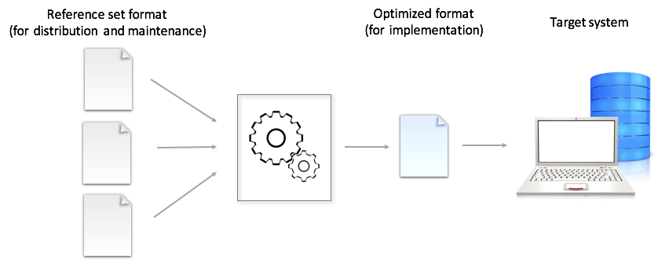

# Implement and Use

When a reference set has been developed and tested it should be prepared for use by implementing it in the environment where it is going to function. I.e. the implementation process and the tasks involved will vary dependent on the setting.

Often, implementation of a reference set will mean integration with one or more software artefacts, to enable data capture, represented by appropriate reference set members.

An important part of this process is proper binding between the information model and the reference set to ensure effective integration with data entry and storage functions. Many situations will also involve implementation of two or more interdependent reference sets, which require their dependencies to be considered to reach the most optimal implementation.

In this guide we highlight two aspects that are important when implementing SNOMED CT reference sets, i.e. supporting implementation with proper implementation guidance and considerations related to optimizing the reference set for a particular implementation.

## Implementation Guidance

The tasks involved with implementing a reference set will depend on the situation and the technical setting where the reference set is going to function. To support successful implementation, and to ensure that the reference set is used as intended it is important with precise and clear instructions for the people responsible for implementing the reference set, i.e. the people preparing the reference set for routine use within a particular setting.

Implementation guidance should, as a minimum, include instructions on:

* The overall purpose and intended use of the reference set
* The reference set design, i.e. attributes and data types
* Dependencies to terminology artifacts, such as
  * other reference sets
  * content in the international edition of SNOMED CT
  * content in SNOMED CT extensions
* Dependencies to software artifacts, such as
  * information model structures, i.e.
    * data entry template structures
    * storage model structures
    * message structures
* Maintenance
  * release cycles
  * change management
  * request for change

Additionally, it is valuable to include instructions on how to test the implementation, i.e. exemplar test cases with information on expected outcome given a specific action.

## Optimization for Implementation

As part of an implementation process it is relevant to consider any optimization that could be done to meet requirements for implementation or result in a more effective and/or efficient use at runtime. Because, even though reference sets are distributed in separate files and represented according to the reference set file format, it may be useful to transform these reference sets files into another structure that is more appropriate for the specific use case.

<figure><figcaption>
 Prior to implementation a reference set may be transformed into one or more formats, which are optimized for the particular use of the reference set
</figcaption></figure>

Optimizations that could be considered include:

* **Controlled redundancy.** For some matters it may be useful to introduce some level of redundancy, e.g. by joining reference sets or release files together so that the data is more efficient to access at runtime
  * e.g. combining a simple reference set of concepts with the description file, so that the term preferred for display can be retrieved directly from the subset file.
  * e.g. combining the description file with a language refset, so that the term is in the same row as the acceptability of the description, and the concept id that it describes.
* **Terminology reduction (constrain)**. For the purpose of supporting effective use and ensuring that only relevant components are accessed during runtime it may be useful to filter the components down to only those that are relevant for a specific use case.
  * One way of doing this is by creating simple reference sets of the components that are relevant in a given situation, for example:
    * A subset of relevant concepts.
    * A subset of descriptions acceptable or preferred for the set of concepts.
    * A subset of relationships that are important to know about for that specific subset of concepts and for the given use case. What relationships to include will be very dependent on the use case. In some situations, the relationship subset may be irrelevant, and in other situations it may be important to include all defining relationships and all transitive 'is a' relationships of the subset members.
* **Filtering to a snapshot view of the subset.** As for any other SNOMED CT component changes to reference set members are likely to occur, and as for SNOMED CT components, reference set members can be updated or inactivated. Therefore, it may be useful to create a snapshot view of the reference set to be used for implementation, so that only the latest version of all reference set members can be accessed during runtime. Alternatively, it may be useful to create a view which only includes the most recent version of all active reference set members. This will depend on whether the inactive members should be accessible for viewing or not.
