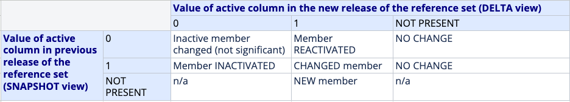

# Manage and Maintain Reference Sets

With time, the set of concepts, or other components, referenced in a reference set will need to change, either because of changes in SNOMED CT, changes in clinical knowledge, or changes dictated by errors or omissions in the original reference set. The original reference set will have been given an identifier that is used to reference the reference set in models or other entities that use that particular reference set. When a change is required that maintains the original intent but updates the content, the change is considered a new version of the reference set. Versioning maintains the reference set identifier and additional reference set attributes.

Following topics will be presented in relation to reference set maintenance:

* [Reference Set Management Considerations](6.6-manage-and-maintain-reference-sets.md#reference-set-management-considerations)
* [Managing Reference Set Changes](6.6-manage-and-maintain-reference-sets.md#managing-reference-set-changes)
* [Request for Change](6.6-manage-and-maintain-reference-sets.md#request-for-change)
* [Tooling](6.6-manage-and-maintain-reference-sets.md#tooling)

## Reference Set Management Considerations

When developing or evaluating a change management process it is important to take different factors into account. Some of these factors are introduced in the table below.

Table: Change management considerations

<table><thead><tr><th width="185.609375">Topic</th><th>Description</th></tr></thead><tbody><tr><td><strong>Request for change</strong>  </td><td>
Where will the need for change come from?

This could be any of the stakeholders involved in the capture or use of the information that is expressed using the subset.
</td></tr><tr><td></td><td>
How will change requests be expressed and submitted?

These may be submitted directly by users, or may be collated and edited by suppliers. The maintainers of the subset may be proactive in looking for improvements, or may wait for requests for change to be submitted.
</td></tr><tr><td></td><td>What lead time is acceptable for the processing of a change request?</td></tr><tr><td></td><td>
What should users of the subset do in the period between recognizing the need for a change, and that need being met by a new release of the subset?

Options may include using free text, creating local codes, or waiting for the revision to be available.
</td></tr><tr><td><strong>Revision cycle</strong></td><td>Will there be a predictable revision cycle with regular releases, or will changes be made on an as-needed basis?</td></tr><tr><td><strong>Resources</strong></td><td>What editorial and technical resources are needed?</td></tr></tbody></table>

## Managing Reference Set Changes

Maintaining reference sets starts as soon as the reference set is specified. The maintenance process involves ensuring that the content of the reference set refers to active concepts in the release upon which the reference set depends. It also involves adding new content to the reference set, for example when additions to the dependee Release fall within the scope of the reference set specification. The alignment of a reference set with the International Release will be undertaken during the international release process, at which time a change report will be created for circulation, providing details of the changes made, in a format that can be circulated virtually to subject matter experts.

The tasks related to reference set changes will typically involve substituting a prior version of a reference set with the more recent version. For example, if a reference set represents a value set which is used in a data entry interface, the reference set may simply be replaced by the updated version of that reference set. On the other hand, if the reference set is of a more complex nature, for example, if it represents a map between SNOMED CT and a classification, and is used for quality monitoring, research, reimbursement etc., it might be necessary to go into more detail about the implications of the change. Regardless of the type of reference set change (addition, inactivation or change) it will always have implications.

### Addition of Reference Sets

If a reference set is added data entry protocols should be updated to link to this reference set where this is found appropriate. For example, if a reference set has been developed to function as a value set for cardiovascular diseases, data entry protocols should link to the reference set in the data entry protocols used to capture cardiovascular diseases. The nature of the binding depends on the underlying information model of the protocol. Additionally, it is important to update the storage models appropriately. See, [Starter Guide - Using SNOMED CT in Clinical Information](https://app.gitbook.com/s/UmSUeu96fIQZWDm7RISx/3-using-snomed-ct-in-clinical-information) to learn about this topic. It may also be necessary to develop queries to generate reports or views based on the new reference set data. Alternatively, an added reference set may include rules to enable decision support, which must be integrated. It may also be necessary to create or update links between reference set members and communication protocols.

### Inactivation of Reference Set

A reference set may be inactivated in situations where an organization is no longer able or prepared to maintain it.

Inactivation of an _entire_ reference set is done by inactivating the concept that identifies the reference set, and inactivating the relationship used to place the reference set in the subtype hierarchy.

Reference sets that are being actively used should not be inactivated without giving prior notice to the users of the reference set, to allow remedial steps to be taken.

Any function using a reference set that is no longer maintained will need updating. For example, if a reference set is inactivated, which is used for data entry, it is important to determine how the inactivation is managed in the system. Thus, it should be clarified whether a new reference set should be defined or whether the inactivated reference set should be added in a local extension. It may also be that a replacement reference set has already been defined.

### Changes to Reference Set Members

The types of changes that can occur in a reference set include:

* Changes to reference set members
* Addition of reference set members
* Inactivation of reference set members

The effect of changes to reference set members depends on the type of reference set and the way the reference set is used. Generally, it is important to assess the extent to which the reference set changes affect the situation in which the reference set is used, such as:

* Data entry. Changes to reference set members may require changing existing data entry protocols.
* Data storage. Changes to reference set members may require migrating or processing pre-existing data in a particular way to ensure consistency.
* Data retrieval. Changes to reference set members may require revising existing queries to take account of the changes.
* Knowledge linkage. Changes to reference set members may require updating bindings to knowledge resources or decision support rules.
* Communications. Changes to reference set members may require updating communication specifications, and in particular managing issues from cross-version communications.

#### Determine changes

One way of determining the changes to a reference set is by creating and comparing the following two views of the reference set:

* **SNAPSHOT view** of the previous reference set release. This view contains one version of every member released up to the time of the snapshot. The version of each member contained in a snapshot is the most recent version of that member at the time of the snapshot.
* **DELTA view** of the new reference set release. This view contains only reference set member versions created since the previous reference set release. Each reference set member version in the DELTA view represents either a new reference set member or a change to an existing member.

These two views make it possible to automatically identify whether a reference set member has been created, changed, reactivated or inactivated. The table below illustrates how to interpret the 'active' attribute, when comparing the delta view of the new release of the reference set with the snapshot view of the previous release of the reference set.

<figure><figcaption></figcaption></figure>

## Request for Change

As clinical practice evolves and adapts to meet the needs of healthcare advances, SNOMED CT content is updated to address these changes. Reference sets may also need to be updated to reflect content changes and to enable clinicians to adequately represent new and emerging techniques and practices. It is therefore important to establish processes for end users and other stakeholders to submit requests for changes. Related to reference sets the types of changes that may be required include:

* Addition of new reference set members
* Removal of reference set members
* Changes to existing reference set members

### Types of Reference Set Changes

#### Addition of New Reference Set Members

When new members are requested for inclusion in a reference set, it should be determined whether any existing components in SNOMED CT are sufficient, or whether it requires a new component to be added - either in the International Edition or as part of an Extension.

#### Removal of Reference Set Members (Inactivation)

To remove a referenced component from a reference set, the relevant reference set member is inactivated. This is done by adding a new row to the reference set in which the value of the active column is set to false. The SNOMED CT versioning mechanism tracks the full history of additions, changes and inactivations because each row in the reference set contains a effective time column indicating when the change became effective. This is the same versioning mechanism with is used to track addition, inactivation and modification of SNOMED CT components.

#### Changes to Existing Reference Set Members

Changes to reference set members can vary, dependent on the refset type and the situation. Examples of changes include:

* Changing the order assigned to a member of an ordered reference set
* Changing the annotation associated to a member of an annotation reference set
* Changing a description from being acceptable to preferred in a language reference set
* Updating the query for an intensional subset definition represented by a member of a query specification reference set

### Approaches

The type of service implemented to support change requests will depend on the amount of reference sets, the number of users, the organisation etc.. Smaller organisations with relatively a few end-users may apply a simple email service for proposing any changes to the refset. Other institutions may implement dedicated systems that track each change request and support proper management of those.

## Tooling

Authoring and managing reference sets require some level of tooling support. Broadly speaking, two types of tooling support exists:

1. Combination of browsing functionality and simple spreadsheets or database system
2. Dedicated reference set management tools with extended features

The extend of sophistication of the tool required depends on various factors, and the combination of those factors:

* Type and size of reference set
  * Simple reference sets with few members
  * Large reference sets of various types
* Use of reference set
  * Local vs. distributed
  * Dependencies (Editions, versions)
* Maintenance of reference set
  * Cycle
  * People

### Functionalities

Relevant functionalities for reference set creation and management include:

* Creation of both extensional and intensional reference sets
  * Services for browsing and displaying SNOMED CT content for manually selecting reference set members
  * Services for manual and intensional expansion of reference set (inclusion of reference set members)
  * Services for manual and intensional exclusion of reference set members
  * Create reference sets according to a specific reference set pattern
  * Create customized reference sets
* Version management of created reference sets
  * Computation of the effect of a related SNOMED CT edition and version on a reference set
* Workflow support
  * Mechanism for approval of reference set before publishing
  * Facility for external feedback and request for change
* Searching existing reference sets, as well as entries about reference sets that may be available elsewhere
* Distribution services

### Considerations Related to using Spreadsheets to Manage Reference Sets

Generally, it is not recommended to use a spreadsheet approach for managing reference sets, because there is a dependency between the reference set and the core content of SNOMED CT. The SNOMED CT release files are important for interpreting the components referenced by the reference set, for example:

* Description file: Access to the descriptions are required to display the terms of the components referenced by the reference set.
* Concept file: Access to the concept file is required to assess whether the components referenced by the reference set are active or inactive

However, in some situations spreadsheets (supported by a browsing facility) may be feasible, for example,

* If the reference set only consists of a few members
* If the reference set is only used locally
* If only one person is responsible for managing the reference set

If a spreadsheet approach is chosen it is recommended to create a [human-readable version](../5-reference-set-types.md#human-readable-reference-set) of that reference set to support interpretation of the identifiers used in the reference set.

<a href="https://docs.google.com/forms/d/e/1FAIpQLScTmbZIf0UEQwYDkY27EEWBkaiYkHSbR0_9DmFrMLXoQLyL7Q/viewform?usp=pp_url&#x26;entry.1767247133=Refset+Guide&#x26;entry.670899847=Manage%20and%20Maintain%20Reference%20Sets" class="button primary">Provide Feedback</a>
