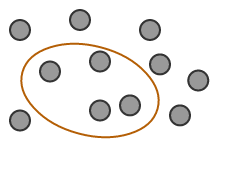

# Requirements Menu

[<figure><figcaption>
---|---|---|---|---|---
</figcaption></figure>](3.1.1.-A-Subset-of-Components_35985527.html)| [__IMAGE_PLACEHOLDER_2__](3.1.2.-An-Ordered-List-of-Components_35985508.html)| [__IMAGE_PLACEHOLDER_3__](3.1.3.-A-Set-of-Associations-between-Components_35985514.html)|  [__IMAGE_PLACEHOLDER_4__](3.1.4.-A-Set-of-Components-Annotated-with-Additional-Information_35985521.html)| [__IMAGE_PLACEHOLDER_5__](3.1.5.-A-Set-of-Maps-between-SNOMED-CT-and-Another-Code-System_35985524.html)| [__IMAGE_PLACEHOLDER_6__](3.1.6.-A-Set-of-Sets-of-Components_35985532.html)  
**[3.1.1. A Subset of Components](3.1.1.-A-Subset-of-Components_35985527.html)******| **[3.1.2. An Ordered List of Components](3.1.2.-An-Ordered-List-of-Components_35985508.html)**| **[3.1.3. A Set of Associations between Components](3.1.3.-A-Set-of-Associations-between-Components_35985514.html)**| **[A set of components annotated with additional information](3.1.4.-A-Set-of-Components-Annotated-with-Additional-Information_35985521.html)**| **[3.1.5. A Set of Maps between SNOMED CT and Another Code System](3.1.5.-A-Set-of-Maps-between-SNOMED-CT-and-Another-Code-System_35985524.html)**| **[3.1.6. A Set of Sets of Components](3.1.6.-A-Set-of-Sets-of-Components_35985532.html)**
